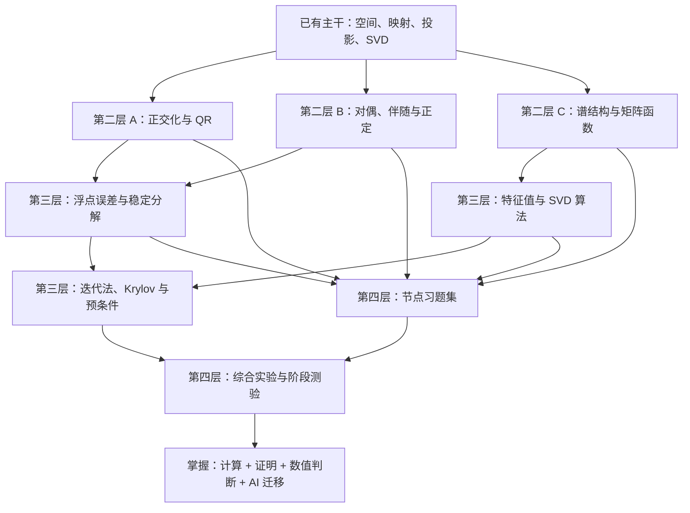

# 线性代数完整学习路线与掌握标准

> [!abstract] 路线定位
> 本路线是[[数学基础完整课程地图与掌握标准]]的第一条施工子路线，负责 10.2、10.3 与 10.8 共 60 个核心节点。本路线把现有“AI 相关矩阵理论主干”扩展为可以系统学习的课程：补齐标准线性代数、矩阵分析、数值线性代数和练习闭环。目标不是百科式覆盖，而是让读者能计算、解释、证明、辨认边界，并把结论迁移到 AI 模型。

## 学习终点

完成本路线后，应达到以下能力：

1. **对象能力**：看到公式时能说明向量、矩阵、子空间和映射分别是什么、住在哪个空间、维度是否相容；
2. **计算能力**：能手算小型分解与方程，能为大矩阵选择合理算法，而不是默认显式求逆；
3. **证明能力**：能重建核心定理的论证链，知道每个条件在哪一步使用；
4. **数值能力**：能区分问题条件性与算法稳定性，能解释浮点误差、谱间隙和小奇异值的影响；
5. **AI 迁移能力**：能独立分析 PCA、线性回归、LoRA、谱归一化、表示秩、白化和矩阵优化器中的线性代数结构。

> [!info] 第一层的处理方式
> 集合、函数和基本矩阵运算仍采用桥接复习；Gaussian 消元因为同时连接秩、LU、数值稳定性和隐式微分，已升级为独立核心节点[[线性方程组、消元与 LU 分解]]。

## 全路线依赖图

## 已有主干的定位

现有节点不是废弃草稿，而是课程的中高层骨架。后续需要按“初学者优先”规范补上阅读前检查、更多中间步骤、手算题和练习链接。

| 主线 | 已有节点 | 当前判断 |
|---|---|---|
| 空间与映射 | [[向量空间]]、[[线性映射]]、[[基与坐标]]、[[线性泛函与对偶空间]]、[[伴随算子]] | 早期三章已补初学者推导、数值/AI 层、15 题、独立解答与 SVG；对偶—伴随—VJP 桥梁已闭环 |
| 几何与求解 | [[内积空间]]、[[标准正交基与 Gram-Schmidt]]、[[QR 分解]]、[[正交投影]]、[[最小二乘]] | 已完成教材化主链：三章基础节点各有完整推导、数值/AI 边界、15 题、独立详解与 SVG；正交化、QR 和稳定性实验已衔接 |
| 子空间与逆问题 | [[四个基本子空间]]、[[Moore-Penrose 伪逆]] | 四子空间与伪逆均完成教材化升级；双投影、最小范数、滤波与跨秩边界已闭环 |
| 谱结构 | [[特征分解]]、[[特征多项式与重数]]、[[广义特征向量与 Jordan 结构]]、[[Schur 分解]]、[[矩阵函数与矩阵指数]]、[[极分解]]、[[矩阵符号函数]]、[[定理 - 有限维谱定理]]、[[二次型与正定矩阵]]、[[Cholesky 分解]]、[[奇异值分解]] | 特征分解—谱定理—SVD 已完成初学者推导、数值验收、AI 边界和题解；高级谱结构与算法已衔接 |
| 低秩与稳定性 | [[矩阵范数]]、[[定理 - Eckart–Young–Mirsky]]、[[有效秩]]、[[条件数]]、[[矩阵扰动]] | 五章均已完成初学者推导、数值策略、AI 形状/边界、A–E 题解与图示；下一门槛是真实数据实验和闭卷验收 |

## 第二层：补全标准线性代数

### 2A. 正交化与直接分解

| 顺序 | 节点 | 必须掌握的结果 | 配套实践 |
|---:|---|---|---|
| 1 | [[标准正交基与 Gram-Schmidt]] | 从线性无关组构造标准正交组；解释投影消去 | 手算二维/三维；退化例子 |
| 2 | [[QR 分解]] | $\boldsymbol A=\boldsymbol Q\boldsymbol R$ 的存在、形状与最小二乘 | 手算 QR；与正规方程比较 |
| 3 | [[线性方程组、消元与 LU 分解]] | 消元、主元、置换和 $\boldsymbol P\boldsymbol A=\boldsymbol L\boldsymbol U$ | 解小型方程组；隐式微分 |
| 4 | [[迹、行列式与体积]] | trace 不变性；行列式的多线性、交替性、体积缩放、可逆性和 log-det | 小矩阵手算；变量变换；随机 trace 估计 |

行列式只覆盖理论和 AI 必需部分，不把余子式展开训练成主线；大矩阵计算使用分解和 log-det 算法。

### 2B. 对偶、伴随与正定结构

| 顺序 | 节点 | 必须掌握的结果 | 配套实践 |
|---:|---|---|---|
| 5 | [[线性泛函与对偶空间]] | 线性泛函、对偶基、坐标无关的微分 | 从函数到梯度的桥梁 |
| 6 | [[伴随算子]] | $\langle T\boldsymbol x,\boldsymbol y\rangle=\langle\boldsymbol x,T^{*}\boldsymbol y\rangle$ | 推导反向传播中的转置 |
| 7 | [[二次型与正定矩阵]] | 等价判据、Rayleigh 商、PSD 序和曲率 | 椭圆等高线与 Hessian |
| 8 | [[Cholesky 分解]] | 正定矩阵的 $\boldsymbol L\boldsymbol L^{*}$ 分解 | 解 SPD 系统、采样高斯 |

### 2C. 谱结构与矩阵函数

| 顺序 | 节点 | 必须掌握的结果 | 配套实践 |
|---:|---|---|---|
| 9 | [[特征多项式与重数]] | 代数/几何重数、可对角化判据 | $2\times2$、$3\times3$ 例子 |
| 10 | [[广义特征向量与 Jordan 结构]] | 广义特征空间分解、Jordan 链、核增长恢复块、矩阵幂中的多项式因子 | 完整手算与证明；不作为浮点数值算法 |
| 11 | [[Schur 分解]] | 复酉三角化、实准上三角化、不变旗标、重排谱簇、正规特例与 QR 相似迭代 | 手算缺陷矩阵/旋转矩阵；四类残差；RNN/SSM 稳定子空间 |
| 12 | [[矩阵函数与矩阵指数]] | Jordan/Hermite/Cauchy 函数演算、指数、ODE、数值路线与 Fréchet 导数 | $e^{tA}$ 手算、连续 SSM 精确离散化、非正规瞬态实验 |
| 13 | [[极分解]] | 矩形/秩亏极分解、唯一性、最近 Stiefel 因子、Newton/NS/QDWH 与 Fréchet 微分 | 手算与证明；条件数实验；对接 Muon、Procrustes 和正交 retraction |
| 14 | [[矩阵符号函数]] | 半平面谱分割、谱投影、sign 分解、block 根/polar、Newton/Schur 与 Fréchet 条件性 | 手算与证明；非正规实验；对接连续 SSM、谱分治与 msign 边界 |

## 第三层：数值线性代数

详细结构见[[数值线性代数 MOC]]。学习顺序不是“把理论公式写成代码”，而是先建立误差模型，再比较算法。

| 阶段 | 节点组 | 核心问题 |
|---|---|---|
| 3A | [[浮点数与舍入误差]]、[[前向误差与后向误差]] | 计算机实际存储和运算了什么？ |
| 3B | [[数值稳定性]]、[[稳定求解线性方程组]] | 算法是否等价于精确求解一个邻近问题？ |
| 3C | [[实验 - Gram-Schmidt 与 QR 的正交性误差]]、[[Householder 与 Givens 变换]] | 怎样稳定构造 QR？ |
| 3D | [[稳定最小二乘与正规方程的风险]] | 线性回归怎样在条件数、秩、残差与成本之间选择 QR、QRCP 或 SVD？ |
| 3E | [[幂法、反幂法与 Rayleigh 商迭代]]、[[Hessenberg 化与 QR 特征值算法]] | 怎样计算而不只定义局部或完整特征值？ |
| 3F | [[Lanczos 方法]]、[[Arnoldi 方法]]、[[Krylov 子空间与预条件]] | 大矩阵只需少量谱方向时怎么办？ |
| 3G | [[定常迭代法与谱半径]]、[[Krylov 子空间与预条件]]、[[共轭梯度法]] | 稀疏 SPD 系统如何求解？ |
| 3H | [[随机化低秩近似与随机 SVD]] | 完整 SVD 太贵时，如何获得概率保证？ |

## 第四层：练习、解答与测验

每个正式基础节点都必须连接一份习题集；答案放在独立解答节点，避免阅读时立即看到结果。详细规范见[[练习与测验 MOC]]。

### 每个节点的五类题

| 层级 | 题型 | 检查的能力 |
|---|---|---|
| A | 识别与复述 | 能否辨认对象、条件和维度 |
| B | 手算与构造 | 能否独立算完最小例子 |
| C | 推导与证明 | 能否说明每一步依据 |
| D | 边界与反例 | 能否发现缺失假设和错误推广 |
| E | AI 迁移 | 能否把结论用于模型、优化或表示问题 |

### 卷级测验与分组复习

10.2的正式卷末验收统一为[[阶段测验 - 线性代数（10.2）|LA-CUM-01]]：20分钟无提示口试 + 240分钟、100分闭卷，覆盖LA-01—24，并配有[[阶段测验解答 - 线性代数（10.2）|独立逐题详解]]与[[实验 - 线性代数累计复现门|nonce随机三轨计算复现门]]。它检查空间—映射—商、内积—QR—最小二乘、Kronecker—tensor、特征—Jordan—Schur—矩阵函数及AI边界；SVD/伪逆作为矩形映射与规范解的桥接知识单列，不冒充LA-17—24的正式编号。

10.3的正式卷末验收为[[阶段测验 - 矩阵分析（10.3）|MA-CUM-01]]：20分钟无提示口试 + 270分钟、100分闭卷，覆盖MA-01—16，并配有[[阶段测验解答 - 矩阵分析（10.3）|逐题详解]]与[[实验 - 矩阵分析累计复现门|nonce随机三轨计算门]]。它不重考基础分解步骤，而是检查norm—positive margin—gap—condition—low rank—matrix function—pseudospectrum—structured perturbation的跨章判断，并以盲干预、48小时换机制和14天迁移检查保持性。

原有标签现在作为错题复习桶而非待建卷：

1. `L2-A`：正交化、QR、消元/LU、trace/determinant、正定与Cholesky；其中10.3内容不计入10.2主卷节点，但可作为先修补救；
2. `L2-B`：对偶、伴随、重数、Jordan、Schur和矩阵函数；10.2主卷以LA-15—16和LA-19—24直接验收，高级扰动与算法边界再由10.3承接；
3. `L2-C`：SVD、伪逆、极分解与matrix-sign接口；前两者作为10.2卷内桥接知识，后两者及高级矩阵分析由10.3承接；
4. `LA-AI`：回归、PCA、低秩、谱约束、Attention和结构化压缩，已进入第13—14题与计算C轨。

10.8的数值算法深度仍由NLA-CUM-01独立验收。测验不是只给分数：错题必须回链到具体概念节点，并记录错误属于定义、计算、证明、条件、数值边界还是迁移。

## 掌握判据

一个主题不能因为“读完”就标记掌握。至少完成以下四项：

- [ ] 不看正文，能用普通语言解释核心问题和结论；
- [ ] 能独立完成一题手算和一题维度检查；
- [ ] 能复现核心推导，或明确指出引用了哪个定理；
- [ ] 能构造一个反例或解释一个 AI 调用点的条件边界。

一个阶段完成还需：

- [ ] 节点习题中 A、B 类基本无障碍；
- [ ] C、D 类能独立完成多数；
- [ ] E 类能写出对象、维度、假设和结论；
- [ ] 综合实验可复现；
- [ ] 阶段测验错题已回链复习，而不是只看答案。

## 实施批次

### 批次 A：补最关键的标准课程断点

> [!success] 状态：内容与配套闭环已建立
> 4 个理论节点、4 份 A–E 习题、4 份独立完整解答与 2 个确定性数值实验均已写入知识库。它们暂时保持 `draft`，阶段测验和间隔复查通过后再升级状态。

1. [x] [[标准正交基与 Gram-Schmidt]]；
2. [x] [[QR 分解]]；
3. [x] [[二次型与正定矩阵]]；
4. [x] [[Cholesky 分解]]；
5. [x] [[实验 - Gram-Schmidt 与 QR 的正交性误差]]；
6. [x] [[实验 - 正定边界、条件数与 Cholesky pivot]]；
7. [x] 每个理论节点都有独立习题与解答，入口汇总于[[练习与测验 MOC]]。

### 批次 B：直接求解、不变量与算子结构

> [!success] 状态：已完成极分解与经典矩阵 sign 层
> 已完成 10 个理论节点、10 份 A–E 习题、10 份独立完整解答、8 幅自绘几何/结构示意图，以及矩阵指数瞬态、Newton–Schulz 条件数和 matrix sign 非正规敏感性三个专题实验；经典 sign 已把矩阵函数、谱投影、稳定子空间、迭代、可微计算和 msign 边界接通。

1. [x] [[线性方程组、消元与 LU 分解]]；
2. [x] [[迹、行列式与体积]]；
3. [x] [[线性泛函与对偶空间]]；
4. [x] [[伴随算子]]；
5. [x] [[特征多项式与重数]]；
6. [x] [[广义特征向量与 Jordan 结构]]；
7. [x] [[Schur 分解]]；
8. [x] [[矩阵函数与矩阵指数]]；
9. [x] [[极分解]]；
10. [x] [[矩阵符号函数]]；
11. [x] [[实验 - 稳定非正规系统的矩阵指数瞬态]]；
12. [x] [[实验 - Newton-Schulz 极分解的条件数效应]]。
13. [x] [[实验 - 矩阵符号函数的谱分割与非正规敏感性]]。
14. [x] [[浮点数与舍入误差]]、[[习题 - 浮点数与舍入误差]]、[[解答 - 浮点数与舍入误差]]与[[实验 - 浮点求和次序与灾难性消去]]。
15. [x] [[前向误差与后向误差]]、[[习题 - 前向误差与后向误差]]、[[解答 - 前向误差与后向误差]]与[[实验 - 小残差、大前向误差与条件数]]。
16. [x] [[数值稳定性]]、[[习题 - 数值稳定性]]、[[解答 - 数值稳定性]]与[[实验 - 等价公式不等价稳定]]。

### 批次 C：进入数值线性代数

1. [x] 浮点数与舍入误差；[x] 前向/后向误差；[x] 数值稳定性；
2. [x] [[稳定求解线性方程组]]、[[习题 - 稳定求解线性方程组]]、[[解答 - 稳定求解线性方程组]]与[[实验 - 选主元、后向误差与迭代改进]]；
3. [x] [[Householder 与 Givens 变换]]、[[习题 - Householder 与 Givens 变换]]、[[解答 - Householder 与 Givens 变换]]与[[实验 - Householder 符号、Givens 缩放与 QR 正交性]]；
4. [x] [[稳定最小二乘与正规方程的风险]]、[[习题 - 稳定最小二乘与正规方程的风险]]、[[解答 - 稳定最小二乘与正规方程的风险]]与[[实验 - 正规方程、QR 与截断 SVD 的稳定性]]；
5. [x] [[幂法、反幂法与 Rayleigh 商迭代]]、[[习题 - 幂法、反幂法与 Rayleigh 商迭代]]、[[解答 - 幂法、反幂法与 Rayleigh 商迭代]]与[[实验 - 谱间隙、移位与 Rayleigh 商迭代收敛]]；
6. [x] [[Hessenberg 化与 QR 特征值算法]]、[[习题 - Hessenberg 化与 QR 特征值算法]]、[[解答 - Hessenberg 化与 QR 特征值算法]]与[[实验 - Hessenberg 约化、移位与 QR deflation]]；
7. [x] [[Lanczos 方法]]、[[Arnoldi 方法]]与[[SVD 算法与谱范数估计]]，三章均已建立 A–E 习题、独立解答、三面板图与可复现实验；
8. [x] [[定常迭代法与谱半径]]、[[Krylov 子空间与预条件]]、[[共轭梯度法]]、[[GMRES、MINRES 与残差最小化]]、[[稀疏矩阵计算与存储复杂度]]与[[随机化低秩近似与随机 SVD]]，均已建立正文、练习、解答和实验；
9. [x] [[阶段测验 - 数值计算与数值线性代数（10.8）]]与独立详解已组卷；[ ] 真实作答与间隔复查尚未完成。

### 批次 D：补齐 10.2 与 10.3 的十个课程断点

> [!info] 施工原则
> 总课程地图锁定的 10.2/10.3 共 40 个核心节点中已有 30 个正文。本批不是增加旁支，而是补齐已在后续章节中被频繁调用、却尚无独立初学者正文的十个断点。每一小批同步交付正文、视觉、A–E 习题、独立解答和 MOC 回链。

| 小批 | 节点 | 依赖理由 | 状态 |
|---|---|---|---|
| D0 早期底座升级 | [[向量空间]]、[[基与坐标]]、[[线性映射]]、[[四个基本子空间]] | 把早期概览升级为可独立授课的空间—表示—映射—四空间主链 | completed：四章正文、60 题、四份独立详解与四幅 SVG 已建立 |
| D0-G 几何—求解升级 | [[内积空间]]、[[正交投影]]、[[最小二乘]] | 把度量、正交分解、最近点、残差正交、最小范数与稳定算法接成一条初学者可学主链 | completed：三章正文、45 题、三份独立详解与三幅 SVG 已建立 |
| D0-S 谱—低秩升级 | [[特征分解]]、[[定理 - 有限维谱定理]]、[[奇异值分解]]、[[Moore-Penrose 伪逆]]、[[定理 - Eckart–Young–Mirsky]] | 贯通一般特征方向、正规谱结构、矩形双空间、规范反演与最优低秩逼近 | completed：五章正文、75 题、五份独立详解与五幅 SVG 已建立 |
| D0-N 度量—敏感性升级 | [[矩阵范数]]、[[条件数]]、[[矩阵扰动]]、[[有效秩]] | 贯通矩阵大小、问题敏感性、谱值/子空间稳定性与近似维数诊断 | completed：四章正文、60 题、四份独立详解与四幅 SVG 已建立 |
| D1 标准空间结构 | [[子空间、张成与线性无关]]、[[核、像与秩零化度定理]]、[[直和、商空间与不变子空间]] | 先补生成、独立性、秩与分解语言，修复后续所有谱/低秩节点的隐含前提 | completed：三章正文、45 题、独立详解与三幅 SVG 已建立 |
| D2 谱的变分与扰动 | [[Rayleigh 商与极值表征]]、[[特征向量与子空间扰动定理]] | 连接正定性、幂法、CG、谱间隙和表示子空间稳定性 | completed：两章正文、30 题、独立详解与两幅 SVG 已建立 |
| D3 矩阵—张量接口 | [[Kronecker 积、向量化与矩阵方程]]、[[多线性映射、张量与缩并]] | 为矩阵微分、注意力、卷积、结构化参数和高阶导数建立形状语言 | completed：两章正文、30 题、独立详解与两幅 SVG 已建立 |
| D4 高级矩阵分析 | [[矩阵函数的 Fréchet 导数]]、[[非正规矩阵、预解式与伪谱]]、[[结构化矩阵与结构化扰动]] | 统一可微矩阵层、瞬态放大和保结构误差分析 | completed：三章正文、45 题、三份独立详解与三幅 SVG 已建立 |

10.2卷级验收工具已达到材料`regression-passed`：[[阶段测验 - 线性代数（10.2）]]、[[阶段测验解答 - 线性代数（10.2）]]与[[实验 - 线性代数累计复现门]]组成口试—闭卷—nonce随机三轨—盲干预—48小时—14天证据链，并由[[linear_algebra_cumulative_contract_audit.py]]复核；个人仍是`not-attempted`，等待真实原稿与间隔复测。

10.3卷级验收工具已达到材料`regression-passed`：[[阶段测验 - 矩阵分析（10.3）]]、[[阶段测验解答 - 矩阵分析（10.3）]]与[[实验 - 矩阵分析累计复现门]]组成口试—闭卷—nonce随机三轨—盲干预—48小时—14天证据链，并由[[matrix_analysis_cumulative_contract_audit.py]]复核；个人仍是`not-attempted`，等待真实原稿与间隔复测。

依赖顺序不是难度排名。D3 可以在 D2 后半并行准备；D4 的内容建设已经闭环，但正式验收仍应在[[全微分与 Fréchet 导数]]或等价桥接复习完成后进行。

## 主要参照

- [MIT 18.06 Linear Algebra](https://ocw.mit.edu/courses/18-06sc-linear-algebra-fall-2011/pages/syllabus/)：标准本科线性代数课程覆盖。
- Sheldon Axler, [Linear Algebra Done Right, 4th ed.](https://linear.axler.net/)：抽象结构、证明和谱理论。
- [MIT 18.335 Introduction to Numerical Methods](https://ocw.mit.edu/courses/18-335j-introduction-to-numerical-methods-spring-2019/)：数值误差、分解和迭代算法。
- [Mathematics for Machine Learning](https://mml-book.github.io/)：数学主题与机器学习问题之间的课程接口。
