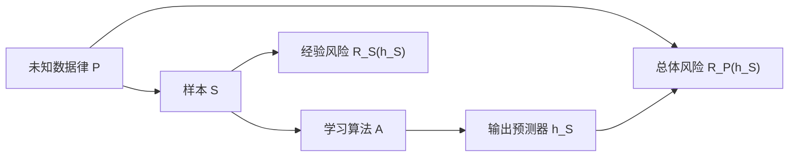

# 学习问题、决策与风险 MOC

> [!abstract] 本卷任务
> 在任何泛化界之前，先把“谁从什么数据、用什么规则、对什么未来对象、承担什么损失”写成完整合同。对象不清，后续 PAC、Bayes、validation 与 OOD 声明都会失去含义。

## 核心节点

| ID | 节点 | 关键出口 | 状态 |
|---|---|---|---|
| LT-01 | [[统计学习问题的对象合同]] | data—sample—algorithm—output—risk 全链 | draft + A–E 闭环 |
| LT-02 | [[数据生成分布与采样假设]] | i.i.d./dependent/adaptive 数据边界 | draft + A–E 闭环 |
| LT-03 | [[预测器、假设空间与学习算法]] | parameter、function、class、algorithm 分层 | draft + A–E 闭环 |
| LT-04 | [[损失、总体风险与经验风险]] | train quantity 与 target quantity 分离 | draft + A–E 闭环 |
| LT-05 | [[经验风险最小化、近似 ERM 与超额风险分解]] | approximation/estimation/optimization 分账 | draft + A–E 闭环 |
| LT-06 | [[Bayes 决策、Bayes 预测器与 Bayes 风险]] | conditional law 下的最优 action | draft + A–E 闭环 |
| LT-07 | [[可实现、不可知、相合性与可学习性]] | 四种理论状态不混用 | draft + A–E 闭环 |
| LT-08 | [[训练集、验证集、测试集与自适应复用]] | leakage 与 reusable holdout 边界 | draft + A–E 闭环 |

当前为 **8/8 正文，8/8 独立 v2 图文单元，8/8 具 A–E 习题与独立解答，0/8 经真实验收**。LT-01—08 的图示均由 [[plot_learning_problem_decision_v2.py]] 确定性生成，已补齐引图问题、正式图注、读图方法、适用边界和初学者自检，并通过 SVG 结构、XML、1200 px 渲染与人工视觉检查。第一卷已成稿但保持 `draft / not-attempted`；后继 20.2 也已完成同标准迁移，当前施工进入 20.3 的 VC 维主线。
