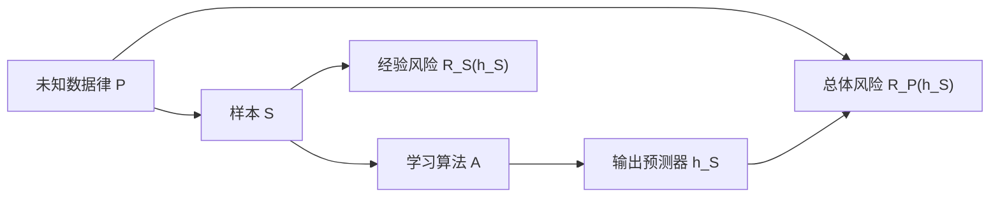

# 学习问题、决策与风险 MOC

> [!abstract] 本卷任务
> 在任何泛化界之前，先把“谁从什么数据、用什么规则、对什么未来对象、承担什么损失”写成完整合同。对象不清，后续 PAC、Bayes、validation 与 OOD 声明都会失去含义。



## 核心节点

| ID | 节点 | 关键出口 | 状态 |
|---|---|---|---|
| LT-01 | [[统计学习问题的对象合同]] | data—sample—algorithm—output—risk 全链 | draft + A–E 闭环 |
| LT-02 | [[数据生成分布与采样假设]] | i.i.d./dependent/adaptive 数据边界 | draft + A–E 闭环 |
| LT-03 | [[预测器、假设空间与学习算法]] | parameter、function、class、algorithm 分层 | draft + A–E 闭环 |
| LT-04 | [[损失、总体风险与经验风险]] | train quantity 与 target quantity 分离 | draft + A–E 闭环 |
| LT-05 | [[经验风险最小化、近似 ERM 与超额风险分解]] | approximation/estimation/optimization 分账 | draft + A–E 闭环 |
| LT-06 | [[Bayes 决策、Bayes 预测器与 Bayes 风险]] | conditional law 下的最优 action | draft + A–E 闭环 |
| LT-07 | [[可实现、不可知、相合性与可学习性]] | 四种理论状态不混用 | draft + A–E 闭环 |
| LT-08 | [[训练集、验证集、测试集与自适应复用]] | leakage 与 reusable holdout 边界 | draft + A–E 闭环 |

## 卷级累计验收

| 材料 | 作用 | 当前状态 |
|---|---|---|
| [[阶段测验 - 学习问题、决策与风险（20.1）]] | `LT-CUM-01`：20 分钟口试 + 210 分钟、100 分 A—E 闭卷；覆盖 LT-01—08 | `regression-passed / not-attempted` |
| [[阶段测验解答 - 学习问题、决策与风险（20.1）]] | 独立封存详解、口试红线、九层账本与错题回链 | `sealed until first attempt` |
| [[实验 - 学习问题、决策与风险累计复现门]] | scorer nonce 指定对象—风险、Bayes 决策或 holdout 反馈主轨，并要求跨轨盲参 | `regression-passed / not-attempted` |
| [[learning_problem_decision_cumulative_contract_audit.py]] | 双跑 canonical/盲参，复核 stdout、XML、hash、覆盖保护与六处状态面 | `PASS` |


三轨把八章压缩成可调用的整合结构：A 轨在有限二元问题中分离 Bayes risk、类近似、有限样本 class excess 与 selection gap；B 轨从 conditional risk 推出 cost/reject Bayes action；C 轨用 holdout order statistic 与 simultaneous bound 分离验证选择乐观和 fresh evaluation。材料图由[[learning_problem_decision_cumulative_gate.py]]确定性生成；默认总图是[[00-知识库管理/_assets/plots/learning-theory/plot-learning-problem-decision-cumulative-gate-v2.svg]]。

## 当前状态

```text
formal nodes: 8 / 8
node exercises / solutions: 8 / 8
volume evidence gate built: 1 / 1
personal oral / closed-book / blind-run evidence: 0
material state: regression-passed
learning state: not-attempted
next: build the 20.2 volume evidence gate for LT-09—16
```

LT-01—08 具备 **8/8 正文、8/8 独立 v2 图文单元、8/8 A—E 习题与独立解答，以及 1/1 卷级验收工具链**。这仍不是 8/8 真实掌握：在口试、闭卷、nonce 盲参、48 小时与 14 天证据未产生前，全部正文保持 `draft`，个人保持 `not-attempted`。
