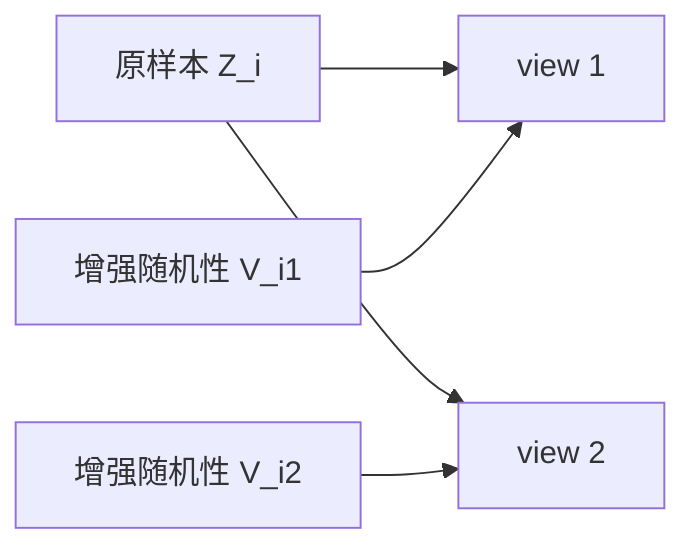
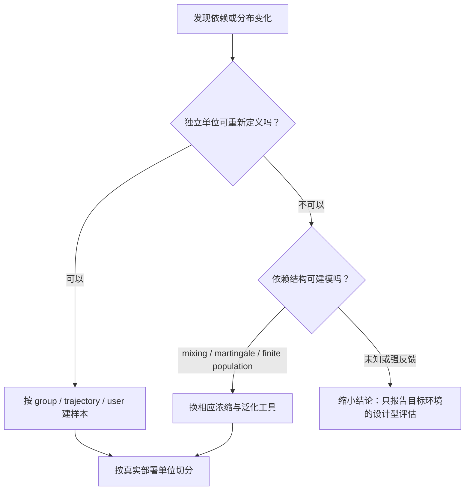

# 数据生成分布与采样假设

> [!abstract] 本章主问题
> “数据来自 $P$”只规定每个观测的边缘分布，不能自动推出样本彼此独立；经典 i.i.d. 合同是联合分布恰好等于 $P^m$。复制、增强、时间相关、同一用户多记录、主动选择和反馈收集都会改变联合律、方差与有效样本量，必须在套用浓缩不等式或泛化界之前单独审计。

> [!question] 初学者读完必须能回答
> 1. “每个 $Z_i\sim P$”与“$(Z_1,\ldots,Z_m)\sim P^m$”的逻辑差别是什么？
> 2. 怎样构造边缘同分布却完全相关的反例？
> 3. 数据增强、同一用户多条记录与时间序列为什么会改变 covariance 与有效样本量？
> 4. Exchangeability、无放回抽样、stationarity、mixing 与 i.i.d. 分别允许什么依赖？
> 5. Group/time/preprocessing leakage 应怎样通过 sampling unit 与切分顺序诊断？
> 6. i.i.d. 不成立时，应改 theorem、改数据收集还是改 target population？

先用下图回答一个视觉问题：**相同的单点边缘分布为什么可能来自完全不同的联合律，增强 view 与文件行数又为何不能直接当作独立样本数？**

![[00-知识库管理/_assets/figures/learning-theory/fig-sampling-joint-law-dependence-v2.svg|880]]

> [!figure] 图 20.1.2｜边缘同分布、i.i.d. 联合律与有效样本单位
> A 对比每个 $Z_i\sim P$ 与共享 latent/group variable $U$ 产生的相关 samples；B 将 i.i.d. 写成 joint probability 对任意 measurable rectangles 的乘积分解；C 画出每个 parent sample 生成多个 views 的依赖树，并要求先按 parent/user/time block 切分。来源：独立绘制；理论接口参考 product measures、dependent sampling 与 effective sample size；生成脚本：[[plot_learning_problem_decision_v2.py]]；确定性依赖图，无随机种子。

**怎样读图。** A 先固定所有边缘仍为 $P$，观察 shared $U$ 足以让样本高度相关；B 再用联合律而不是圆点间距定义 i.i.d.，每个采样单位必须是 fresh draw；C 最后把 augmented records 向上追溯到共同 parent，切分、bootstrap 和 concentration 的单位应与独立层级一致，并在方差账本中保留 covariance terms。

**适用边界（图没有证明什么）。** 图没有给 mixing、martingale、cluster sampling 或 finite-population concentration 的完整定理，也不声称所有 augmentation views 都无统计价值；它只说明 nominal row count 不等于 independent sample size。Effective sample size 往往依赖 estimand 与依赖结构，不能从一张依赖图唯一读出；真实 sampling/selection bias 还可能改变边缘分布本身。

## 一、学习目标

1. 用联合分布精确定义 identical distribution 与 independence；
2. 解释 $S\sim P^m$ 的每一个量词；
3. 构造“边缘都相同但完全相关”的反例；
4. 计算依赖对经验均值方差与有效样本量的影响；
5. 区分 exchangeability、无放回抽样、stationarity、mixing 与 i.i.d.；
6. 画出分组数据、数据增强、对比学习 batch 的依赖图；
7. 识别随机切分中的 group leakage、time leakage 与 preprocessing leakage；
8. 在不满足 i.i.d. 时说明应改 theorem、改 sampling unit 还是改目标分布。

## 二、i.i.d. 不是一句口号，而是一条联合律

令单个观测 $Z$ 取值于 $\mathcal Z$，分布为 $P$。样本

$$
S=(Z_1,\ldots,Z_m)
$$

称为 independent and identically distributed，记作

$$
S\sim P^m,
$$

当且仅当对所有可测集合 $B_1,\ldots,B_m\subseteq\mathcal Z$，

$$
\Pr(Z_1\in B_1,\ldots,Z_m\in B_m)
=\prod_{i=1}^mP(B_i).
$$

它同时包含两项：

1. **同分布**：每个 $Z_i$ 的边缘律都是 $P$；
2. **独立**：知道任意一部分样本，不改变其余样本的条件律。

只有第一项时，联合分布可以有强相关；只有第二项时，每个位置又可能来自不同分布 $P_i$。

## 三、为什么学习理论爱用 i.i.d.

i.i.d. 不是因为现实世界天然如此，而是因为它提供三条干净连接：

### 3.1 经验平均对固定函数无偏

若 $f(Z)$ 可积，定义

$$
\widehat\mu_S=\frac1m\sum_{i=1}^mf(Z_i).
$$

只要各 $Z_i$ 与 $P$ 同分布，就有

$$
\mathbb E_S[\widehat\mu_S]
=\frac1m\sum_{i=1}^m\mathbb E[f(Z_i)]
=\mathbb E_{Z\sim P}f(Z).
$$

注意：这一步只用线性性与同分布，尚未使用独立。

### 3.2 独立性带来 $1/m$ 方差缩减

若 $\operatorname{Var}(f(Z))=\sigma^2$ 且独立，则

$$
\operatorname{Var}(\widehat\mu_S)
=\frac{1}{m^2}\sum_{i=1}^m\operatorname{Var}(f(Z_i))
=\frac{\sigma^2}{m}.
$$

交叉协方差之所以消失，才是“更多样本降低波动”的关键。

### 3.3 乘积结构允许浓缩与 symmetrization

Hoeffding、McDiarmid、ghost sample 和许多 uniform convergence 证明都利用独立替换某个坐标或把联合 MGF 分解。若数据相关，结论未必完全消失，但 proof tool 与 effective rate 必须改变。

## 四、手算反例：两个样本看似来自同一分布，却没有获得两份信息

设

$$
B\sim\operatorname{Bernoulli}(1/2).
$$

比较两种数据生成方式。

### 4.1 真正独立

$$
Z_1,Z_2\overset{\text{i.i.d.}}\sim\operatorname{Bernoulli}(1/2).
$$

经验均值 $\overline Z=(Z_1+Z_2)/2$ 满足

$$
\mathbb E\overline Z=\frac12,
\qquad
\operatorname{Var}(\overline Z)
=\frac{1/4+1/4}{4}=\frac18.
$$

### 4.2 完全复制

$$
Z_1=B,\qquad Z_2=B.
$$

每个边缘仍是 Bernoulli$(1/2)$，经验均值仍无偏；但

$$
\overline Z=B,
\qquad
\operatorname{Var}(\overline Z)=\frac14.
$$

文件里有两行，信息量却仍只有一次抽样。若复制 100 次，方差还是 $1/4$，绝不会变成 $1/400$。

## 五、相关样本与有效样本量

若 $X_1,\ldots,X_m$ 方差均为 $\sigma^2$，任意两者相关系数均为 $\rho$，则

$$
\operatorname{Var}(\overline X)
=\frac{1}{m^2}
\left[m\sigma^2+m(m-1)\rho\sigma^2\right]
=\frac{\sigma^2}{m}\bigl[1+(m-1)\rho\bigr].
$$

令它等于 $\sigma^2/m_{\rm eff}$，得到

$$
m_{\rm eff}
=\frac{m}{1+(m-1)\rho}.
$$

这只是 equicorrelation 模型下的解释性公式，不是所有依赖数据的通用样本量定义；但它清楚表明：正相关可能让 nominal size 与 information size 相差巨大。

例如 $m=100,\rho=0.1$：

$$
m_{\rm eff}=\frac{100}{1+99\times0.1}\approx9.17.
$$

## 六、比 i.i.d. 更宽或不同的采样合同

| 合同 | 保留什么 | 不保证什么 | AI/统计例子 |
|---|---|---|---|
| exchangeable | 联合律对有限置换不变 | 有限样本下不必独立 | 隐变量混合后产生的相依序列 |
| 无放回抽样 | 从有限总体取不同个体 | 坐标间独立 | 从固定标注池抽 validation set |
| stationary | 时间平移后联合律不变 | 独立、快速遗忘 | 稳态传感器或市场序列 |
| mixing | 远距离依赖逐渐衰减 | 近邻独立 | 时间序列、轨迹数据 |
| martingale/adaptive | 条件期望结构可控 | 同分布、独立 | active learning、online experiment |
| clustered | 组之间可能独立，组内相关 | 记录级独立 | 同一患者多次检查、同一用户多条会话 |

> [!important] 采样单位必须对应独立单位
> 若患者独立而同一患者有 20 张片子，理论与数据切分的基本单位通常是患者，不是图片。训练和测试共享患者会造成身份/背景泄漏，即使图片文件完全不同。

## 七、数据增强：条数增加不等于独立样本增加

设原样本 $Z_i\sim P$，增强随机性 $V_{ij}$，第 $j$ 个 view 为

$$
\widetilde Z_{ij}=T(Z_i,V_{ij}).
$$

即使 $V_{i1},V_{i2}$ 相互独立，两个 view 在边缘上仍共享 $Z_i$：

$$
\widetilde Z_{i1}\not\!\perp\!\!\!\perp \widetilde Z_{i2}
\quad\text{通常成立。}
$$

更准确的依赖图是

增强的价值可能来自注入任务正确的不变性、扩大支持集附近覆盖、平滑算法或降低 estimator variance；不能用“数据量从 $m$ 变成 $km$”自动解释。[[S-2020-Su-7466-泛化性乱弹]]中的噪声与局部平滑路线，正需要这一条件审计。

## 八、对比学习中的 batch dependence

InfoNCE 类目标中，一个样本的 loss 会把同 batch 其他样本当 negatives。即使原始 $Z_i$ 独立，loss terms

$$
L_i=L(Z_i;Z_1,\ldots,Z_m)
$$

共享整批数据，因此 $L_i$ 并非相互独立。可以仍对独立 base sample 使用函数浓缩或 U-statistic 工具，但不能把每个 pair 当成新的独立观测。

这也是“batch size 增大改变优化噪声”之外的第二层作用：它会改变训练 objective 的抽样估计本身。

## 九、随机切分为什么可能完全失效

### 9.1 group leakage

同一用户、患者、设备或文档模板的记录散落在 train/test。模型识别 group identity，而不是可迁移规律。

### 9.2 time leakage

用未来信息预测过去，或预处理统计量使用了整个时间段。线上目标是 $P_{t+1}$，随机切分却估计混合分布上的插值风险。

### 9.3 preprocessing leakage

在全数据上做 feature selection、normalization、tokenizer fitting 或去重决策，再切分。test information 已进入算法 $A$。

### 9.4 duplicate/near-duplicate leakage

同一内容的裁剪、改写、镜像或模板版本跨 split，使 test 变成 memorization lookup。

> [!tip] 正确切分原则
> 先问部署时什么对象才是“新的”，再按该独立单位和时间方向切分。不是先随机打乱，然后希望 split 自动代表未来。

## 十、train、test 与 deployment 的三分布

现实中常有

$$
P_{\rm train},\qquad P_{\rm test},\qquad P_{\rm deploy}.
$$

test score 无偏估计部署风险，需要至少有

$$
P_{\rm test}=P_{\rm deploy}
$$

以及 test 未被自适应反复使用等条件。若训练与部署分布不同，则目标是

$$
R_{P_{\rm deploy}}(h),
$$

而从 $P_{\rm train}$ 样本推断它需要 overlap、shift type、invariance 或 causal structure 等额外假设。分布偏移在 20.8 卷系统展开。

## 十一、不满足 i.i.d. 时如何处理

三种正确反应是：

1. **重定义样本单位**：患者、用户、轨迹或文档是 base sample；
2. **替换理论工具**：finite-population、mixing、martingale、algorithmic stability；
3. **缩小外推范围**：明确结果只适用于观测到的测试协议。

错误反应是继续写 $S\sim P^m$，只在 limitation 里补一句“数据可能不完全独立”。

## 十二、研究报告的 sampling checklist

| 问题 | 最低合格答案 |
|---|---|
| population 是谁？ | 时间、地域、用户群、筛选条件与标签协议 |
| sampling unit 是什么？ | 独立个体/文档/episode，而非文件行数 |
| 组内相关如何处理？ | group split、cluster-aware uncertainty 或依赖理论 |
| augmentation 如何生成？ | base sample、随机变换、标签保持假设 |
| test 是否独立于算法选择？ | 说明访问次数、调参流程与最终 holdout |
| deployment 与 test 是否相同？ | 相同依据，或 shift 假设与目标环境验证 |

## 十三、边界与常见误解

> [!warning] 四个“不等于”
> - 边缘同分布 $\ne$ 联合独立；
> - 数据条数 $\ne$ 有效样本量；
> - 随机打乱 $\ne$ 合法独立切分；
> - augmentation label-preserving on train examples $\ne$ 整个 population 上的任务不变性。

本章没有声称所有相关数据都不可学习。相反，相关结构往往含有重要信息；问题在于必须用正确的联合律、目标与证明工具来表达它。

## 十四、复习清单

- [ ] 我能写出 $P^m(B_1\times\cdots\times B_m)=\prod_iP(B_i)$；
- [ ] 我能解释无偏性为何不需要独立，但 $1/m$ 方差缩减通常需要；
- [ ] 我会用复制反例区分 nominal size 与 information size；
- [ ] 我能为增强、group、time series 画依赖图；
- [ ] 我能根据部署对象选择 split unit；
- [ ] i.i.d. 失败时，我会改对象、改 theorem 或缩小结论，而不是隐藏假设。

## 来源

- [[S-2014-Shalev-Shwartz-Ben-David-Understanding-Machine-Learning]]：经典 $P^m$ 学习 setting；
- [[S-2020-Su-7466-泛化性乱弹]]：噪声、局部平滑与增强依赖的 AI 问题桥；
- 图示脚本：`00-知识库管理/_labs/code/plot_learning_problem_contract.py`。
