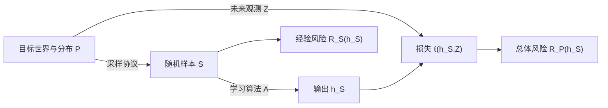

# 统计学习问题的对象合同

> [!abstract] 本章主问题
> 一个统计学习问题不是“拿数据训练模型”这一句话，而是一份至少写明**观测空间、未知数据律、采样机制、可输出预测器、学习算法、损失和目标风险**的对象合同；只有合同完整，“训练成功”“泛化良好”“有 $95\%$ 保证”才具有可检验的数学含义。

> [!question] 初学者读完必须能回答
> 1. 一个统计学习问题最少需要声明哪些空间、随机对象、算法与目标？
> 2. 未知分布 $P$、随机样本 $S$ 和已经观测到的数据集 $s$ 为什么不是同一个对象？
> 3. predictor、hypothesis class、learner 与 parameterization 的定义域/陪域分别是什么？
> 4. loss 与 target distribution 怎样共同决定“最好”的含义？
> 5. “以 $95\%$ 概率泛化”中的概率究竟对哪一层随机性取？
> 6. 如何把一个自然语言 AI 任务改写成可证伪、可复现的对象合同？

先用下图回答一个视觉问题：**从未知世界到学习输出，一份完整合同必须让哪些对象依次通过哪些映射，才有资格谈风险与泛化？**

![[00-知识库管理/_assets/figures/learning-theory/fig-learning-problem-object-contract-v2.svg|880]]

> [!figure] 图 20.1.1｜统计学习问题的七对象合同
> A 从 population law $P$、sampling protocol、random sample $S$ 到 realized dataset $s$，区分世界、抽样与观测；B 把 learner $A:(S,U)\mapsto h_{S,U}$ 与 parameter representation、hypothesis class 分层；C 用 loss $\ell$ 定义 population risk $R_P$，再明确 excess/gap/utility 等验收声明。来源：独立绘制；理论接口参考 Shalev-Shwartz–Ben-David 的学习问题形式化与统计决策框架；生成脚本：[[plot_learning_problem_decision_v2.py]]；确定性结构示意，无随机种子。

**怎样读图。** 先沿 A 写出每层的类型与随机来源，尤其不要把随机变量 $S$ 与某次 realization $s$ 混写；再沿 B 区分函数集合 $\mathcal H$、选择规则 $A$ 与参数坐标 $\theta$；最后用 C 反向审计一句“模型更好”，检查它是否同时声明 target population、action、loss、comparator 和 confidence probability。

**适用边界（图没有证明什么）。** 图只提供对象与箭头的类型合同，不证明某个 learner 可学习、可计算或会泛化。它省略 measurability、existence of minimizers、distribution shift 与 causal intervention 等技术条件；监督、自监督、生成和强化学习还会加入不同 observation/action/trajectory 结构。完整合同也不等于已有足够数据识别其中的未知对象。

## 一、学完本章应能做什么

1. 把一个自然语言 AI 任务改写成完整统计学习合同；
2. 区分输入空间 $\mathcal X$、标签空间 $\mathcal Y$、动作空间 $\mathcal A$ 与完整观测空间 $\mathcal Z$；
3. 区分未知分布 $P$、随机样本 $S$、已经观测到的数据集 $s$；
4. 写出学习算法 $A$ 与它输出的随机预测器 $h_S$；
5. 指出随机性来自样本、算法、测试对象还是部署环境；
6. 解释为何没有损失与目标分布就没有“最好模型”；
7. 将监督、自监督、无监督任务放进同一个 decision-theoretic 框架；
8. 识别一次实验报告中缺失的对象与偷换的量词。

## 二、从一个具体任务开始：垃圾邮件分类

暂时考虑最简单的二分类：输入是一封邮件，经预处理得到向量 $x$；标签 $y=1$ 表示垃圾邮件，$y=0$ 表示正常邮件。我们有 $m$ 封已标注邮件，希望输出一个规则，给未来邮件分类。

自然语言中隐藏着一整套问题：

- “未来邮件”从哪里来？是否与训练邮件属于同一时期、语言和用户群？
- 邮件怎样被向量化？原始文本和模型输入是否同一对象？
- 误杀一封正常邮件与漏掉一封垃圾邮件是否代价相同？
- 输出的是硬标签、垃圾概率还是一个供人工复核的分数？
- 学习器能选择哪些规则？训练随机种子是否算算法的一部分？
- 我们要控制平均错误、最坏用户错误，还是某一类的召回率？

统计学习从来不是先回答“用 Transformer 还是树模型”，而是先把这些对象固定。

## 三、最小七对象合同

### 3.1 空间：什么可以被观察、预测和执行

监督学习常写

$$
\mathcal Z=\mathcal X\times\mathcal Y,
$$

其中：

| 对象 | 垃圾邮件例子 | 一般含义 |
|---|---|---|
| $\mathcal X$ | token 序列或特征向量集合 | 模型可见的输入空间 |
| $\mathcal Y$ | $\{0,1\}$ | 真实结果/标签空间 |
| $\mathcal A$ | $\{0,1\}$ 或 $[0,1]$ | 模型允许采取的预测动作 |
| $\mathcal Z$ | $\mathcal X\times\mathcal Y$ | 一个完整受监督观测的空间 |

$\mathcal A$ 与 $\mathcal Y$ 不必相同。真实标签可能是类别 $y\in\{1,\ldots,K\}$，模型动作却是概率向量 $a\in\Delta^{K-1}$；log loss 评价概率动作，0–1 loss 评价最终类别动作。

> [!warning] 原始对象、观测与张量不是同一层
> 一封邮件、经过清洗的文本、token id 序列、embedding 张量分别属于现实对象、观测协议、编码和计算表示。任何一步丢失的信息，都改变了学习器实际上能解决的问题。

### 3.2 未知世界：数据生成分布 $P$

令

$$
Z=(X,Y)\sim P,
$$

其中 $P$ 是 $\mathcal Z$ 上的概率分布。$P$ 不只是“数据集的直方图”；它编码未来输入多常见、标签有多不确定以及二者如何相关。

在经典 setting 中，$P$ 未知但固定。学习器看不到 $P$ 本身，只看到它产生的有限样本。若部署期数据来自另一个分布 $Q$，那么要评价的是 $R_Q$，不能继续默认为 $R_P$。

### 3.3 随机样本 $S$ 与实现值 $s$

长度为 $m$ 的训练样本写成

$$
S=(Z_1,\ldots,Z_m).
$$

大写 $S$ 表示随机变量；训练完成后磁盘里那一份具体数据写成

$$
s=(z_1,\ldots,z_m).
$$

经典独立同分布合同是

$$
S\sim P^m,
$$

但这只是一个可审计假设，详见[[数据生成分布与采样假设]]。

### 3.4 预测器与假设空间

一个确定性预测器是函数

$$
h:\mathcal X\to\mathcal A.
$$

学习器允许考虑的函数集合记为

$$
\mathcal H\subseteq\mathcal A^{\mathcal X}.
$$

例如线性二分类器类可写成

$$
\mathcal H=
\left\{x\mapsto \mathbf 1\{w^\top x+b\ge 0\}:w\in\mathbb R^d,b\in\mathbb R\right\}.
$$

这里的 $h$ 是输入到动作的函数，不等于保存它的参数向量；多组参数可能表示同一函数，见[[预测器、假设空间与学习算法]]。

### 3.5 学习算法 $A$

确定性学习算法是映射

$$
A:\mathcal Z^m\to\mathcal H,
\qquad
h_S=A(S).
$$

若训练使用随机初始化、mini-batch 顺序、dropout 或采样，则应写

$$
h_{S,U}=A(S,U),
$$

其中 $U$ 是算法随机性。理论声明必须说明概率是只对 $S$，还是同时对 $(S,U)$ 取得。

### 3.6 损失函数 $\ell$

损失把预测动作与真实结果转成代价：

$$
\ell:\mathcal A\times\mathcal Y\to[0,\infty].
$$

二分类 0–1 损失为

$$
\ell_{01}(a,y)=\mathbf 1\{a\ne y\}.
$$

若误杀正常邮件的代价是漏判垃圾邮件的五倍，就应写 cost-sensitive loss，而不能用 accuracy 替代业务目标。

### 3.7 目标风险

固定预测器 $h$ 在分布 $P$ 上的总体风险为

$$
R_P(h)
=\mathbb E_{(X,Y)\sim P}\bigl[\ell(h(X),Y)\bigr].
$$

学习算法的输出依赖随机样本，所以最终目标是随机量

$$
R_P(h_S)=R_P(A(S)).
$$

理论可能控制它的期望，也可能给出高概率结论，例如

$$
\Pr_{S\sim P^m}
\left(R_P(h_S)\le \varepsilon\right)\ge 1-\delta.
$$

这句话中的 $m,\varepsilon,\delta,P,A,\ell$ 缺一不可。

## 四、对象之间的方向不能倒置

关键方向是 $P\to S\to h_S$。训练数据影响输出，输出再在未知世界中承担损失。把 $h_S$ 当成预先固定，会错误地消掉 data dependence；把数据集经验分布当作 $P$，则会把训练误差误认成目标误差。

## 五、随机性账本

同一个公式中可能有四类随机性：

| 随机源 | 记号 | 典型问题 |
|---|---|---|
| 训练样本 | $S\sim P^m$ | 换一批数据会不会得到坏模型？ |
| 算法随机性 | $U$ | 换 seed 会不会显著改变输出？ |
| 新测试对象 | $Z\sim P$ | 一个固定模型的平均未来损失是多少？ |
| 环境/任务变化 | $Q$ 或 $P_t$ | 部署分布已变，原保证是否仍适用？ |

例如

$$
\mathbb E_{S,U}R_P(h_{S,U})
$$

是对训练数据与训练随机性平均后的 expected risk；而

$$
\Pr_{S,U}\!\left(R_P(h_{S,U})\le \varepsilon\right)\ge1-\delta
$$

是一次训练以高概率得到好模型的保证。两者不等价：很小的平均风险仍可能隐藏小概率灾难性训练。

## 六、监督、无监督、自监督如何进入同一框架

七对象合同不是只能描述标签分类。更一般地，给定 observation $Z\sim P$，学习器输出决策对象 $h$，并由任务 functional $L(h;Z)$ 评价。

| 范式 | 学习输入 | 输出对象 | 训练目标 | 最终必须另外说明的目标 |
|---|---|---|---|---|
| 监督学习 | $(X,Y)$ | $X\to A$ 的预测器 | label-based empirical loss | 同分布或部署分布上的预测风险 |
| 密度估计 | $X$ | 分布/密度 $q$ | negative log likelihood 等 | density fit、sampling 或 downstream utility |
| 聚类 | $X$ | partition/centers | within-cluster distortion 等 | 稳定性、语义或下游价值 |
| 自监督 | $X$ 及其 views/masks | representation/conditional predictor | pretext loss | transfer、probe 或 fine-tune 风险 |

因此“无标签”不等于“没有目标合同”。自监督训练 loss 只定义 pretext task；它为何帮助下游，需要额外的 distribution、augmentation 与 task-related assumption。

## 七、一个完整合同示例

考虑垃圾邮件硬分类：

$$
\begin{aligned}
&\mathcal X=\{\text{token sequences of length}\le 512\},\qquad
\mathcal Y=\mathcal A=\{0,1\},\\
&P=\text{2026 年目标用户群中邮件与人工标签的联合分布},\\
&S\sim P^m,\\
&\mathcal H=\{h_\theta:\theta\in\Theta\},\\
&h_{S,U}=A(S,U),\\
&\ell(a,y)=5\mathbf1\{a=1,y=0\}+\mathbf1\{a=0,y=1\},\\
&\text{target}=R_P(h_{S,U}).
\end{aligned}
$$

如果实际训练数据来自历史用户 $P_{\rm train}$，部署来自 $P_{\rm deploy}$，则最后一行应改为 $R_{P_{\rm deploy}}$，并且“为何能从前者推断后者”成为额外假设，而不是记号上的小改动。

## 八、手算：相同 accuracy，不同决策问题

设 100 封邮件中有 10 封垃圾邮件。

- 模型 $h_1$：错杀 2 封正常邮件，漏掉 3 封垃圾邮件；
- 模型 $h_2$：错杀 4 封正常邮件，漏掉 1 封垃圾邮件。

二者 accuracy 都是 $95\%$。若普通 0–1 loss，则经验风险都是 $0.05$。若错杀成本为 5、漏判成本为 1：

$$
\widehat R(h_1)=\frac{5\cdot2+1\cdot3}{100}=0.13,
$$

$$
\widehat R(h_2)=\frac{5\cdot4+1\cdot1}{100}=0.21.
$$

“哪个模型更好”不是预测表本身决定的，而由动作、损失与目标人群共同决定。

## 九、最常见的六种合同破损

> [!danger] 不能接受的缩写
> 1. “数据服从分布”却不说 train/test/deploy 是哪个分布；
> 2. “模型为 $\theta$”却不定义 $\theta$ 如何诱导函数；
> 3. “误差很小”却不说 loss、metric 与 reduction；
> 4. “以概率 $1-\delta$”却不说概率对谁取得；
> 5. “样本量是 $m$”却把相关增强样本当成 $m$ 次独立抽样；
> 6. “泛化到新任务”却仍使用原任务的 $P$ 和 $\ell$。

## 十、AI 研究中的四层审计

| 层 | 论文/项目必须回答 | 失败后果 |
|---|---|---|
| 数据层 | population 是谁？采样、过滤、去重、标注如何做？ | 无法解释 selection bias 与 leakage |
| 模型层 | 输出函数类与参数化是什么？ | capacity 与 identifiability 失真 |
| 算法层 | optimizer、seed、early stopping、augmentation 是什么？ | 把 algorithmic effect 误算成 class effect |
| 评价层 | target distribution、loss、metric、uncertainty 是什么？ | benchmark 分数无法外推 |

大语言模型预训练也遵守这张表：语料选择定义观测分布，next-token loss 定义训练 decision，Transformer 与 tokenizer 定义表示和函数类，sampling/decoding 定义部署动作，而“有帮助、真实、安全”不是 next-token loss 自动保证的同义词。

## 十一、边界与后续路线

- 本章只建立问题合同，不证明任何泛化界；
- $S\sim P^m$ 的精确定义、相关数据反例与增强边界见[[数据生成分布与采样假设]]；
- 参数空间、函数类与算法的区别见[[预测器、假设空间与学习算法]]；
- $R_S$ 与 $R_P$ 的严格关系见[[损失、总体风险与经验风险]]；
- 最优可能风险与 Bayes decision 在 LT-06 建立；
- “存在 learner”与“某算法好用”的量词区别在 PAC/VC 卷建立。

## 十二、复习清单

- [ ] 我能写出 $\mathcal X,\mathcal Y,\mathcal A,\mathcal Z,P,S,\mathcal H,A,\ell,R_P$；
- [ ] 我能指出 $S$、$U$、$Z$ 与 deployment shift 四类随机性；
- [ ] 我不会把参数、预测器、假设空间和学习算法混用；
- [ ] 我不会在缺少损失与目标分布时比较模型；
- [ ] 我能把一个自监督目标与下游评价拆成两份合同。

## 来源

- [[S-2014-Shalev-Shwartz-Ben-David-Understanding-Machine-Learning]]：正式统计学习框架与后续 ERM/PAC 主线；
- 图示脚本：`00-知识库管理/_labs/code/plot_learning_problem_contract.py`。
