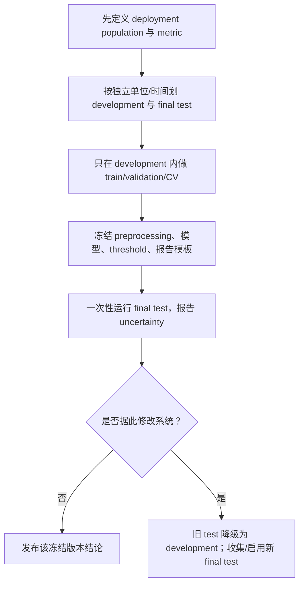

# 训练集、验证集、测试集与自适应复用

> [!abstract] 本章主问题
> train、validation、test 的区别不是文件名，而是信息是否反馈进学习算法：训练集拟合候选，验证集选择 pipeline，因此属于 meta-learner 的输入；只有在整个 pipeline 冻结后仍与模型选择独立、且来自目标分布的 final test，才能提供条件无偏评价。反复查看 test/leaderboard 后继续修改模型，会把 holdout 变成训练信号，必须支付选择复杂度、限制反馈信息或重新收集独立测试集。

> [!question] 初学者读完必须能回答
> 1. Train、validation 与 final test 的角色怎样由 information flow 而不是文件名定义？
> 2. 为什么 validation selection 使最终模型依赖 $S_{va}$，即使它不参与 gradient？
> 3. 独立 test estimate 对冻结模型的 conditional unbiasedness 需要哪些条件？
> 4. 从固定 $K$ 个候选中选择为什么要支付 $\log K$，adaptive querying 又多了什么问题？
> 5. Data leakage、selection bias、sampling noise 与 distribution shift 如何区分？
> 6. Nested CV、reusable holdout、leaderboard 与重新收集 test set 分别解决什么？

先用下图回答一个视觉问题：**train、validation、test 的统计角色怎样由反馈箭头决定，什么时候 final holdout 会悄悄变成学习算法的输入？**

![[00-知识库管理/_assets/figures/learning-theory/fig-train-validation-test-feedback-v2.svg|880]]

> [!figure] 图 20.1.8｜Train、validation、test 与自适应反馈
> A 将 train 拟合 candidates 与 validation 选择 pipeline 串联，说明 validation 属于 meta-learner；B 让 frozen pipeline 与 fresh final test 产生 reported estimate；C 以 leaderboard 结果返回 developer 的虚线闭环表示 adaptive test reuse。来源：独立绘制；理论接口参考 holdout selection、adaptive data analysis 与 evaluation protocols；生成脚本：[[plot_learning_problem_decision_v2.py]]；确定性信息流图，无随机种子。

**怎样读图。** A 先把 preprocessing、architecture、checkpoint 和 threshold selection 全部算进最终 pipeline，判断哪些数据影响了它；B 再以“模型先冻结、test 后抽样且来自 target $P$”为条件读取 unbiasedness/concentration；C 最后数反馈回合和候选复杂度，任何 test/leaderboard signal 只要改变后续开发决策，就使最终 $h$ 依赖原 holdout。

**适用边界（图没有证明什么）。** 图没有给 reusable-holdout、differential privacy、max-information 或 adaptive concentration 的具体 bound。Fresh test 只能审计其 sampling target，不能消除 covariate/concept shift、label error 或 subgroup uncertainty；固定 $K$ 的 $\log K$ 直觉也不适用于无限/连续、强自适应搜索而不加复杂度控制。Cross-validation 与 retraining 仍需明确最终 estimand。

## 一、学习目标

1. 用组合算法定义 train、validation 与 test 的统计角色；
2. 推导独立测试集对已冻结模型的条件无偏性；
3. 推导固定 $K$ 个候选模型的 simultaneous holdout bound；
4. 解释 validation selection 为何要支付 $\log K$ 或更一般 complexity；
5. 区分 non-adaptive multiple comparison 与 adaptive querying；
6. 构造反复 test reuse 的过拟合机制；
7. 区分 data leakage、selection bias、distribution shift 与 test sampling noise；
8. 解释 cross-validation、nested CV、retraining 与 final test 的角色；
9. 为 group/time/benchmark/LLM evaluation 设计合法协议；
10. 知道 reusable holdout、description length、privacy/max-information 的适用边界。

## 二、三份数据是三种信息角色

### 2.1 training set

$$
S_{tr}\sim P^{n_{tr}}
$$

用于拟合 parameters、representation、feature statistics 或 base model：

$$
h_{\lambda}=A_{\lambda}(S_{tr},U),
$$

其中 $\lambda$ 表示 architecture、regularization、prompt template、checkpoint rule 等候选配置。

### 2.2 validation set

$$
S_{va}\sim P^{n_{va}}
$$

用于选择

$$
\widehat\lambda
\in\arg\min_{\lambda\in\Lambda}R_{S_{va}}(h_\lambda).
$$

最终输出

$$
\widehat h
=h_{\widehat\lambda}
=A_{\rm meta}(S_{tr},S_{va},U).
$$

所以 validation 没直接更新 gradient 也仍参与**最终学习算法**。

### 2.3 final test set

$$
T\sim P_*^{n_{te}}
$$

在 pipeline 冻结后估计

$$
R_{P_*}(\widehat h).
$$

若 $P_*\ne P$，test 还承担 target environment 定义；如果 test collection 不能代表 deployment，独立性也救不了 external validity。

## 三、独立测试为什么条件无偏

假设 $\widehat h$ 由 $(S_{tr},S_{va},U)$ 决定，且

$$
T=(Z'_1,\ldots,Z'_{n_{te}})
\sim P_*^{n_{te}}
$$

与这些变量独立。条件于开发信息

$$
\mathcal D=(S_{tr},S_{va},U),
$$

$\widehat h$ 已固定：

$$
\begin{aligned}
\mathbb E_T[R_T(\widehat h)\mid\mathcal D]
&=\frac1{n_{te}}
\sum_j\mathbb E_{Z'_j\sim P_*}
[\ell(\widehat h,Z'_j)\mid\mathcal D]\\
&=R_{P_*}(\widehat h).
\end{aligned}
$$

若 loss 方差为 $\sigma^2(\widehat h)$，条件方差为

$$
\operatorname{Var}_T(R_T(\widehat h)\mid\mathcal D)
=\frac{\sigma^2(\widehat h)}{n_{te}}.
$$

这说明测试集提供的是带 uncertainty 的估计，不是 population risk 真值。

## 四、固定有限候选集：选择要付 $\log K$

设 $h_1,\ldots,h_K$ 在看 validation set $V$ 前已经固定，loss 在 $[0,1]$。对每个 $k$，Hoeffding 给

$$
\Pr\left(
|R_V(h_k)-R_P(h_k)|>\varepsilon
\right)
\le2e^{-2n\varepsilon^2}.
$$

union bound：

$$
\Pr\left(
\max_{1\le k\le K}
|R_V(h_k)-R_P(h_k)|>\varepsilon
\right)
\le2K e^{-2n\varepsilon^2}.
$$

令右边为 $\delta$，得到

$$
\boxed{
\varepsilon_K(n,\delta)
=\sqrt{\frac{\log(2K/\delta)}{2n}}.
}
$$

若

$$
\widehat k\in\arg\min_kR_V(h_k),
$$

在 simultaneous event 上，令 $k^*=\arg\min_kR_P(h_k)$：

$$
\begin{aligned}
R_P(h_{\widehat k})
&\le R_V(h_{\widehat k})+\varepsilon_K\\
&\le R_V(h_{k^*})+\varepsilon_K\\
&\le R_P(h_{k^*})+2\varepsilon_K.
\end{aligned}
$$

这与 ERM bridge 完全同构：validation selection 是在有限 meta-hypothesis class 上做 ERM。

## 五、手算：候选越多，holdout 误差条带越宽

取 $n=1000,\delta=0.05$。

- $K=1$：

$$
\varepsilon_1
=\sqrt{\frac{\log40}{2000}}
\approx0.0429.
$$

- $K=100$：

$$
\varepsilon_{100}
=\sqrt{\frac{\log4000}{2000}}
\approx0.0644.
$$

- $K=10^6$：

$$
\varepsilon_{10^6}
=\sqrt{\frac{\log(4\times10^7)}{2000}}
\approx0.0936.
$$

候选数以 $\log K$ 进入，但大规模自动搜索、prompt iteration、feature screening 和 leaderboard submissions 仍会产生实质选择成本。

## 六、为什么最小 validation score 通常乐观

假设所有候选真实风险相同：

$$
R_P(h_k)=r,
$$

而 validation estimate 为

$$
R_V(h_k)=r+\xi_k,\qquad \mathbb E\xi_k=0.
$$

选择最小者得到

$$
R_V(h_{\widehat k})=r+\min_k\xi_k.
$$

只要噪声非退化且 $K>1$，通常

$$
\mathbb E\min_k\xi_k<0.
$$

因此 reported best validation score 向下偏。若 $\xi_k$ 近似独立 Gaussian$(0,\sigma^2)$，极值量级约为

$$
-\sigma\sqrt{2\log K},
$$

这里只作直觉近似；候选预测通常相关，精确偏差取决于 covariance 与 selection procedure。

## 七、non-adaptive 与 adaptive reuse 的分界

### 7.1 non-adaptive finite candidates

候选 $h_1,\ldots,h_K$ 在看 holdout 前全部固定。union bound 或 validation class complexity 可处理。

### 7.2 adaptive analysis

第 $t$ 个候选依赖此前 holdout 返回：

$$
h_t=\mathcal A_t(a_1,\ldots,a_{t-1},S_{\rm tr}),
$$

$$
a_t\approx R_T(h_t).
$$

现在 $h_t$ 与 $T$ 相关。分析者可逐步探测 test 的随机波动甚至重建其特征；不能假装每轮都是“一个预先固定模型的独立评价”。

[[S-2015-Dwork-Adaptive-Data-Analysis-Holdout-Reuse]]用 differential privacy、description length 与 approximate max-information 建立受控复用方法。核心不是“加噪声总能解决”，而是限制从 holdout 释放给 adaptive analyst 的信息。

## 八、一个极端 adaptive 反例

设 test 输入 $x_1,\ldots,x_n$ 和标签 $y_1,\ldots,y_n$。若评价接口允许无限精细地查询各种函数经验均值，分析者可能逐步恢复 label 信息，最后构造

$$
h_T(x_i)=y_i
$$

在 test 上风险 0，而在独立新样本上仍接近随机猜测。

公开 leaderboard 通常不会直接暴露所有标签，但高精度分数、无限提交与可控 prediction changes 会形成侧信道。这就是 submission limit、private test split、score rounding 和 periodic refresh 的统计意义。

## 九、cross-validation 到底估计什么

$K$-fold CV 把 development data 分成 $K$ 份，每轮用 $K-1$ 份训练、一份验证，平均 validation loss：

$$
\widehat R_{CV}(\lambda)
=\frac1K\sum_{j=1}^KR_{V_j}
(A_\lambda(S_{-j})).
$$

它主要用于：

- 选择 hyperparameter $\lambda$；
- 估计“在约 $(K-1)/K$ 数据上训练该算法”的表现；
- 降低单一 split 的偶然性。

选出 $\widehat\lambda$ 后常在全部 development data 上重新训练。这一 final model 与各 fold model 不同，因此最终性能仍最好由独立 test 估计。

### nested CV

若数据很少又要估计整个 model-selection procedure，可用：

- inner folds：选择 hyperparameters；
- outer folds：评价包含选择在内的 pipeline。

outer score 不应反馈到 inner development；若不断根据 outer 结果重写 pipeline，outer fold 也被自适应用作 validation。

## 十、随机切分不保证合法

延续[[数据生成分布与采样假设]]：

| 任务结构 | 错误 split | 正确方向 |
|---|---|---|
| 同一患者多图 | image-level random split | patient/group split |
| 时间预测 | 混合过去未来 | temporal forward split |
| 文档切块 | chunk-level split | source-document/lineage split |
| 推荐/广告 | 同用户事件跨 split | user/time/policy-aware split |
| 数据增强 | views 分散到不同 split | base example 先分组再增强 |
| benchmark 污染 | 只做 exact dedup | semantic/near-duplicate/provenance audit |

集合文件不相交是必要的工程检查，却不是随机变量独立和 target representativeness 的充分条件。

## 十一、泄漏的六种类型

1. **label leakage**：feature 含预测时不可得的 label 后果；
2. **preprocessing leakage**：用全数据 fit normalization、feature selection、tokenizer 决策；
3. **group leakage**：同一实体跨 split；
4. **time leakage**：未来进入过去；
5. **duplicate/contamination**：相同或近似内容跨 train/test；
6. **adaptive evaluation leakage**：test score/错误案例反复反馈到开发。

前五类改变数据合同；第六类改变算法与 holdout 的独立性。它们的修复方法不同。

## 十二、final test 不是“看一眼”这么简单

“只使用一次”更准确的含义是：

- 在读取结果前冻结 code、weights、threshold、metric 与 subgroup analysis plan；
- 读取后可以发布结果、做诊断，但若继续修改模型，修改后的版本需要新 final test；
- 多个预注册 metrics 可一起报告，并根据问题调整 multiplicity/uncertainty；
- 测试失败不意味着不能研究原因，而是不能继续把同一测试集称为对新版本的独立 final evidence。

## 十三、测试不确定性

二分类 0–1 loss 下，若冻结模型在 $n$ 个独立 test examples 上错 $e$ 个：

$$
\widehat R_T=\frac en.
$$

标准误的 plug-in 近似为

$$
\operatorname{SE}
\approx\sqrt{\frac{\widehat R_T(1-\widehat R_T)}{n}},
$$

但小样本/极端概率应使用 Wilson、Clopper–Pearson 或 concentration interval，而不是机械 Wald interval。比较两个模型最好在同一 test examples 上用 paired differences，利用相关性降低方差。

## 十四、LLM 与公开 benchmark 的特殊问题

大模型评估常同时面临：

- pretraining contamination，test 已进入训练分布；
- prompt/template tuning，benchmark 被用作 validation；
- 多模型、多 checkpoint、多 decoding 配置选择；
- evaluator model 与训练偏好模型共享数据；
- human evaluation 的 annotator/group/time shift；
- 公布错误样例后整个社区共同 adaptive overfitting。

应补充 private/rotating test、canary/provenance、submission budget、预注册 prompt、held-out task families 和真正新收集的 temporal evaluation。

## 十五、可执行评价协议

## 十六、常见错误

> [!danger] 五条错误捷径
> - “validation 不反向传播，所以没参与训练”；
> - “文件不重叠，所以数据独立”；
> - “test 很大，所以可以无限次查看”；
> - “只调了一点 prompt，不算针对 benchmark 调参”；
> - “cross-validation 后最优分数就是 final unbiased performance”。

正确问题永远是：最终输出 $\widehat h$ 是否为评价数据 $T$ 的函数？若是，就要把这种依赖纳入复杂度/信息分析，或换新独立 test。

## 十七、复习清单

- [ ] 我能把 validation 写进 meta-learner；
- [ ] 我能证明独立 test 的条件无偏性；
- [ ] 我能推导 $\sqrt{\log(2K/\delta)/(2n)}$；
- [ ] 我能解释 selection optimism；
- [ ] 我能区分 finite non-adaptive 与 adaptive reuse；
- [ ] 我能设计 group/time/nested split；
- [ ] 我会同时报告 test point estimate 与 uncertainty；
- [ ] 若 test 反馈导致模型改变，我会要求新的 final test。

## 来源

- [[S-2017-Su-4638-训练验证测试集]]：train/validation/test 角色的中文入口；
- [[S-2015-Dwork-Adaptive-Data-Analysis-Holdout-Reuse]]：adaptive reuse、reusable holdout 与 information-control 主线；
- [[S-2014-Shalev-Shwartz-Ben-David-Understanding-Machine-Learning]]：fixed learner、risk 与 finite-sample learning 框架；
- 图示脚本：`00-知识库管理/_labs/code/plot_risk_decision_evaluation_contract.py`。
