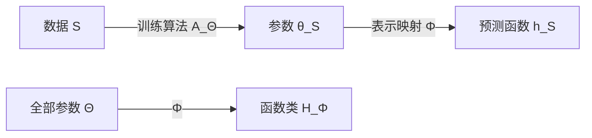

# 预测器、假设空间与学习算法

> [!abstract] 本章主问题
> 参数 $\theta$ 是函数的表示，预测器 $h_\theta$ 是实际决策规则，假设空间 $\mathcal H$ 是允许输出的函数集合，学习算法 $A$ 则是从样本到函数的选择机制；同一 $\mathcal H$ 上的不同算法可以有完全不同的稳定性与泛化，同一函数也可能对应大量参数，因此不能把 parameter count、function class 与 optimizer 混成一个“模型”。

> [!question] 初学者读完必须能回答
> 1. Predictor、hypothesis、hypothesis class、parameter space 与 learner 分别是什么类型的对象？
> 2. 为什么表示映射 $\Phi:\Theta\to\mathcal H$ 常常不是单射？
> 3. Parameter count 为什么不能直接等同于不同预测函数的数量或有效容量？
> 4. 同一 $\mathcal H$ 上的不同 initialization、optimizer、regularizer 与 stopping rule 如何改变输出 law？
> 5. Proper/improper 与 deterministic/randomized learner 分别改变哪一层陪域或随机性？
> 6. Data-dependent hypothesis class 为什么会改变需要证明的对象？

先用下图回答一个视觉问题：**参数、预测函数集合与学习算法为什么是三张不同地图，同一函数的多重参数表示又怎样影响容量与稳定性讨论？**

![[00-知识库管理/_assets/figures/learning-theory/fig-predictor-class-learner-v2.svg|880]]

> [!figure] 图 20.1.3｜参数表示、函数类与学习算法三层地图
> A 以多组 $\theta$ 汇聚到同一 $h$ 表示 parameterization 的 many-to-one symmetry；B 将 $\mathcal H\subseteq\mathcal A^{\mathcal X}$ 画成预测函数集合而非参数容器；C 让 sample $S$ 与 seed $U$ 共同进入 algorithm $A$，输出 random predictor $h_{S,U}$。来源：独立绘制；理论接口参考 hypothesis classes、randomized learners 与 parameter symmetries；生成脚本：[[plot_learning_problem_decision_v2.py]]；确定性结构示意，无随机种子。

**怎样读图。** A 先固定预测函数不变，沿不同参数路径理解 permutation/scaling symmetry，避免用 parameter distance 代替 function distance；B 再把 architecture/constraints 解释为候选 functions 的集合；C 最后把 optimizer、regularizer、initialization、early stopping 和 numerical tolerance 全部纳入 learner，比较的是 $S\mapsto h_S$ 的输出行为而不只是同一个类名。

**适用边界（图没有证明什么）。** 图没有计算 VC/Rademacher/covering complexity，也不声称 parameter symmetries 是唯一冗余来源。相同 function class 的不同算法可以泛化不同，但图不提供稳定性或隐式偏置定理；在 data-dependent representation/class、pretraining 或 continual learning 中，$\mathcal H$ 本身还可能依赖额外数据，需扩展概率空间和条件化方式。

## 一、学习目标

1. 精确定义 predictor、hypothesis、hypothesis class、parameterization 与 learner；
2. 画出 $\Theta\to\mathcal H$ 与 $\mathcal Z^m\to\mathcal H$ 两条不同映射；
3. 构造“不同参数、相同函数”的例子；
4. 解释同一函数类上不同算法为何可能输出不同预测器；
5. 区分 proper/improper、deterministic/randomized、batch/online learner；
6. 说明 regularization、early stopping 与 initialization 属于算法或有效搜索空间的哪一层；
7. 识别 data-dependent hypothesis class 带来的证明风险；
8. 对神经网络声明进行 function-space 与 parameter-space 双重审计。

## 二、四个对象，一次分清

### 2.1 预测器 $h$

确定性预测器是函数

$$
h:\mathcal X\to\mathcal A.
$$

它回答“给定输入，采取什么预测动作”。在回归中 $\mathcal A=\mathbb R$；在概率分类中 $\mathcal A=\Delta^{K-1}$；在语言模型中，$h(x)$ 可能是 vocabulary 上的条件分布。

### 2.2 假设空间 $\mathcal H$

$$
\mathcal H\subseteq \mathcal A^{\mathcal X}
$$

是学习器获准输出的函数集合。它表达归纳偏置：线性类假设决策边界简单，卷积类编码局部共享，equivariant architecture 限制变换下的函数行为。

### 2.3 参数空间与表示映射

计算实现通常选择参数空间 $\Theta$ 和表示映射

$$
\Phi:\Theta\to\mathcal A^{\mathcal X},
\qquad
\Phi(\theta)=h_\theta.
$$

由它诱导的函数类为

$$
\mathcal H_\Phi=\Phi(\Theta)=\{h_\theta:\theta\in\Theta\}.
$$

$\Phi$ 往往不是单射：

$$
\theta_1\ne\theta_2
\quad\text{但}\quad
h_{\theta_1}=h_{\theta_2}.
$$

### 2.4 学习算法 $A$

确定性 batch learner 是

$$
A:\mathcal Z^m\to\mathcal H,
\qquad h_S=A(S).
$$

若算法先输出参数，则写

$$
A_\Theta:\mathcal Z^m\to\Theta,
\qquad
h_S=\Phi(A_\Theta(S)).
$$

随机算法还接收 $U$：

$$
A_\Theta:\mathcal Z^m\times\mathcal U\to\Theta.
$$

## 三、两条映射不能混在一起

第一条路线 $S\mapsto\theta_S\mapsto h_S$ 说明**算法实际输出什么**；第二条路线 $\Theta\mapsto\mathcal H_\Phi$ 说明**哪些函数原则上可表示**。

常见偷换是：

- 用参数总数代替函数类复杂度；
- 用“网络可表示某函数”代替“SGD 能从有限数据找到该函数”；
- 用某 optimizer 的经验偏置代替 architecture 的显式限制；
- 用参数距离代替函数距离或预测差异。

## 四、手算一：无穷多参数表示同一线性函数

取参数

$$
\theta=(a,b)\in\mathbb R^2,
$$

定义

$$
h_{a,b}(x)=(a+b)x.
$$

表示映射只通过 $a+b$ 影响函数。因此所有满足

$$
a+b=c
$$

的参数都表示同一个 $h(x)=cx$。例如

$$
(a,b)=(1,0),(0,1),(2,-1)
$$

都表示 $h(x)=x$。

对应 fiber（原像）是

$$
\Phi^{-1}(h_c)=\{(a,b):a+b=c\},
$$

即参数平面中的一条直线。沿方向 $(1,-1)$ 移动，函数完全不变。

于是：

1. 参数 Hessian 在冗余方向上可能奇异；
2. 参数估计不唯一，不代表预测函数不可确定；
3. parameter norm 会在同一 function fiber 上变化；
4. 要讨论函数复杂度，必须检查量是否在等价类上良定义。

## 五、神经网络中的对称性不只是玩具

两层 ReLU 网络

$$
h(x)=W_2\sigma(W_1x)
$$

利用 $\sigma(cx)=c\sigma(x)$（$c>0$），可作变换

$$
W_1\mapsto cW_1,
\qquad
W_2\mapsto c^{-1}W_2,
$$

而保持 $h$ 不变。隐藏单元置换也常保持函数不变。

但参数惩罚

$$
\|W_1\|_F^2+\|W_2\|_F^2
$$

会随 $c$ 改变。[[S-2020-Su-7681-L2正则与尺度不变性]]用这一现象提醒我们：parameter-space L2 同时约束函数与同一函数的尺度代表，不能无条件视为 function-invariant complexity。

> [!warning] 不要反向过度推论
> “参数范数依赖表示”不等于“所有范数界都无效”。path norm、spectral product、normalized margin 等量正是在尝试匹配函数与参数化结构；每种量仍需检查 invariance、data dependence 与 bound tightness。

## 六、同一假设空间，不同算法

取训练样本

$$
S=\{(-2,0),(-1,0),(1,1),(2,1)\}
$$

和一维阈值类

$$
\mathcal H=\{h_t(x)=\mathbf1\{x\ge t\}:t\in\mathbb R\}.
$$

所有 $t\in(-1,1]$ 都有零训练错误。两个 ERM tie-breaking rule 可以是：

$$
A_{\rm left}(S)=h_{-1+0^+},
\qquad
A_{\rm mid}(S)=h_0.
$$

两者属于同一 $\mathcal H$，训练风险同为零，却可能对区间 $(-1,0)$ 作不同预测。若真实分布在该区间有质量，总体风险便不同。

所以“ERM 的泛化”往往还需要说明：结论是否对**任意**经验最小化解成立，还是依赖某个 tie-breaker、regularizer 或 optimization path。

## 七、算法的常见分类

| 分类 | 定义 | 例子/注意 |
|---|---|---|
| proper learner | $A(S)\in\mathcal H$ | ERM 在指定类中选函数 |
| improper learner | 输出可在更大类 $\mathcal H'\supsetneq\mathcal H$ | aggregation、某些 boosting/privatization 方法 |
| deterministic | 相同 $S$ 总输出相同 $h$ | 闭式 ridge、固定 tie-breaking |
| randomized | 输出还依赖 $U$ | SGD、dropout、posterior sampling |
| batch | 一次读完整样本 | 经典 ERM |
| online | 每轮预测、看反馈再更新 | OGD、experts、bandit |
| passive | 数据分布不由 learner 选择 | 标准 i.i.d. setting |
| active/adaptive | learner 决定查询或收集什么 | active learning、Bayesian optimization |

“proper”不是“正确”，“improper”也不是违规；它只是说明输出是否被限制在 target class 中。

## 八、regularization 到底属于哪一层

考虑

$$
\widehat\theta
\in\arg\min_{\theta\in\Theta}
\left\{R_S(h_\theta)+\lambda\Omega(\theta)\right\}.
$$

可以有三种解读：

1. **算法解读**：在同一 $\mathcal H_\Phi$ 内用 $\Omega$ 选择一个解；
2. **约束类解读**：Lagrange 对偶条件合适时，近似等价于 $\Omega(\theta)\le B$ 的搜索；
3. **先验/MAP 解读**：若经验项与 likelihood reduction、$\Omega$ 与 proper prior 精确匹配，可作条件性的 Bayesian mode 解释。

三者不是自动等价。early stopping、initialization、mini-batch noise 也往往在不改变 nominal architecture 的情况下，改变算法实际可到达或偏好的解。

## 九、data-dependent hypothesis class 的陷阱

标准 uniform convergence 常先固定 $\mathcal H$，再抽样 $S$。若先看数据再设计

$$
\mathcal H_S,
$$

则不能直接套用“对固定 $\mathcal H$”的概率界。

例如：先浏览全部标签，选出最相关的 100 个特征，再声称只在 100 维线性类中学习。实际上 feature selection 也是算法的一部分；若它使用 test 或 validation 标签，整个 adaptive pipeline 都进入 hypothesis search。

正确处理包括：

- 把 selection procedure 纳入 learner $A$；
- 对所有候选 class 同时控制并支付选择复杂度；
- 使用独立 data split；
- 使用 stability、PAC-Bayes 或 selective-inference 等适当工具。

## 十、函数类、算法与数据共同决定输出

可把最终模型写成

$$
h_{S,U}^{\Phi,A}=\Phi(A_\Theta(S,U)).
$$

于是一次性能变化至少有四个可能来源：

| 改动 | 主要改变 | 不应自动声称 |
|---|---|---|
| 增宽网络 | 参数化与可表示类 | 一定扩大有效函数复杂度或降低风险 |
| 换 optimizer | 选择路径与 implicit bias | architecture capacity 已改变 |
| 加 weight decay | 目标与参数代表偏好 | 就是坐标无关 Bayesian prior |
| 加数据 | sample 与算法输入 | 若数据重复/偏移，information 等比例增长 |

## 十一、AI 实例：预训练模型 + 线性探针

设表示器 $f_\phi:\mathcal X\to\mathbb R^d$ 已预训练，linear probe 为

$$
h_{w,\phi}(x)=\operatorname{softmax}(Wf_\phi(x)).
$$

- 冻结 $\phi$ 只训练 $W$：hypothesis class 是固定表示上的线性读出；
- fine-tune $(W,\phi)$：函数类与算法路径都更大；
- 只比较最终 accuracy，无法区分表示本身的线性可读性、优化难度、数据量和 regularization；
- “相同 backbone”也不等于相同 learner：augmentation、optimizer 与 early stopping 都属于 $A$。

这就是为什么 LT-60 会把 linear probe 与 fine-tuning 当成两份不同的评价合同。

## 十二、理论声明的量词审计

以下四句话强度不同：

1. 存在 $h\in\mathcal H$ 使 $R_P(h)$ 很小；
2. 存在算法 $A$ 能从有限样本找到低风险 $h$；
3. 指定算法 $A$ 以高概率找到低风险 $h$；
4. 指定计算预算内的实现能稳定、可复现地做到这一点。

representation theorem 常只回答 1；learnability 回答 2 或 3；实际 AI 系统还必须回答 4。把“存在表示”直接写成“可以学习”是典型量词跨越。

## 十三、边界与后续路线

- 本章没有比较 $R_S$ 与 $R_P$，下一章才建立风险差；
- nominal $\mathcal H$ 的容量并非解释算法泛化的唯一语言，20.4/20.5 会引入 data-dependent complexity 与 stability；
- 参数冗余不等于 function class 无限复杂；二者关系要由 VC/Rademacher/norm 等量说明；
- optimization 能否到达 ERM、到达哪个 ERM，将在 LT-05 与 LT-79 分别讨论；
- randomized output 的评价可能是 mixture predictor、posterior vote 或单次 sample，必须单独定义。

## 十四、复习清单

- [ ] 我能画出 $S\xrightarrow{A_\Theta}\theta_S\xrightarrow{\Phi}h_S$；
- [ ] 我能写出 $\mathcal H_\Phi=\Phi(\Theta)$，并解释 $\Phi$ 可能非单射；
- [ ] 我能举出同一 $\mathcal H$ 上两个不同 learner；
- [ ] 我能区分 proper、improper、deterministic 与 randomized；
- [ ] 我不会用 parameter count 直接替代 function complexity；
- [ ] 我会把 feature selection、early stopping 和 validation choice 纳入算法。

## 来源

- [[S-2014-Shalev-Shwartz-Ben-David-Understanding-Machine-Learning]]：hypothesis class、learner 与 proper/improper 主线；
- [[S-2020-Su-7681-L2正则与尺度不变性]]：神经网络参数等价与尺度依赖案例；
- 图示脚本：`00-知识库管理/_labs/code/plot_learning_problem_contract.py`。
