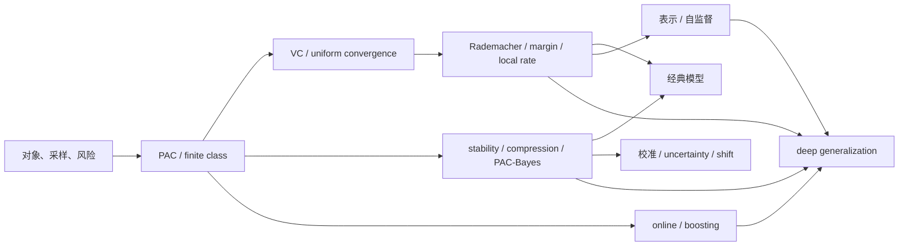

# 学习理论 MOC

> [!abstract] 核心问题
> 给定有限、带噪、可能发生偏移的数据，学习算法为什么能对未知对象作出预测？答案不能只写“模型没有过拟合”，而必须明确 data law、algorithm、hypothesis、loss、risk、probability guarantee、computation 与 evaluation protocol。

完整的 84 节范围、固定 ID、先修、掌握标准和验收规划见[[学习理论完整课程地图与掌握标准]]。

## 十卷入口

| 卷 | 入口 | 节点 | 一句话出口 |
|---|---|---:|---|
| 20.1 | [[学习问题、决策与风险 MOC]] | 8 | 把学习对象和风险写对 |
| 20.2 | [[PAC 学习与有限假设类 MOC]] | 8 | 从 concentration 到有限类保证 |
| 20.3 | [[VC 维与一致收敛 MOC]] | 8 | 用组合容量处理无限类 |
| 20.4 | [[数据依赖复杂度、间隔与快率 MOC]] | 8 | 用样本、范数和 margin 细化界 |
| 20.5 | [[稳定性、压缩、PAC-Bayes 与信息泛化 MOC]] | 8 | 建立 algorithm/posterior-dependent guarantee |
| 20.6 | [[经典模型与模型选择 MOC]] | 12 | 连接统计结构、算法与选择偏差 |
| 20.7 | [[表示学习、度量学习与自监督 MOC]] | 8 | 审计 pretext、sampling、collapse 与 transfer |
| 20.8 | [[校准、不确定性与分布偏移 MOC]] | 8 | 从 in-distribution accuracy 走向可靠性 |
| 20.9 | [[在线学习、Boosting 与序列预测 MOC]] | 8 | 从 batch risk 走向 regret |
| 20.10 | [[深度泛化理论接口与开放边界 MOC]] | 8 | 区分深网泛化的 regimes 与证据等级 |

## 总依赖



## 来源角色

- 正式骨架：*Understanding Machine Learning*、*Foundations of Machine Learning*、Stanford CS229T、MIT 9.520/CBMM；
- 原始定理：Valiant、Vapnik–Chervonenkis、Bartlett–Mendelson、Bousquet–Elisseeff、McAllester 等；
- 科学空间：泛化/正则化、自监督/对比学习、batch coupling、参数化与具体 AI 失败案例的问题入口；
- 独立证据：手推 finite examples、counterexamples、可复现实验和真实闭卷。

博客不承担 PAC/VC 定理的权威来源；正式教材也不能代替对现代深网实验 setting 的审计。

## 当前状态

> [!success] 全章静态材料门已经回归通过
> [[learning_theory_teaching_contract_audit.py]]现独立检查 LT-01—84 的十卷 ID/目录合同、84 组习题—解答双射、1260 个 A—E 题解 ID、144 张实际调用来源卡、2012 条作用域内 Wiki 链接、96 个节点嵌图/97 个章节图文单元、84 个课程地图映射，以及 18 个节点制图脚本与 108 个已存资产的双重复跑字节一致性。20.1 由[[learning_problem_decision_cumulative_contract_audit.py]]复核对象—风险—选择卷级门；20.2 由[[pac_finite_class_cumulative_contract_audit.py]]复核 PAC/有限类的上界—选择—下界门。证书只说明材料结构与生成证据可复现；84 篇正文仍为 `draft`，个人学习仍为 `not-attempted`。

```text
locked scope: 84 / 84
formal nodes: 84 / 84
exercise sets: 84 / 84
solutions: 84 / 84
static material audit: regression-passed
volume evidence gates built: 2 / 10
personally passed volumes: 0 / 10
state: draft nodes / regression-passed material / not-attempted learner
next: build the 20.3 VC-dimension evidence gate, then continue toward LT-QUAL-01 / LT-QUAL-02
```

LT-01—84 已成稿，共 84 套、1260 道 A—E 训练及独立详解；全量 YAML、双链、题解 ID、图片/XML、图文单元、课程映射与生成确定性通过独立审计。20.1 的[[阶段测验 - 学习问题、决策与风险（20.1）|LT-CUM-01]]与 20.2 的[[阶段测验 - PAC 学习与有限假设类（20.2）|PAC-CUM-01]]现各自形成“口试—闭卷—答案/输出隔离—scorer nonce 三轨—盲参—48 小时—14 天”证据门，材料均为 `regression-passed`；尚无个人口试、闭卷或盲测原稿，所以正文与个人状态继续保持 `draft / not-attempted`。下一施工点是 20.3（LT-17—24）。
