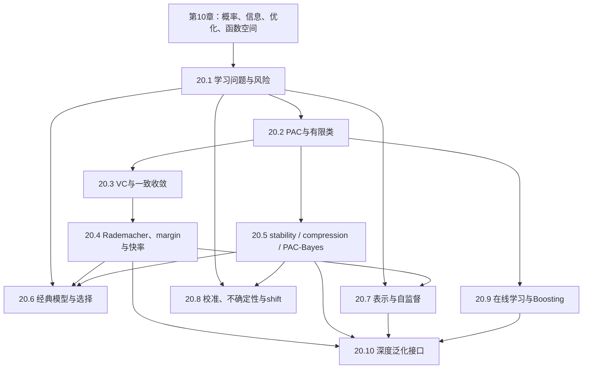

# 学习理论完整课程地图与掌握标准

> [!abstract] 课程定位
> 数学基础教会我们怎样定义、证明和计算；学习理论进一步追问：**为什么一个只看过有限样本的算法，能对尚未看到的数据作出可靠预测？** 本课程从 decision problem、risk 与 sampling contract 出发，依次建立 PAC、VC、Rademacher、stability、PAC-Bayes、online learning 和 distribution shift，并把经典模型、自监督表示与深度泛化放回同一证据框架。

> [!warning] 范围完整不等于所有学习问题已经解决
> 84 个节点是一门从初学者到研究入口的核心课程，不宣称经典 uniform-convergence theory 已解释现代深网的一切。对 interpolation、implicit bias、NTK、feature learning 与 scale-dependent phenomena，只陈述条件清楚的结果、已复现实验和开放边界。

## 一、培养目标

完成十卷正文并通过真实验收后，学习者应能：

1. **写对学习问题**：区分 data-generating law、sample、hypothesis、algorithm、loss、population risk 和 evaluation protocol；
2. **重建泛化证明**：从 concentration、union bound、symmetrization、complexity 或 stability 推出明确 sample-complexity / excess-risk 结论；
3. **判断保证范围**：区分 realizable/agnostic、in-expectation/high-probability、pointwise/uniform、distribution-free/distribution-dependent；
4. **理解算法与归纳偏置**：说明 ERM、regularization、margin、compression、Bayesian posterior 与 online update 分别控制什么；
5. **审计现代 AI 声明**：识别自监督、过参数化、校准、OOD 与深度泛化报告中的对象错置和证据越界；
6. **进入研究**：能把一个经验现象改写成有量词、基线、反例与验证路线的理论问题。

## 二、边界与相邻章节分工

| 内容 | 本章处理 | 交给其他章 |
|---|---|---|
| 浓缩、概率、信息、优化 | 调用并用于学习界 | 完整数学证明在第 10 章 |
| 经典模型 | 统计对象、归纳偏置、risk 与理论边界 | 工程 API 和大型实现不进入主干 |
| 神经网络 | capacity/generalization 与 regime 接口 | 表达、初始化、反传在第 30 章；训练算法在第 60 章 |
| 自监督表示 | objective、sampling、collapse、task sufficiency | 具体 Transformer/CNN 架构在第 40 章 |
| 在线学习 | regret、experts、OCO 和 online-to-batch | bandit/RL 的完整交互决策在第 80 章 |
| 因果 | 用于说明 shift 下“相关不等于可迁移” | identification、intervention 与因果图另建专题 |
| 深度学习理论 | classical bounds 的适用/失效与研究接口 | mean-field/NTK/训练动力学深入放入第 90 章 |

不纳入：模型排行榜、框架教程、没有 data/evaluation contract 的“泛化技巧清单”，以及只因数学有趣但不被学习问题调用的经验过程旁支。

## 三、固定规模

| 卷 | 模块 | 核心节点 | 主要问题 |
|---|---|---:|---|
| 20.1 | 学习问题、决策与风险 | 8 | 究竟什么对象在“学习”？ |
| 20.2 | PAC 学习与有限假设类 | 8 | 有限样本保证怎样第一次成立？ |
| 20.3 | VC 维与一致收敛 | 8 | 无限假设类的容量怎样刻画？ |
| 20.4 | 数据依赖复杂度、间隔与快率 | 8 | 怎样利用样本、范数与 margin 得到更细的界？ |
| 20.5 | 稳定性、压缩、PAC-Bayes 与信息泛化 | 8 | 怎样从算法或 posterior 而非只从假设类证明泛化？ |
| 20.6 | 经典模型与模型选择 | 12 | 经典算法的统计结构和现代接口是什么？ |
| 20.7 | 表示学习、度量学习与自监督 | 8 | 什么使 representation 对下游任务有用而不坍缩？ |
| 20.8 | 校准、不确定性与分布偏移 | 8 | 预测在现实变化下怎样才可靠？ |
| 20.9 | 在线学习、Boosting 与序列预测 | 8 | 不预设固定 i.i.d. batch 时怎样定义表现？ |
| 20.10 | 深度泛化理论接口与开放边界 | 8 | 过参数化为何仍可能泛化，哪些解释尚不充分？ |
| **合计** |  | **84** | 固定主干；扩展专题另计 |

> [!important] 固定 84 个核心节点
> 同一概念只有一个主节点。新研究若只服务一个狭窄模型，先进入扩展专题；只有被多个下游章节反复调用，才讨论替换现有核心节点，而不是不断增加总量。

## 四、先修依赖

建议顺序：20.1 → 20.2 → 20.3；随后 20.4 与 20.5 并行；20.6 用于模型落地；20.7—20.9 可按目标选择；最后进入 20.10。

## 五、逐卷核心节点

### 20.1 学习问题、决策与风险（LT-01—08）

**卷终能力**：任何训练代码之前，先写清 data law、sample、action、hypothesis、algorithm、loss、risk 和 evaluation protocol。

| ID | 核心节点 | 层级 | 核心问题 | 状态 |
|---|---|---|---|---|
| LT-01 | [[统计学习问题的对象合同]] | 核心 | “从数据学习”涉及哪些不同对象和随机性？ | draft + A–E 闭环 |
| LT-02 | [[数据生成分布与采样假设]] | 核心 | i.i.d.、exchangeable、dependent 与 adaptive data 有何差别？ | draft + A–E 闭环 |
| LT-03 | [[预测器、假设空间与学习算法]] | 核心 | hypothesis、parameter、algorithm output 为什么不能混用？ | draft + A–E 闭环 |
| LT-04 | [[损失、总体风险与经验风险]] | 核心 | train loss 与未来预测误差之间隔着什么？ | draft + A–E 闭环 |
| LT-05 | [[经验风险最小化、近似 ERM 与超额风险分解]] | 核心 | optimization error、estimation error 和 approximation error 如何分账？ | draft + A–E 闭环 |
| LT-06 | [[Bayes 决策、Bayes 预测器与 Bayes 风险]] | 核心 | 给定真实 conditional law 时最优决策是什么？ | draft + A–E 闭环 |
| LT-07 | [[可实现、不可知、相合性与可学习性]] | 核心 | realizable、agnostic、consistent、learnable 分别在说什么？ | draft + A–E 闭环 |
| LT-08 | [[训练集、验证集、测试集与自适应复用]] | 核心 | 测试集为什么会被“用坏”，数据泄漏如何数学化？ | draft + A–E 闭环 |

### 20.2 PAC 学习与有限假设类（LT-09—16）

**卷终能力**：从 concentration 与 union bound 证明第一批 distribution-free sample-complexity 结论，并看清其量词。

| ID | 核心节点 | 层级 | 核心问题 | 状态 |
|---|---|---|---|---|
| LT-09 | [[泛化间隙与浓缩不等式接口]] | 核心 | 固定 hypothesis 的 empirical risk 何时接近 population risk？ | draft + A–E 闭环 |
| LT-10 | [[PAC 学习定义与样本复杂度]] | 核心 | probably approximately correct 的概率究竟对谁取？ | draft + A–E 闭环 |
| LT-11 | [[有限假设类、Union Bound 与一致收敛]] | 核心 | 为什么容量以 $\log|\mathcal H|$ 进入样本量？ | draft + A–E 闭环 |
| LT-12 | [[可实现情形的一致 ERM 保证]] | 核心 | zero training error 何时足以泛化？ | draft + A–E 闭环 |
| LT-13 | [[不可知 PAC、ERM 与双侧一致收敛]] | 核心 | noisy labels 下为何需要 excess-risk 而非零误差？ | draft + A–E 闭环 |
| LT-14 | [[Occam 界、编码长度与先验权重]] | 进阶 | 较短描述为何获得较小 complexity penalty？ | draft + A–E 闭环 |
| LT-15 | [[No-Free-Lunch 与归纳偏置]] | 核心 | 为什么不加结构就不可能普遍学习？ | draft + A–E 闭环 |
| LT-16 | [[样本复杂度下界与 Minimax 视角]] | 进阶 | 上界是否只是证明松，信息论下界怎样回答？ | draft + A–E 闭环 |

### 20.3 VC 维与一致收敛（LT-17—24）

**卷终能力**：从 combinatorial growth 刻画无限 binary hypothesis class，并理解 fundamental theorem 的精确范围。

| ID | 核心节点 | 层级 | 核心问题 | 状态 |
|---|---|---|---|---|
| LT-17 | [[打散、增长与 VC 维]] | 核心 | 一个分类器族能在多少点上实现任意标签？ | draft + A–E 闭环 |
| LT-18 | [[增长函数与经验二分模式]] | 核心 | 样本上的有效分类数怎样替代 $|\mathcal H|$？ | draft + A–E 闭环 |
| LT-19 | [[Sauer-Shelah 引理]] | 核心 | finite VC dimension 如何把指数增长压成多项式？ | draft + A–E 闭环 |
| LT-20 | [[VC 一致收敛与泛化界]] | 核心 | growth function 如何进入 high-probability risk bound？ | draft + A–E 闭环 |
| LT-21 | [[二分类统计学习基本定理]] | 核心 | PAC、ERM、uniform convergence 与 finite VC 在何种条件下等价？ | draft + A–E 闭环 |
| LT-22 | [[结构风险最小化与非一致可学习性]] | 进阶 | 无限并类如何按复杂度层级学习？ | draft + A–E 闭环 |
| LT-23 | [[多分类的 Natarajan 维与 Graph 维]] | 进阶 | binary VC 怎样推广到多个标签？ | draft + A–E 闭环 |
| LT-24 | [[实值函数类、伪维与阈值化]] | 进阶 | regression/function class 的组合容量怎样定义？ | draft + A–E 闭环 |

### 20.4 数据依赖复杂度、间隔与快率（LT-25—32）

**卷终能力**：使用 ghost sample、symmetrization 和 Rademacher averages 推导 data-dependent bound，并知道 margin/localization 从何改善界。

| ID | 核心节点 | 层级 | 核心问题 | 状态 |
|---|---|---|---|---|
| LT-25 | [[Ghost Sample、对称化与经验过程入口]] | 核心 | 未知 expectation 怎样换成两个样本的差？ | draft + A–E 闭环 |
| LT-26 | [[Rademacher 复杂度与经验复杂度]] | 核心 | 随机符号拟合能力如何度量函数类？ | draft + A–E 闭环 |
| LT-27 | [[收缩引理与 Lipschitz 损失复合]] | 核心 | loss composition 怎样传递复杂度？ | draft + A–E 闭环 |
| LT-28 | [[范数约束线性类的复杂度]] | 核心 | feature norm 与 weight norm 怎样控制泛化？ | draft + A–E 闭环 |
| LT-29 | [[分类间隔、Margin Bound 与 SVM 接口]] | 核心 | 为什么不仅看是否分对，还看离边界多远？ | draft + A–E 闭环 |
| LT-30 | [[覆盖数、Metric Entropy 与 Chaining 入口]] | 进阶 | 多尺度近似如何比单一网格更精细？ | draft + A–E 闭环 |
| LT-31 | [[局部 Rademacher 复杂度与快收敛率]] | 进阶 | 为什么接近最优解的局部类可能更简单？ | draft + A–E 闭环 |
| LT-32 | [[Fat-Shattering、回归与 Lipschitz 风险]] | 进阶 | 实值函数的尺度敏感容量怎样控制 regression？ | draft + A–E 闭环 |

### 20.5 稳定性、压缩、PAC-Bayes 与信息泛化（LT-33—40）

**卷终能力**：不只问“假设类有多大”，还从 algorithm sensitivity、compressed description、posterior 与 information leakage 证明泛化。

| ID | 核心节点 | 层级 | 核心问题 | 状态 |
|---|---|---|---|---|
| LT-33 | [[算法稳定性与替换一个样本]] | 核心 | 数据改变一点，输出风险改变多少？ | draft + A–E 闭环 |
| LT-34 | [[正则化 ERM 的稳定性]] | 核心 | strong convexity 与 regularization 如何产生稳定性界？ | draft + A–E 闭环 |
| LT-35 | [[随机梯度算法的稳定性接口]] | 进阶 | step size、smoothness 与训练时长怎样影响 generalization？ | draft + A–E 闭环 |
| LT-36 | [[样本压缩方案与泛化]] | 进阶 | 若模型只由少量样本决定，为什么能泛化？ | draft + A–E 闭环 |
| LT-37 | [[PAC-Bayes Bound 的测度变换主线]] | 核心 | posterior risk 如何由 empirical risk 与 KL complexity 控制？ | draft + A–E 闭环 |
| LT-38 | [[PAC-Bayes 先验、后验与数据依赖边界]] | 进阶 | prior 何时可看数据，posterior 为什么不是普通 Bayesian posterior？ | draft + A–E 闭环 |
| LT-39 | [[互信息与信息论泛化界]] | 进阶 | algorithm output 泄露了多少 sample 信息？ | draft + A–E 闭环 |
| LT-40 | [[容量界、稳定性界与 PAC-Bayes 的比较]] | 核心 | 不同 bound 控制的对象、优缺点和不可比性是什么？ | draft + A–E 闭环 |

### 20.6 经典模型与模型选择（LT-41—52）

**卷终能力**：不仅会调用算法，还能写出其 statistical model、population target、inductive bias、identifiability 与 evaluation boundary。

| ID | 核心节点 | 层级 | 核心问题 | 状态 |
|---|---|---|---|---|
| LT-41 | [[偏差—方差—噪声分解]] | 核心 | prediction error 怎样分成可约与不可约部分？ | draft + A–E 闭环 |
| LT-42 | [[正则化、交叉验证与模型选择]] | 核心 | hyperparameter selection 如何避免 optimistic bias？ | draft + A–E 闭环 |
| LT-43 | [[线性回归的统计学习理论]] | 核心 | least squares 在随机设计、噪声和病态下保证什么？ | draft + A–E 闭环 |
| LT-44 | [[逻辑回归、复合损失与概率分类]] | 核心 | log loss 如何连接 conditional probability 与 decision boundary？ | draft + A–E 闭环 |
| LT-45 | [[支持向量机、最大间隔与核方法]] | 核心 | hard/soft margin、regularization 与 dual representation 如何统一？ | draft + A–E 闭环 |
| LT-46 | [[核岭回归与 Gaussian Process 接口]] | 进阶 | frequentist regularization 与 Bayesian prior 在哪里相同、哪里不同？ | draft + A–E 闭环 |
| LT-47 | [[决策树、分裂准则与剪枝]] | 核心 | greedy partition 的 inductive bias 和 instability 是什么？ | draft + A–E 闭环 |
| LT-48 | [[Bagging、Random Forest 与 Boosting]] | 核心 | averaging 与 stagewise reweighting 分别减少什么误差？ | draft + A–E 闭环 |
| LT-49 | [[PCA 的统计估计与主子空间风险]] | 核心 | sample covariance 的谱方向何时可信？ | draft + A–E 闭环 |
| LT-50 | [[K-Means、聚类风险与不可辨识性]] | 核心 | 没有标签时目标、评价与 cluster identity 如何定义？ | draft + A–E 闭环 |
| LT-51 | [[潜变量模型、混合模型与 EM]] | 核心 | incomplete likelihood、E/M steps 与 local optimum 如何区分？ | draft + A–E 闭环 |
| LT-52 | [[模型可辨识性、选择与 Misspecification]] | 进阶 | 参数能否恢复、预测能否正确和模型是否真实为何不同？ | draft + A–E 闭环 |

### 20.7 表示学习、度量学习与自监督（LT-53—60）

**卷终能力**：把 representation、pretext objective、positive/negative sampling、augmentation 与 downstream task 写成可验证合同。

| ID | 核心节点 | 层级 | 核心问题 | 状态 |
|---|---|---|---|---|
| LT-53 | [[表示学习的任务、表示与下游风险]] | 核心 | 好 representation 是对哪个 task family 好？ | draft + A–E 闭环 |
| LT-54 | [[度量学习、相似性与检索风险]] | 核心 | learned distance 的监督信号、几何与评价如何对应？ | draft + A–E 闭环 |
| LT-55 | [[对比学习、InfoNCE 与密度比]] | 核心 | contrastive objective 在估计什么，哪些解释只是 surrogate？ | draft + A–E 闭环 |
| LT-56 | [[正负样本、Batch 依赖与梯度估计]] | 核心 | batch composition 为什么改变 objective 而不只是 variance？ | draft + A–E 闭环 |
| LT-57 | [[数据增强、不变性、等变性与任务充分性]] | 核心 | augmentation 何时保留 label，何时删除 task information？ | draft + A–E 闭环 |
| LT-58 | [[表示坍缩、非坍缩与可辨识边界]] | 核心 | variance/covariance/stop-gradient 为什么可能阻止常数解？ | draft + A–E 闭环 |
| LT-59 | [[遮蔽预测、Teacher–Student 与自监督目标]] | 进阶 | masked prediction 与 consistency learning 的 target 从哪里来？ | draft + A–E 闭环 |
| LT-60 | [[Linear Probe、Fine-Tuning 与迁移评估]] | 核心 | probe performance 能和不能说明 representation 的什么？ | draft + A–E 闭环 |

### 20.8 校准、不确定性与分布偏移（LT-61—68）

**卷终能力**：区分 accuracy、proper scoring、calibration、coverage 与 robustness，并对 shift 类型给出相应可识别假设。

| ID | 核心节点 | 层级 | 核心问题 | 状态 |
|---|---|---|---|---|
| LT-61 | [[概率校准、Proper Scoring Rule 与可靠性图]] | 核心 | 概率预测怎样评价才不只看分类对错？ | draft + A–E 闭环 |
| LT-62 | [[Aleatoric、Epistemic 与模型不确定性]] | 核心 | 哪些不确定性可由更多数据减少？ | draft + A–E 闭环 |
| LT-63 | [[Bayesian Posterior Predictive、Ensemble 与近似边界]] | 进阶 | 不同 uncertainty method 产生的分散来自哪里？ | draft + A–E 闭环 |
| LT-64 | [[Conformal Prediction 与有限样本 Coverage]] | 核心 | exchangeability 下怎样得到 distribution-free marginal coverage？ | draft + A–E 闭环 |
| LT-65 | [[Covariate、Label 与 Concept Shift]] | 核心 | $P(X)$、$P(Y)$、$P(Y\mid X)$ 哪一部分改变？ | draft + A–E 闭环 |
| LT-66 | [[重要性加权与 Covariate Shift 校正]] | 核心 | density ratio 可估时如何重写 target risk？ | draft + A–E 闭环 |
| LT-67 | [[Domain Adaptation 与 Domain Generalization Bound]] | 进阶 | source risk、distribution discrepancy 与 shared labeling assumption 如何组合？ | draft + A–E 闭环 |
| LT-68 | [[OOD、鲁棒性与因果不变性的边界]] | 核心 | robustness benchmark 为什么不自动证明因果可迁移？ | draft + A–E 闭环 |

### 20.9 在线学习、Boosting 与序列预测（LT-69—76）

**卷终能力**：在 adversarial sequence 上用 regret/mistake 而不是 population risk 衡量算法，并理解 online-to-batch 接口。

| ID | 核心节点 | 层级 | 核心问题 | 状态 |
|---|---|---|---|---|
| LT-69 | [[在线学习协议、Regret 与 Comparator]] | 核心 | 没有固定数据分布时“学得好”如何定义？ | draft + A–E 闭环 |
| LT-70 | [[Experts、Weighted Majority 与 Multiplicative Weights]] | 核心 | 指数权重为何获得 $\sqrt{T\log N}$ 量级 regret？ | draft + A–E 闭环 |
| LT-71 | [[Online Gradient Descent 与 Mirror Descent]] | 核心 | convex geometry 怎样控制 sequential regret？ | draft + A–E 闭环 |
| LT-72 | [[随机、对抗与自适应序列的区别]] | 核心 | adversary 何时能看算法随机性，保证如何改变？ | draft + A–E 闭环 |
| LT-73 | [[Perceptron Mistake Bound 与 Margin]] | 核心 | 可分数据上的错误次数为何由 margin 控制？ | draft + A–E 闭环 |
| LT-74 | [[Boosting、弱学习与指数损失]] | 核心 | weak learner 如何组合成 strong learner？ | draft + A–E 闭环 |
| LT-75 | [[Online-to-Batch Conversion]] | 进阶 | regret bound 怎样变成 expected/high-probability risk bound？ | draft + A–E 闭环 |
| LT-76 | [[Bandit Feedback 与强化学习接口]] | 进阶 | 只观察所选 action loss 后增加了什么统计困难？ | draft + A–E 闭环 |

### 20.10 深度泛化理论接口与开放边界（LT-77—84）

**卷终能力**：能够审计“深网为何泛化”的多种解释，区分 theorem、proxy、parameterization artifact 与 empirical regime。

| ID | 核心节点 | 层级 | 核心问题 | 状态 |
|---|---|---|---|---|
| LT-77 | [[插值、双下降与经典偏差方差边界]] | 进阶 | test risk 为何可能在 interpolation threshold 后再次下降？ | draft + A–E 闭环 |
| LT-78 | [[过参数化与 Benign Overfitting]] | 进阶 | zero training error 在哪些数据/谱条件下仍可预测？ | draft + A–E 闭环 |
| LT-79 | [[隐式偏置、最大间隔与优化选择]] | 进阶 | 多个插值解中 algorithm 为什么选择特定解？ | draft + A–E 闭环 |
| LT-80 | [[范数、平坦性、Sharpness 与参数化不变性]] | 进阶 | complexity proxy 何时只是坐标/尺度 artifact？ | draft + A–E 闭环 |
| LT-81 | [[神经网络容量与 Norm-Based Bound]] | 进阶 | parameter count、path/spectral norm 与 depth 怎样进入界？ | draft + A–E 闭环 |
| LT-82 | [[NTK、Lazy Training 与 Kernel Regime]] | 进阶 | 宽网络何时近似固定 kernel，什么现象解释不了？ | draft + A–E 闭环 |
| LT-83 | [[Mean-Field、Feature Learning 与训练 Regime]] | 进阶 | representation 会动时如何超越 lazy kernel 视角？ | draft + A–E 闭环 |
| LT-84 | [[深度泛化证据地图与开放问题]] | 核心 | classical bound、scaling observation 与 mechanistic theory 如何共存？ | draft + A–E 闭环 |

## 六、分阶段掌握标准

| 等级 | 可观察能力 | 代表任务 |
|---|---|---|
| L1 对象识别 | 能区分 sample、distribution、hypothesis、algorithm 和 risk | 给训练报告补全对象/量词 |
| L2 基础计算 | 能手算 empirical/population risk、Bayes rule、简单 PAC bound | 二点分布、有限假设类、线性模型 |
| L3 定理重建 | 能独立证明 finite-class、VC/Rademacher 或 stability 主链 | 不看答案写出假设、概率事件和 closure |
| L4 边界判断 | 能构造删条件反例和识别 evaluation leakage | non-i.i.d.、adaptive test、misspecification |
| L5 AI 迁移 | 能为真实模型建立 theory—algorithm—experiment contract | contrastive、calibration、domain shift |
| L6 研究入口 | 能比较多种 bound/机制，提出可证伪开放问题 | deep generalization、benign overfitting |

卷级通过至少达到 L4；课程总出口要求所有卷达 L4、至少两个专题达 L5，并能在陌生论文中完成 45 分钟对象—定理—实验口头审计。

## 七、每节点交付与视觉规范

每个节点默认包含：

- 面向初学者的具体 prediction problem；
- 正式对象、量词、假设和 theorem/proof；
- 一道可手算 finite sample 或 finite class 例子；
- 一个最小 counterexample 或 failed evaluation；
- A—E 习题与独立详解；
- 至少一个有教学意义的 visual；涉及估计/算法时给可复现实验；
- AI 报告中的 tensor/model/data 对象映射；
- 教材/原论文/科学空间线索的证据分层。

视觉按问题选择：

- probability space、sampling 与 evaluation flow 用 Mermaid；
- hypothesis growth、decision regions、margin 与 calibration 用 SVG；
- sample complexity、generalization gap、double descent 和 shift 用脚本曲线；
- theorem 的 hypothesis—event—conclusion 用 proof map；
- 图必须有读图说明与“不能推出”段，不以漂亮趋势替代理论。

### 全章静态材料门

[[learning_theory_teaching_contract_audit.py]]已对固定主干执行独立静态与生成回归：LT-01—84 的 ID、路径和十卷数量完全闭合；84 组习题与独立解答形成双射，1260 个 A—E 题解 ID 完全一致；144 张实际调用来源卡均可定位，其中 `verified / active / draft = 13 / 129 / 2`，两张 `draft` 均为带断言审计和适用边界的科学空间 C 级桥梁，不承担正式定理主证据；2027 条作用域内 Wiki 链接、96 个节点嵌图/97 个章节图文单元和 84 个课程表映射通过。`--run-compute`又将 18 个节点制图脚本运行两次，当前 109 个已存学习理论资产与仓库版本保持字节一致。

因此第 20 章的**静态材料状态**可记为 `regression-passed`。这不改变 84 篇正文的 `draft`，也不把任何分卷或个人学习升级为通过；卷级题卷、答案/输出隔离、随机实验轨和间隔迁移仍需逐卷建立。

### 20.1 卷级材料门

第一卷现已建立[[阶段测验 - 学习问题、决策与风险（20.1）|LT-CUM-01]]、[[阶段测验解答 - 学习问题、决策与风险（20.1）|独立封存详解]]与[[实验 - 学习问题、决策与风险累计复现门|三轨累计复现门]]。它以 20 分钟口试、210 分钟闭卷、九层学习问题账本、`attempt_id + scorer nonce`、跨轨盲参、48 小时换机制与 14 天陌生评价迁移，将 LT-01—08 从章节集合压缩为一条可执行证据链。[[learning_problem_decision_cumulative_contract_audit.py]]独立复核 8/8 scope、14/14 题解与 100 分、答案隔离、解析风险锚点、canonical/固定盲参双跑、SVG/XML/hash、覆盖保护与六处状态面。

20.1 的**卷级验收材料**因此为 `regression-passed`，但尚无学习者原稿，个人仍为 `not-attempted`。这是“已建立 1/10 材料门”，不是“已通过 1/10 分卷”。

### 20.2 卷级材料门

第二卷现已建立[[阶段测验 - PAC 学习与有限假设类（20.2）|PAC-CUM-01]]、[[阶段测验解答 - PAC 学习与有限假设类（20.2）|独立封存详解]]与[[实验 - PAC 学习与有限假设类累计复现门|三轨累计复现门]]。它以八层 PAC 证明账本串联 fixed-$h$ 浓缩、finite union、可实现 survival、不可知 two-gap ERM、Occam/Kraft 预算、NFL 与 Le Cam 下界；`attempt_id + scorer nonce`、跨轨盲参、48 小时换机制和 14 天 adaptive-evaluation 迁移阻止挑轨与照图复述。[[pac_finite_class_cumulative_contract_audit.py]]独立复核 8/8 scope、14/14 题解与 100 分、解析锚点、canonical/固定盲参双跑、SVG/XML/hash、Kraft 违规拒绝、覆盖保护与六处状态面。

20.2 的**卷级验收材料**为 `regression-passed`，但个人仍为 `not-attempted`。至此是“已建立 2/10 材料门”，个人通过仍为 0/10。

### 20.3 卷级材料门

第三卷现已建立[[阶段测验 - VC 维与一致收敛（20.3）|VC-CUM-01]]、[[阶段测验解答 - VC 维与一致收敛（20.3）|独立封存详解]]与[[实验 - VC 维与一致收敛累计复现门|三轨累计复现门]]。它以八层 VC 证明账本串联经验二分、增长函数、Sauer–Shelah、ghost sample/双样本化、VC 一致收敛、二分类基本定理、加权 SRM、多分类维数与伪维；`attempt_id + scorer nonce`、跨轨盲参、48 小时换机制和 14 天陌生函数类迁移把“看懂定理”压成可审计的构造—上界—反例链。[[vc_uniform_convergence_cumulative_contract_audit.py]]独立复核 8/8 scope、14/14 题解与 100 分、解析锚点、canonical/固定盲参双跑、SVG/XML/hash、覆盖保护、非法权重拒绝与六处状态面。

20.3 的**卷级验收材料**为 `regression-passed`，但个人仍为 `not-attempted`。至此是“已建立 3/10 材料门”，个人通过仍为 0/10。

## 八、累计验收规划

每卷最终建立 100 分闭卷题、独立详解与随机计算/反例门。课程另设两次跨卷资格考：

| 验收 | 覆盖 | 核心主链 |
|---|---|---|
| LT-QUAL-01 | 20.1—20.5 | object/risk → PAC/VC → Rademacher → stability/PAC-Bayes |
| LT-QUAL-02 | 20.6—20.10 | model selection → representation → reliability → online → deep boundary |

成稿不等于通过。真实状态仍使用 `not-attempted / attempted / passed / retained`，并要求首次闭卷、评分、48 小时重做、14 天迁移和随机实验干预。

## 九、来源策略

正式主线以 Shalev-Shwartz 与 Ben-David 的 *Understanding Machine Learning*、Mohri–Rostamizadeh–Talwalkar 的 *Foundations of Machine Learning*、Stanford CS229T 与 MIT 9.520/CBMM 课程为骨架；定理追溯 Valiant、Vapnik–Chervonenkis、Bartlett–Mendelson、Bousquet–Elisseeff、McAllester 等原始来源。

科学空间在 PAC/VC 的体系覆盖相对薄弱，因此不承担 formal backbone；它主要提供现代问题入口：

- 泛化与 perturbation/gradient penalty/VAT；
- L2、weight scale、Lipschitz 与参数化边界；
- R-Drop、SimCSE/SimSiam、自监督与 collapse；
- 对比学习的 batch coupling；
- 具体 NLP/生成任务中的 loss、regularization 与 evaluation 反例。

博客中的推导和经验结果必须回到原论文、教材或独立实验核验，不把“有效技巧”自动升级为 distribution-free theorem。

## 十、当前基线（2026-08-28）

| 指标 | 当前值 | 解释 |
|---|---:|---|
| 锁定核心节点 | 84 | 十卷范围与 ID 已确定 |
| 已有正式正文 | 84 | LT-01—84 已建立；均保持 `draft` |
| 已有节点习题/解答 | 84 / 84 | 每节点 15 题，共 1260 题，独立详解已建立 |
| 全章静态材料审计 | `regression-passed` | [[learning_theory_teaching_contract_audit.py]]覆盖结构、题解、来源、链接、图文和确定性双跑 |
| 已建立卷级证据门 | 3 / 10 | 20.1 的 LT-CUM-01、20.2 的 PAC-CUM-01 与 20.3 的 VC-CUM-01 材料回归通过；其余七卷待建立 |
| 已通过分卷 | 0 / 10 | 尚无个人口试、闭卷、盲参和延迟证据 |
| 下一施工点 | 20.4 卷级证据门 | 覆盖 LT-25—32 的复杂度、Rademacher、收缩与 margin，再按依赖推进两次跨卷资格考 |

## 十一、导航

- 总入口：[[学习理论 MOC]]
- 数学先修：[[数学基础完整课程地图与掌握标准]]
- 全库范围：[[01-范围与章节]]
- 课程标准：[[00-课程教学与研究总纲]] · [[05-质量门槛与检查清单]]
- 实践闭环：[[练习与测验 MOC]] · [[推导与实验 MOC]]
