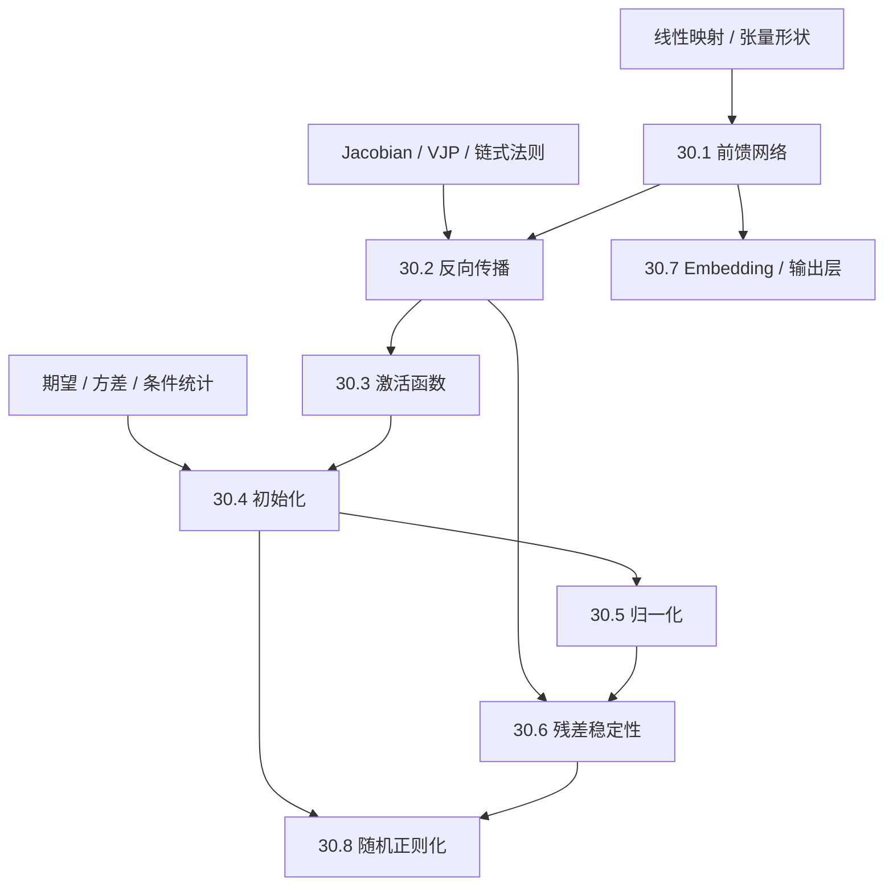

# 神经网络基础完整课程地图与掌握标准

> [!abstract] 课程定位
> 本章是数学/学习理论与现代架构之间的结构桥。它面向第一次系统学习神经网络的读者，但终点是能独立推导前向与反向公式、审计尺度传播和数值语义、阅读初始化/归一化/残差论文，并把定理、经验规律与工程约定分开。

## 一、范围锁定

- 固定 **8 卷、64 个核心节点**，使用稳定 ID `NN-01`—`NN-64`；
- 每节点建立一篇正文、15 道 A—E 习题、独立详解与至少一个完整图文单元；
- 30 章只处理跨架构复用的网络基本部件；CNN/RNN/GNN/Attention 进入 40 章，优化器与大规模训练进入 60 章；
- 与 20 章重合处改变问题焦点：20 章证明学习/泛化保证，30 章分析模块的计算、梯度、尺度与参数化。

## 二、认知依赖

## 三、30.1 前馈网络、感知机与表达能力（NN-01—08）

**卷终能力**：能把神经网络写成带形状的函数复合，手算前向值与参数数，区分线性可分、非线性表示、万能逼近和深度效率。

| ID | 核心节点 | 层级 | 核心问题 | 状态 |
|---|---|---|---|---|
| NN-01 | [[人工神经元、仿射变换与决策超平面]] | 核心 | 单个神经元在向量空间中究竟计算什么？ | draft + A–E 闭环 |
| NN-02 | [[线性层、批量张量与参数计数]] | 核心 | 一个 dense layer 的形状、批处理和参数数怎样统一？ | draft + A–E 闭环 |
| NN-03 | [[感知机模型、更新规则与线性可分性]] | 核心 | 阈值神经元怎样学习超平面，何时必然失败？ | draft + A–E 闭环 |
| NN-04 | [[多层感知机与逐层前向计算]] | 核心 | 多层函数如何组合，隐藏表示是什么对象？ | draft + A–E 闭环 |
| NN-05 | [[XOR、隐藏表示与非线性必要性]] | 核心 | 为什么堆叠线性层仍然只是线性映射？ | draft + A–E 闭环 |
| NN-06 | [[万能逼近定理、紧集与逼近误差]] | 进阶 | 宽度足够何时能逼近连续函数，定理没保证什么？ | draft + A–E 闭环 |
| NN-07 | [[深度分离、线性区域与表达效率]] | 进阶 | 深度何时以更少单元表达浅网难以表达的函数？ | draft + A–E 闭环 |
| NN-08 | [[参数对称性、等价表示与可辨识边界]] | 进阶 | 置换与重缩放为何使参数不唯一？ | draft + A–E 闭环 |

## 四、30.2 计算图、反向传播与自动微分（NN-09—16）

**卷终能力**：能从局部 Jacobian/VJP 独立推导复杂计算图的 reverse-mode 梯度，并审计内存、稳定融合、不可微点和高阶微分。

| ID | 核心节点 | 层级 | 核心问题 | 状态 |
|---|---|---|---|---|
| NN-09 | [[计算图、拓扑序与前向执行]] | 核心 | 复合函数怎样变成可执行 DAG？ | draft + A–E 闭环 |
| NN-10 | [[局部微分、Jacobian、JVP 与 VJP]] | 核心 | 局部线性算子怎样沿图传播？ | draft + A–E 闭环 |
| NN-11 | [[标量链式法则与反向传播递推]] | 核心 | adjoint 为什么从输出反向累加？ | draft + A–E 闭环 |
| NN-12 | [[线性层与仿射层的反向传播]] | 核心 | $XW+b$ 对输入、权重和偏置的梯度是什么？ | draft + A–E 闭环 |
| NN-13 | [[激活、分支、广播与梯度累加]] | 核心 | 分支、共享和 broadcasting 怎样改变反向语义？ | draft + A–E 闭环 |
| NN-14 | [[Softmax–Cross-Entropy 的稳定融合反向]] | 核心 | 为什么 fused gradient 是 $p-y$，怎样避免溢出？ | draft + A–E 闭环 |
| NN-15 | [[Forward_Reverse AD、Tape 与复杂度|Forward/Reverse AD、Tape 与复杂度]] | 进阶 | 输入/输出维数怎样决定 AD 模式？ | draft + A–E 闭环 |
| NN-16 | [[Gradient Checking、Checkpointing 与高阶微分边界]] | 进阶 | 如何验证、节省激活并避免错误高阶梯度？ | draft + A–E 闭环 |

## 五、30.3 激活函数、门控与非线性（NN-17—24）

**卷终能力**：能从值域、导数、光滑性、齐次性、均值漂移、计算成本和任务证据选择激活，而不是按流行度替换名称。

| ID | 核心节点 | 层级 | 核心问题 | 状态 |
|---|---|---|---|---|
| NN-17 | [[激活函数的角色、选择准则与函数性质]] | 核心 | 非线性究竟打破了哪种退化？ | draft + A–E 闭环 |
| NN-18 | [[Sigmoid、Tanh 与饱和梯度]] | 核心 | 饱和、零中心和导数上界怎样影响训练？ | draft + A–E 闭环 |
| NN-19 | [[ReLU、Leaky ReLU 与次梯度约定]] | 核心 | 分段线性、死亡单元和零点导数怎样处理？ | draft + A–E 闭环 |
| NN-20 | [[ELU、SELU 与自归一化接口]] | 进阶 | 激活能否单独维持均值方差稳定？ | draft + A–E 闭环 |
| NN-21 | [[Softplus、GELU、SiLU 与平滑门控]] | 核心 | 平滑激活如何在梯度与计算间权衡？ | draft + A–E 闭环 |
| NN-22 | [[GLU、GeGLU、SwiGLU 与乘性门]] | 核心 | 门控为何增加表达与参数/计算成本？ | draft + A–E 闭环 |
| NN-23 | [[Maxout、分段线性区域与条件计算]] | 进阶 | 最大仿射族怎样形成凸分段线性函数？ | draft + A–E 闭环 |
| NN-24 | [[激活函数的数值稳定、尺度与经验选择]] | 核心 | 如何做公平消融并识别精度/尺度伪影？ | draft + A–E 闭环 |

## 六、30.4 初始化与信号传播（NN-25—32）

**卷终能力**：能重建 fan-in/fan-out 方差推导、相关传播和 Jacobian spectrum 诊断，并区分有限宽网络与独立均值场假设。

| ID | 核心节点 | 层级 | 核心问题 | 状态 |
|---|---|---|---|---|
| NN-25 | [[方差传播与宽层均值场近似]] | 核心 | 线性组合的均值和方差怎样随层传播？ | draft + A–E 闭环 |
| NN-26 | [[Xavier、Glorot 初始化]] | 核心 | sigmoid/tanh 网络为何使用 fan-average 尺度？ | draft + A–E 闭环 |
| NN-27 | [[Kaiming、He 初始化]] | 核心 | ReLU 截断如何改变二阶矩？ | draft + A–E 闭环 |
| NN-28 | [[反向梯度方差与 Fan-In_Fan-Out 权衡|反向梯度方差与 Fan-In/Fan-Out 权衡]] | 核心 | 同一权重方差能否同时守住前向与反向？ | draft + A–E 闭环 |
| NN-29 | [[相关传播、Edge of Chaos 与临界初始化]] | 进阶 | 两个输入的相关性为何可能坍缩到固定点？ | draft + A–E 闭环 |
| NN-30 | [[正交初始化与 Dynamical Isometry]] | 进阶 | 方差稳定为何不等于全部奇异值稳定？ | draft + A–E 闭环 |
| NN-31 | [[偏置、输出层与零初始化的对称性边界]] | 核心 | 哪些参数能零初始化，哪些会让单元永远相同？ | draft + A–E 闭环 |
| NN-32 | [[LSUV、Fixup 与现代初始化诊断]] | 进阶 | 数据依赖校准和无归一化残差初始化如何工作？ | draft + A–E 闭环 |

## 七、30.5 归一化、尺度与统计量（NN-33—40）

**卷终能力**：能按 normalized axes、统计来源、affine 参数和 train/eval 语义推导 normalization，并诊断小批量、分布式与混合精度问题。

| ID | 核心节点 | 层级 | 核心问题 | 状态 |
|---|---|---|---|---|
| NN-33 | [[归一化的对象、轴与不变性]] | 核心 | normalization 到底在哪些轴上计算统计量？ | draft + A–E 闭环 |
| NN-34 | [[BatchNorm 前向统计与训练—推理差异]] | 核心 | batch statistics 与 running statistics 如何分工？ | draft + A–E 闭环 |
| NN-35 | [[BatchNorm 反向传播、尺度不变性与噪声]] | 进阶 | 均值方差依赖怎样耦合样本梯度？ | draft + A–E 闭环 |
| NN-36 | [[LayerNorm 的逐样本几何与反向传播]] | 核心 | 为什么 LayerNorm 不依赖 batch size？ | draft + A–E 闭环 |
| NN-37 | [[RMSNorm、均值移除与缩放不变性]] | 核心 | 去掉 centering 后保留了什么、失去什么？ | draft + A–E 闭环 |
| NN-38 | [[InstanceNorm、GroupNorm 与 WeightNorm]] | 核心 | 按 instance/group/weight 归一化分别服务什么结构？ | draft + A–E 闭环 |
| NN-39 | [[Pre-Norm、Post-Norm 与归一化放置]] | 进阶 | normalization 放在残差分支前后怎样改变 Jacobian？ | draft + A–E 闭环 |
| NN-40 | [[小批量、混合精度、分布式与因果归一化边界]] | 进阶 | 统计聚合和有限精度怎样破坏语义？ | draft + A–E 闭环 |

## 八、30.6 残差连接、深度与稳定性（NN-41—48）

**卷终能力**：能从 $h_{l+1}=h_l+F_l(h_l)$ 推导梯度、路径和离散动力学，并审计残差缩放与超深网络初始化。

| ID | 核心节点 | 层级 | 核心问题 | 状态 |
|---|---|---|---|---|
| NN-41 | [[残差学习、恒等捷径与退化问题]] | 核心 | 恒等捷径怎样改变深网优化对象？ | draft + A–E 闭环 |
| NN-42 | [[残差块 Jacobian 与梯度直通]] | 核心 | $I+J_F$ 为什么提供直接梯度通道？ | draft + A–E 闭环 |
| NN-43 | [[ResNet 的 ODE 与离散动力系统视角]] | 进阶 | 残差层何时可看成 Euler step？ | draft + A–E 闭环 |
| NN-44 | [[残差缩放、Lipschitz 界与深度稳定性]] | 进阶 | 分支尺度怎样控制跨层扰动？ | draft + A–E 闭环 |
| NN-45 | [[Pre-Activation、Pre-Norm 与 Post-Norm 残差]] | 核心 | 激活/归一化位置怎样改变恒等路径？ | draft + A–E 闭环 |
| NN-46 | [[Highway、Dense Connection 与 Skip 结构比较]] | 进阶 | 加法、门控与拼接的表示/成本差异是什么？ | draft + A–E 闭环 |
| NN-47 | [[ReZero、Fixup、DeepNorm 与深网缩放]] | 进阶 | 如何让极深网络从近恒等映射开始？ | draft + A–E 闭环 |
| NN-48 | [[深度、有效路径与稳定性证据地图]] | 核心 | 梯度稳定、表达力和泛化证据怎样分层？ | draft + A–E 闭环 |

## 九、30.7 Embedding、权重共享与输出参数化（NN-49—56）

**卷终能力**：能把 lookup、矩阵乘法、共享输出层和大词表归一化写成带形状的运算，并分析秩、稀疏梯度和计算代价。

| ID | 核心节点 | 层级 | 核心问题 | 状态 |
|---|---|---|---|---|
| NN-49 | [[Embedding Lookup、稀疏梯度与参数规模]] | 核心 | 查表与 one-hot 矩阵乘法为何等价？ | draft + A–E 闭环 |
| NN-50 | [[Embedding 几何、相似度与各向异性]] | 核心 | 内积、余弦和 norm 怎样影响表示比较？ | draft + A–E 闭环 |
| NN-51 | [[输入—输出权重共享与 Weight Tying]] | 核心 | 同一矩阵用于编码和解码时改变了什么？ | draft + A–E 闭环 |
| NN-52 | [[Softmax 输出层、Logit 尺度与概率参数化]] | 核心 | logits 如何成为条件类别分布？ | draft + A–E 闭环 |
| NN-53 | [[Softmax Bottleneck 与低秩限制]] | 进阶 | 线性 logits 对 log-probability matrix 有何秩限制？ | draft + A–E 闭环 |
| NN-54 | [[Sampled、Hierarchical 与 Adaptive Softmax]] | 进阶 | 大词表归一化怎样换取有偏/结构化计算？ | draft + A–E 闭环 |
| NN-55 | [[Padding、Mask、特殊符号与词表边界]] | 核心 | 离散符号和 mask 怎样进入梯度与损失？ | draft + A–E 闭环 |
| NN-56 | [[Embedding 初始化、缩放、分解与量化接口]] | 进阶 | 参数量、动态范围和低秩分解怎样权衡？ | draft + A–E 闭环 |

## 十、30.8 随机正则化与网络级泛化接口（NN-57—64）

**卷终能力**：能写清训练随机变量、期望预测器、测试时替换、正则化目标与评价协议，避免把经验技巧自动升级为泛化定理。

| ID | 核心节点 | 层级 | 核心问题 | 状态 |
|---|---|---|---|---|
| NN-57 | [[Dropout 的随机掩码、期望与 Inverted Scaling]] | 核心 | 为什么训练除以 keep probability，测试时不再缩放？ | draft + A–E 闭环 |
| NN-58 | [[Dropout 的方差、共适应解释与 Bayesian 边界]] | 进阶 | 期望匹配为何不等于非线性网络预测匹配？ | draft + A–E 闭环 |
| NN-59 | [[DropConnect、权重噪声与激活噪声]] | 核心 | 随机性加在参数、激活或梯度上有什么差异？ | draft + A–E 闭环 |
| NN-60 | [[Stochastic Depth、DropPath 与有效深度]] | 核心 | 随机跳过残差分支怎样保持期望与梯度路径？ | draft + A–E 闭环 |
| NN-61 | [[Label Smoothing、置信度与目标偏置]] | 核心 | 平滑标签改变了哪个估计目标？ | draft + A–E 闭环 |
| NN-62 | [[Mixup、Manifold Mixup 与插值正则]] | 进阶 | 输入/隐藏空间插值依赖什么标签几何？ | draft + A–E 闭环 |
| NN-63 | [[Jacobian、Gradient Penalty 与 Lipschitz 正则接口]] | 进阶 | 局部导数惩罚与全局 Lipschitz 保证有何差距？ | draft + A–E 闭环 |
| NN-64 | [[网络级正则化的交互、消融与证据地图]] | 核心 | 多种正则同时使用时怎样做因果归因？ | draft + A–E 闭环 |

## 十一、分层掌握标准

| 等级 | 可观察能力 | 代表任务 |
|---|---|---|
| L1 对象与形状 | 写出 layer 输入、输出、参数和广播轴 | dense、norm、embedding |
| L2 前向与手算 | 用小张量完整算到 logits/loss | XOR、BN、dropout |
| L3 反向与推导 | 独立推出 VJP、方差传播或 Jacobian | affine、softmax、residual |
| L4 边界与反例 | 删除假设并构造训练/推理失败 | 饱和、small batch、zero init |
| L5 系统迁移 | 解释现代 block 中多个部件的交互 | Transformer/ResNet block audit |
| L6 研究入口 | 区分定理、scaling limit、经验规律 | edge of chaos、dynamical isometry |

卷级通过至少达到 L4；课程总出口要求八卷全部达到 L4，至少两卷达到 L5，并能在 45 分钟内完成陌生 neural block 的形状—前向—反向—尺度—数值—证据审计。

## 十二、来源与视觉策略

- 正式骨架：Goodfellow–Bengio–Courville *Deep Learning*、Dive into Deep Learning、正规大学深度学习课程；
- 原始证据：Perceptron、backprop、universal approximation、初始化、normalization、residual、embedding/softmax 与 regularization 原论文；
- 科学空间：作为激活、归一化、尺度、门控、梯度与现代结构问题入口，结论回查论文；
- 视觉：形状/数据流用 proof-map，激活和信号传播用可复现曲线，归一化轴/残差路径用 paper-ink，实验结果保留设置与边界。

## 十三、当前基线（2026-08-29）

| 指标 | 当前值 | 解释 |
|---|---:|---|
| 锁定核心节点 | 64 | 八卷范围与 ID 已确定 |
| 已有正式正文 | 64 | NN-01—64 已完成正文与正式图文单元 |
| 已有节点习题/解答 | 64 / 64 | NN-01—64 共 960 题及逐题独立详解 |
| 现行教学迁移 | 12 / 64 | NN-01—12 已由[[neural_network_foundations_teaching_contract_audit.py]]复核课程位置、两遍路线、问题链、对象账本、贯穿算例与公式七问 |
| 待迁移节点 | 52 / 64 | NN-13—64 保留既有正文、题解与图，但尚未按现行教学合同回归 |
| 分卷材料回归 | 1 / 8 | 30.1 的八节点、八组题解、八幅正式图、来源与共享 fixture 已通过；个人仍为 `not-attempted` |
| 旧章节累计门 | composed | NN-CUM-01 题卷、独立解答与计算复现门已组成；须在节点迁移与分卷门升级后重新审计 |
| 已通过分卷 | 0 | 尚无真实学习证据 |
| 下一材料施工点 | NN-13—16 | 完成 30.2 的 activation/broadcast、stable fused loss、AD mode 与 verification/memory 后半卷 |

当前状态是 **12/64 教学迁移完成、52/64 待迁移、30.1 材料门 1/8 `regression-passed`、30.2 为 4/8 in-progress、个人 `not-attempted`**。旧 `NN-CUM-01` 的存在只说明历史材料组成，不应跳过现行教学迁移直接要求学习者参加总测验。

## 十四、导航

- 总入口：[[神经网络基础 MOC]]
- 数学先修：[[数学基础完整课程地图与掌握标准]]
- 学习理论先修：[[学习理论 MOC]]
- 课程标准：[[00-课程教学与研究总纲]] · [[05-质量门槛与检查清单]]
- 实践闭环：[[练习与测验 MOC]] · [[推导与实验 MOC]]
- 章节累计出口：[[阶段测验 - 神经网络基础（第三章）]] · [[阶段测验解答 - 神经网络基础（第三章）]] · [[实验 - 神经网络基础累计复现门]]
