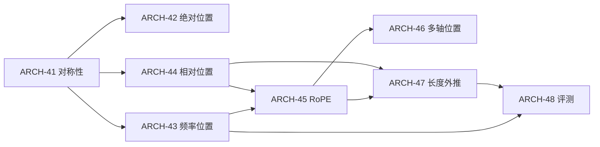

# 位置编码、结构编码与长度外推 MOC

> [!abstract] 本卷主线
> 位置编码不是给 token 加一个“编号装饰”，而是在声明模型对哪些置换保持等变、用什么坐标描述关系，以及训练外坐标怎样改变相位、分辨率和评测分布。本卷从对称性证明开始，依次进入绝对/正弦/相对/RoPE、多轴坐标与长度外推，最终用 length × target-position × task × system-cost 的协议验收。

## 学习顺序与出口

| ID | 节点 | 必须能独立完成 | 状态 |
|---|---|---|---|
| ARCH-41 | [[置换对称性与位置编码的必要性]] | 证明无位置 full self-attention 的置换等变性，并区分 causal mask 的非对称来源 | draft + A–E 闭环 |
| ARCH-42 | [[可学习绝对位置与位置相加合同]] | 写清 table、ID、padding、packing、resize 与 cache offset 的完整接口 | draft + A–E 闭环 |
| ARCH-43 | [[Sinusoidal 位置编码、频率与相对位移]] | 从三角加法公式推出平移旋转与相对内积，并审计频率/混叠 | draft + A–E 闭环 |
| ARCH-44 | [[相对位置表示、偏置与距离函数]] | 区分 logit/K/V 注入点，用全同 values 构造表达反例 | draft + A–E 闭环 |
| ARCH-45 | [[RoPE 的旋转推导、群表示与内积]] | 证明 $R_m^\top R_n=R_{n-m}$，检查 pairing 与 full/cache 等价 | draft + A–E 闭环 |
| ARCH-46 | [[二维、多轴与多模态位置编码]] | 为 text/image/video 建 coordinate schema，推导多轴相对恒等式 | draft + A–E 闭环 |
| ARCH-47 | [[长度外推、位置插值与 RoPE 缩放]] | 重建 PI、统一/逐频缩放和局部重映射，分清历史命名与理论保证 | draft + A–E 闭环 |
| ARCH-48 | [[位置分辨率、混叠与长度外推评测]] | 区分输入接受、数值、检索、推理和部署长度，设计二维评测矩阵 | draft + A–E 闭环 |

## 依赖图

## 练习与确定性审计

- 八份习题：[[习题 - 置换对称性与位置编码的必要性]]、[[习题 - 可学习绝对位置与位置相加合同]]、[[习题 - Sinusoidal 位置编码、频率与相对位移]]、[[习题 - 相对位置表示、偏置与距离函数]]、[[习题 - RoPE 的旋转推导、群表示与内积]]、[[习题 - 二维、多轴与多模态位置编码]]、[[习题 - 长度外推、位置插值与 RoPE 缩放]]、[[习题 - 位置分辨率、混叠与长度外推评测]]；
- 每节点 A—E 各 3 题，共 120 题；解答独立保存且 ID 逐题匹配；
- [[00-知识库管理/_labs/code/architecture_position_audit.py]]：8 项纯标准库审计，覆盖置换、position IDs、sinusoidal、relative bias、RoPE、多轴、缩放与评测总账；
- 静态脚本通过只说明 toy contract 可复算，不等于真实模型已学会长度外推。

## 科学空间专题线

- 起点：[[S-2021-Su-8231-Sinusoidal位置编码追根溯源]]、[[S-2024-Su-10347-位置编码与置换对称]]；
- RoPE：[[S-2021-Su-8265-RoPE]]、[[S-2022-Su-9403-RoPE完备性]]、[[S-2021-Su-8397-二维RoPE与旋转表示]]；
- 外推：[[S-2023-Su-9431-长度外推与局部注意力]]、[[S-2023-Su-9444-长度外推与位置鲁棒性]]、[[S-2023-Su-9675-RoPE-β进制视角]]、[[S-2023-Su-9706-混合进制NTK-RoPE]]、[[S-2023-Su-9708-ReRoPE]]、[[S-2023-Su-9948-长度外推技术复盘]]；
- 多模态与分辨率：[[S-2024-Su-10040-多模态位置编码]]、[[S-2024-Su-10122-RoPE底数选择]]；
- 边界：博客提供中文推导、反例与研究路线；一般定理、历史优先权和 benchmark 结论仍回查原论文与固定协议。

## 掌握门槛

静态材料现已完整，但真实验收仍为 0。通过本卷需要：闭卷完成随机抽取的 C/D 题；运行并解释审计脚本；从陌生实现恢复 position schema；设计一个不被局部窗口、候选数或 target-position 混淆的长上下文实验。
