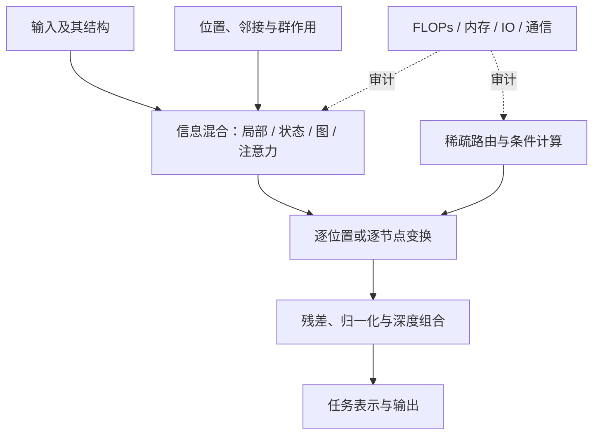

# 表示与模型架构 MOC

> [!abstract] 本章主线
> 模型架构是在输入结构、允许的信息交换和计算预算之间作出的设计。第四章不按模型名字堆百科，而是用统一坐标比较八类问题：局部性与对称性、状态与记忆、图结构、内容寻址、Transformer 组合、位置表示、高效推理和条件计算。

> [!info] 当前教学迁移快照
> ARCH-01—12 已按当前“课程位置—两遍路线—问题链—对象账本—贯穿算例—公式七问”标准完成三波迁移，现行范围为 **12/64**；40.1 为 **8/8 `regression-passed`**，40.2 前半卷为 **4/8 `in-progress`**，分卷材料门仍为 **1/8**。节点正文继续保留 `draft`，个人学习严格保持 `not-attempted`。

## 统一比较坐标

任何架构都必须回答：输入是什么结构；哪些变换应保持不变或等变；一次信息混合能看多远；训练和推理各需多少 FLOPs、内存与通信；并行性怎样；归纳偏置何时有益、何时错配；结论来自恒等式、定理、实验还是解释性假说。

## 八卷导航

| 卷 | 稳定 ID | 核心问题 | 状态 |
|---|---|---|---|
| [[卷积、空间结构与等变性 MOC]] | ARCH-01—08 | 局部连接和参数共享怎样编码空间先验？ | 8/8 `regression-passed` material |
| [[循环网络、记忆与状态空间模型 MOC]] | ARCH-09—16 | 有限状态怎样压缩历史，何时能并行？ | 4/8 `in-progress` material |
| [[图表示与消息传递神经网络 MOC]] | ARCH-17—24 | 无固定顺序的邻接结构怎样被等变处理？ | 静态材料完成 |
| [[Attention 的对象、几何与表达 MOC]] | ARCH-25—32 | 内容寻址怎样形成数据依赖的信息混合？ | 静态材料完成 |
| [[Transformer 架构与组合方式 MOC]] | ARCH-33—40 | Attention、FFN、残差和归一化怎样组成可扩展骨干？ | 静态材料完成 |
| [[位置编码、结构编码与长度外推 MOC]] | ARCH-41—48 | 顺序怎样进入模型，代数性质是否带来外推？ | 静态材料完成 |
| [[高效 Attention 与推理接口 MOC]] | ARCH-49—56 | 如何区分算法复杂度、IO 复杂度与解码缓存？ | 静态材料完成 |
| [[MoE、路由与条件计算 MOC]] | ARCH-57—64 | 稀疏激活怎样换取容量，又怎样付出均衡与通信代价？ | 静态材料完成 |

## 关键边界

- 本章讲架构算子、信息流、形状、复杂度和结构证据；具体优化器与分布式训练算法放入 60 章。
- 本章讲 encoder、decoder 和因果 mask 的架构语义；语言建模目标、tokenization、beam/sample decoding 放入 70 章。
- 本章讲通用 backbone；VAE、GAN、diffusion、flow 的生成目标和专用网络放入 50 章。
- 30 章已经完成 activation、normalization、residual、embedding 等通用部件；本章只分析它们进入具体架构后的交互。

## 科学空间专题入口

- [[科学空间 - 第四章专题来源地图]]：逐篇映射、证据角色与原论文复核状态；
- Transformer 升级之路：Attention、位置编码、长度外推、MLA；
- 线性 Attention / SSM：核特征、递推—卷积对偶、HiPPO、S4；
- GNN 桥接：InfoMap 任务、热扩散直觉与 kNN hubness；核心 GNN 理论由原论文补齐；
- MoE 环游记：几何、负载均衡、无辅助损失路由、动态激活与门控归一化；
- 使用纪律：博客负责问题意识和推导入口，不单独承担历史优先权、普遍性能或工程最优性的最终证明。

## 当前进度

- 已锁定：8 卷、64 个核心节点和章节边界；
- 已生成：ARCH-01—64 正文、960 道 A—E 习题、逐题独立解答与六十四张正式图；
- 当前教学标准迁移：ARCH-01—12 为 12/64，ARCH-13—64 尚待按初学者问题链重审；
- 40.1 当前为 8/8 `regression-passed`，40.2 为 4/8 `in-progress`，分卷材料门为 1/8；40.2 后半卷与 40.3—40.8 的旧静态材料不等于现行教学迁移完成；
- 第四章累计题卷、独立解答与跨卷确定性复现门已组成，但尚未真实作答；
- 分卷材料门：1/8；真实学习验收：0/64，个人状态 `not-attempted`。

## 导航

- [[表示与模型架构完整课程地图与掌握标准]]
- [[神经网络基础 MOC]]
- [[学习理论 MOC]]
- [[练习与测验 MOC]]
- [[推导与实验 MOC]]
- [[阶段测验 - 表示与模型架构（第四章）]]
- [[实验 - 表示与模型架构跨卷累计复现门]]
