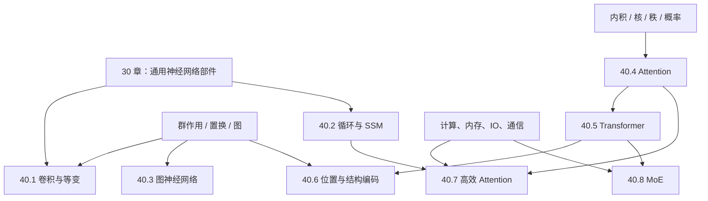

# 表示与模型架构完整课程地图与掌握标准

> [!abstract] 课程定位
> 本章面向第一次系统学习现代 AI 架构的读者，终点不是记住 CNN、RNN、Transformer 或 MoE 的名字，而是能从输入对称性、信息混合算子、张量形状、感受野/记忆、表达限制、数值语义和系统成本独立重建一个架构，并审计论文中的理论与经验主张。

## 一、范围锁定

- 固定 **8 卷、64 个核心节点**，使用稳定 ID `ARCH-01`—`ARCH-64`；
- 每节点目标产物为一篇正文、15 道 A—E 习题、独立详解和至少一个完整图文单元；
- 科学空间是 Attention、RoPE、SSM、MoE 的重点中文推导入口，但所有强结论要回查教材、原论文或可复现实验；
- CNN 与 GNN 的站内覆盖较弱，必须以正式教材和原论文补齐，不能让来源偏好改变课程完备性；
- 所有复杂度都注明变量、训练/预填充/解码阶段、算术/显存/IO/通信口径，禁止只写一个孤立的 $O(\cdot)$。

## 二、认知依赖

## 三、40.1 卷积、空间结构与等变性（ARCH-01—08）

**卷终能力**：能从离散局部算子推导卷积层的形状、感受野、参数共享、平移等变性及下采样边界，并审计一个 CNN backbone 的参数和计算量。

| ID | 核心节点 | 层级 | 核心问题 | 状态 |
|---|---|---|---|---|
| ARCH-01 | [[结构化输入、归纳偏置与架构比较坐标]] | 核心 | 为什么输入对称性和计算约束会决定架构？ | draft + A–E 闭环 |
| ARCH-02 | [[离散卷积、互相关与边界约定]] | 核心 | 深度学习的“卷积”实际算什么，边界怎样处理？ | draft + A–E 闭环 |
| ARCH-03 | [[局部连接、参数共享与平移等变性]] | 核心 | 共享局部核为何带来平移等变性，何时失效？ | draft + A–E 闭环 |
| ARCH-04 | [[通道、卷积核、步幅、填充与膨胀的形状账本]] | 核心 | 多通道卷积的每一维和输出尺寸怎样计算？ | draft + A–E 闭环 |
| ARCH-05 | [[池化、下采样、混叠与不变性边界]] | 核心 | 分辨率降低怎样改变信息、等变性和抗扰动？ | draft + A–E 闭环 |
| ARCH-06 | [[堆叠卷积、感受野与有效感受野]] | 核心 | 深度、kernel、stride 和 dilation 怎样决定可见范围？ | draft + A–E 闭环 |
| ARCH-07 | [[CNN 阶段、残差块与深度可分离卷积]] | 进阶 | 现代 CNN 怎样在容量、分辨率和计算间分配预算？ | draft + A–E 闭环 |
| ARCH-08 | [[群卷积、等变网络与 CNN 证据地图]] | 进阶 | 平移以外的对称性怎样进入网络，理论性质保证什么？ | draft + A–E 闭环 |

## 四、40.2 循环网络、记忆与状态空间模型（ARCH-09—16）

**卷终能力**：能把序列模型写成状态更新，推导 BPTT、门控和线性状态空间离散化，解释递推—卷积对偶及 HiPPO/S4/Mamba 的数学与系统边界。

| ID | 核心节点 | 层级 | 核心问题 | 状态 |
|---|---|---|---|---|
| ARCH-09 | [[序列因果性、隐藏状态与递推计算]] | 核心 | 固定维状态怎样压缩可变长历史？ | draft + A–E 闭环 |
| ARCH-10 | [[Vanilla RNN、BPTT 与梯度消失爆炸]] | 核心 | 共享递推 Jacobian 为什么造成长程优化困难？ | draft + A–E 闭环 |
| ARCH-11 | [[LSTM 的记忆单元、门控与梯度通道]] | 核心 | additive cell state 如何缓解但不消除长程问题？ | draft + A–E 闭环 |
| ARCH-12 | [[GRU、门控递推与 RNN 结构比较]] | 核心 | update/reset gate 与 LSTM 的状态合同有何差异？ | draft + A–E 闭环 |
| ARCH-13 | [[连续与离散线性状态空间模型]] | 核心 | $\dot x=Ax+Bu$ 怎样离散成稳定 recurrence？ | draft + A–E 闭环 |
| ARCH-14 | [[状态空间的递推—卷积对偶与并行扫描]] | 进阶 | 何时可把线性 recurrence 改写成卷积或 scan？ | draft + A–E 闭环 |
| ARCH-15 | [[HiPPO、S4 与结构化长记忆]] | 进阶 | 正交投影怎样导出状态矩阵，S4 如何高效计算？ | draft + A–E 闭环 |
| ARCH-16 | [[选择性状态空间、Mamba 与证据边界]] | 进阶 | 输入依赖参数带来何种选择性，又牺牲什么并行结构？ | draft + A–E 闭环 |

## 五、40.3 图表示与消息传递神经网络（ARCH-17—24）

**卷终能力**：能在节点重标号下定义等变/不变图函数，推导 message passing、graph convolution 和 readout，识别 WL 表达界、over-smoothing 与 over-squashing。

| ID | 核心节点 | 层级 | 核心问题 | 状态 |
|---|---|---|---|---|
| ARCH-17 | [[图数据、节点重标号与置换对称性]] | 核心 | 邻接和特征怎样随节点 permutation 共同变换？ | draft + A–E 闭环 |
| ARCH-18 | [[消息传递神经网络的统一形式]] | 核心 | message、aggregate、update 三步如何保持等变？ | draft + A–E 闭环 |
| ARCH-19 | [[谱图卷积、空间图卷积与归一化邻接]] | 核心 | Laplacian 频域与邻居聚合如何相连？ | draft + A–E 闭环 |
| ARCH-20 | [[聚合器、可辨识性与 Graph Isomorphism Network]] | 进阶 | sum/mean/max 对多重集分别丢失什么？ | draft + A–E 闭环 |
| ARCH-21 | [[图网络深度、过平滑与过挤压]] | 进阶 | 多跳信息为何会同质化或压过窄瓶颈？ | draft + A–E 闭环 |
| ARCH-22 | [[图注意力与结构偏置]] | 核心 | 学习邻居权重与全局 Attention 有何同异？ | draft + A–E 闭环 |
| ARCH-23 | [[图级读出、异构图与任务接口]] | 核心 | 节点表示怎样成为 permutation-invariant 图表示？ | draft + A–E 闭环 |
| ARCH-24 | [[WL 表达界、反例与 GNN 证据地图]] | 进阶 | message passing 能区分哪些图，基准证据怎样读？ | draft + A–E 闭环 |

## 六、40.4 Attention 的对象、几何与表达（ARCH-25—32）

**卷终能力**：能从 Q/K/V 形状手算 scaled dot-product attention，推导 mask、multi-head 和复杂度，并从几何、核、概率与秩视角解释其能力和局限。

| ID | 核心节点 | 层级 | 核心问题 | 状态 |
|---|---|---|---|---|
| ARCH-25 | [[内容寻址、Query、Key 与 Value]] | 核心 | 为什么“匹配依据”和“被读取内容”必须分开？ | draft + A–E 闭环 |
| ARCH-26 | [[Scaled Dot-Product Attention 与 Softmax 数值语义]] | 核心 | $1/\sqrt{d_k}$、log-sum-exp 和归一化分别做什么？ | draft + A–E 闭环 |
| ARCH-27 | [[Attention Mask、因果性与可见性合同]] | 核心 | padding、causal 与结构 mask 怎样进入 logits？ | draft + A–E 闭环 |
| ARCH-28 | [[Self-Attention、Cross-Attention 与张量形状]] | 核心 | query/source 长度不同时矩阵形状怎样变化？ | draft + A–E 闭环 |
| ARCH-29 | [[Multi-Head Attention、投影子空间与参数量]] | 核心 | 多头是并行表示子空间，还是单纯重复计算？ | draft + A–E 闭环 |
| ARCH-30 | [[Attention 的几何、核与概率视角]] | 进阶 | 相似度、核平滑和条件加权三种解释怎样对齐？ | draft + A–E 闭环 |
| ARCH-31 | [[Attention 矩阵的秩、瓶颈与有效秩]] | 进阶 | logit/attention/output 的秩限制分别是什么？ | draft + A–E 闭环 |
| ARCH-32 | [[Attention 失效模式、反例与证据地图]] | 进阶 | 尺度、熵、位置、长度和任务怎样改变结论？ | draft + A–E 闭环 |

## 七、40.5 Transformer 架构与组合方式（ARCH-33—40）

**卷终能力**：能逐层重建 encoder、decoder、encoder–decoder、decoder-only 和 ViT，审计 residual/norm/FFN 的位置、形状、参数与 FLOPs，并区分结构事实和性能经验。

| ID | 核心节点 | 层级 | 核心问题 | 状态 |
|---|---|---|---|---|
| ARCH-33 | [[Transformer Block、残差、归一化与 FFN]] | 核心 | 一个 block 中两类 token mixing 怎样组合？ | draft + A–E 闭环 |
| ARCH-34 | [[Transformer Encoder 与双向表示]] | 核心 | encoder 怎样产生每个位置的上下文表示？ | draft + A–E 闭环 |
| ARCH-35 | [[Transformer Decoder 与自回归因果结构]] | 核心 | shift、causal mask 和 KV 状态怎样定义 decoder？ | draft + A–E 闭环 |
| ARCH-36 | [[Encoder–Decoder 与 Cross-Attention]] | 核心 | source memory 如何被 target queries 条件读取？ | draft + A–E 闭环 |
| ARCH-37 | [[Decoder-Only、Prefix 与架构家族比较]] | 核心 | 三类 Transformer 的可见性和训练接口有何差异？ | draft + A–E 闭环 |
| ARCH-38 | [[Vision Transformer、Patch Token 与二维结构]] | 进阶 | 图像怎样被 token 化，空间先验转移到哪里？ | draft + A–E 闭环 |
| ARCH-39 | [[Transformer 形状、参数量与 FLOPs 总账]] | 核心 | $n,d,h,d_{ff},L$ 怎样决定训练和推理成本？ | draft + A–E 闭环 |
| ARCH-40 | [[Transformer 表达、稳定性与证据边界]] | 进阶 | 架构是否“万能”，理论条件与真实训练差多少？ | draft + A–E 闭环 |

## 八、40.6 位置编码、结构编码与长度外推（ARCH-41—48）

**卷终能力**：能从置换对称性推导位置需求，重建绝对、Sinusoidal、相对、RoPE 与二维位置编码，并用协议而非单一 benchmark 审计长度外推。

| ID | 核心节点 | 层级 | 核心问题 | 状态 |
|---|---|---|---|---|
| ARCH-41 | [[置换对称性与位置编码的必要性]] | 核心 | 无位置信息的 self-attention 能识别顺序吗？ | draft + A–E 闭环 |
| ARCH-42 | [[可学习绝对位置与位置相加合同]] | 核心 | token 与 position 相加依赖哪些 shape/尺度假设？ | draft + A–E 闭环 |
| ARCH-43 | [[Sinusoidal 位置编码、频率与相对位移]] | 核心 | 正弦余弦怎样把位移写成线性变换？ | draft + A–E 闭环 |
| ARCH-44 | [[相对位置表示、偏置与距离函数]] | 核心 | 在 attention logit 中加入相对结构有哪些方式？ | draft + A–E 闭环 |
| ARCH-45 | [[RoPE 的旋转推导、群表示与内积]] | 核心 | 为什么绝对旋转能在 QK 内积中形成相对位置？ | draft + A–E 闭环 |
| ARCH-46 | [[二维、多轴与多模态位置编码]] | 进阶 | 多个坐标轴怎样组合且避免结构混淆？ | draft + A–E 闭环 |
| ARCH-47 | [[长度外推、位置插值与 RoPE 缩放]] | 进阶 | train-short/test-long 的失配来自哪些机制？ | draft + A–E 闭环 |
| ARCH-48 | [[位置分辨率、混叠与长度外推评测]] | 进阶 | PPL、检索与长程依赖测试为何可能给相反结论？ | draft + A–E 闭环 |

## 九、40.7 高效 Attention 与推理接口（ARCH-49—56）

**卷终能力**：能把 attention 成本分成算术、显存、HBM IO 和缓存，区分 exact kernel 与模型近似，并比较 sparse、low-rank、linear、FlashAttention、MQA/GQA/MLA。

| ID | 核心节点 | 层级 | 核心问题 | 状态 |
|---|---|---|---|---|
| ARCH-49 | [[Attention 的二次复杂度、内存与 IO 瓶颈]] | 核心 | $n^2$ 究竟出现在何处，硬件瓶颈是哪一种？ | draft + A–E 闭环 |
| ARCH-50 | [[局部、分块与稀疏 Attention]] | 核心 | 限制可见边怎样换取成本并损失全局依赖？ | draft + A–E 闭环 |
| ARCH-51 | [[低秩投影与序列维压缩 Attention]] | 进阶 | 压缩 K/V 长度依赖什么低秩假设？ | draft + A–E 闭环 |
| ARCH-52 | [[核特征、线性 Attention 与结合律重排]] | 核心 | 哪些 attention 可从 $Q(K^TV)$ 重排获得线性长度成本？ | draft + A–E 闭环 |
| ARCH-53 | [[Performer、随机特征与近似误差]] | 进阶 | Softmax kernel 怎样近似，误差与方差如何进入？ | draft + A–E 闭环 |
| ARCH-54 | [[FlashAttention、精确计算与 IO Awareness]] | 核心 | 不改变 attention 结果，怎样避免物化 $n\times n$ 矩阵？ | draft + A–E 闭环 |
| ARCH-55 | [[KV Cache、MHA、MQA 与 GQA]] | 核心 | 解码时 K/V 共享怎样换显存、带宽与表达？ | draft + A–E 闭环 |
| ARCH-56 | [[MLA、潜变量缓存与推理成本证据]] | 进阶 | 低维 latent cache 如何重参数化，比较口径怎样才公平？ | draft + A–E 闭环 |

## 十、40.8 MoE、路由与条件计算（ARCH-57—64）

**卷终能力**：能从 mixture 目标写出 router、top-k、dispatch、capacity 和负载统计，区分模型容量、每 token 计算与通信成本，并审计 aux-loss 与 loss-free 平衡方案。

| ID | 核心节点 | 层级 | 核心问题 | 状态 |
|---|---|---|---|---|
| ARCH-57 | [[条件计算、专家混合与稀疏激活]] | 核心 | 总参数量与每 token 激活参数量为何能分离？ | draft + A–E 闭环 |
| ARCH-58 | [[Router、Gate、Top-k 与稀疏组合]] | 核心 | 选择专家和加权专家是同一个操作吗？ | draft + A–E 闭环 |
| ARCH-59 | [[Expert Capacity、Dispatch 与 Token Dropping]] | 核心 | 容量溢出怎样影响训练语义和系统吞吐？ | draft + A–E 闭环 |
| ARCH-60 | [[MoE 负载均衡辅助损失与偏置]] | 核心 | importance/load loss 优化的量与主任务一致吗？ | draft + A–E 闭环 |
| ARCH-61 | [[Loss-Free 路由、偏置更新与分配视角]] | 进阶 | 不把均衡项加入 loss，如何闭环调节负载？ | draft + A–E 闭环 |
| ARCH-62 | [[细粒度专家、共享专家与动态激活]] | 进阶 | 专家拆分和可变激活数怎样改变专门化与成本？ | draft + A–E 闭环 |
| ARCH-63 | [[Expert Parallel、All-to-All 与通信成本]] | 核心 | 稀疏算力为什么常被 dispatch 通信吞噬？ | draft + A–E 闭环 |
| ARCH-64 | [[MoE 门控归一化、证据地图与开放问题]] | 进阶 | softmax/sigmoid、先选后归一与先归一后选如何比较？ | draft + A–E 闭环 |

## 十一、分层掌握标准

| 等级 | 可观察能力 | 代表任务 |
|---|---|---|
| L1 对象与形状 | 写清输入结构、参数、状态、mask 和输出轴 | conv、attention、message passing |
| L2 前向与手算 | 用小张量从输入算到输出 | 1D convolution、RNN、QKV、router |
| L3 推导与复杂度 | 证明等变性/对偶，重建参数和成本账本 | CNN、SSM、MHA、MoE |
| L4 反例与边界 | 删除假设并构造结构、数值或协议失败 | aliasing、rank、long context、load collapse |
| L5 系统迁移 | 在训练/预填充/解码下比较未知架构 | FlashAttention、GQA/MLA、expert parallel |
| L6 研究入口 | 分开恒等式、定理、近似、消融和开放问题 | S4、RoPE extrapolation、MoE balance |

每卷通过至少达到 L4；章节出口要求八卷全部达到 L4，至少三卷达到 L5，并能在 60 分钟内对一篇陌生架构论文完成“对象—形状—算子—对称性—复杂度—数值—系统—证据”审计。

## 十二、来源与视觉策略

- 正式骨架：Goodfellow–Bengio–Courville、Dive into Deep Learning、Stanford CS231n/CS224n、图表示学习教材；
- 原始证据：CNN/GCNN、LSTM/GRU、HiPPO/S4/Mamba、GNN/GIN、Transformer/RoPE/Performer/FlashAttention、Switch/DeepSeekMoE 等原论文；
- 科学空间：承担中文问题入口、长推导桥和新近研究争议地图，结论按 source tier 和 claim status 标注；
- 视觉：空间算子用 paper-ink/信号图，状态模型用时间轴与 scan，Attention 用张量账本和矩阵热图，系统成本用 research plot，MoE 用 token-routing/通信图；外部原图只在许可明确且原貌具有证据价值时纳入。

## 十三、当前基线（2026-08-24）

> [!info] 2026-08-29 现行教学迁移
> ARCH-01—04 已完成首波教学重写并由[[architecture_teaching_contract_audit.py]]独立复核，迁移范围为 **4/64**；40.1 为 **4/8 in-progress**，分卷材料门仍为 **0/8**。正文 `draft` 与个人 `not-attempted` 不变，旧“静态材料完成”只说明文件、题解和图存在。

| 指标 | 当前值 | 解释 |
|---|---:|---|
| 锁定核心节点 | 64 | 八卷范围、标题、ID 与边界已确定 |
| 已有正式正文 | 64 | ARCH-01—64 已完成正文与正式图文单元 |
| 已有节点习题/解答 | 64 / 64 | ARCH-01—64 共 960 题及逐题独立详解 |
| 现行教学迁移 | 4 / 64 | ARCH-01—04 已满足当前初学者教学合同 |
| 分卷验收门 | 0 / 8 | 40.1 尚为 4/8 in-progress |
| 章节累计门 | 0 / 1 | 题卷、解答与跨卷实验门已组成；尚未真实作答 |
| 真实学习验收 | 0 | 个人状态 `not-attempted`；材料回归不能替代闭卷与迁移证据 |

## 十四、导航

- 总入口：[[表示与模型架构 MOC]]
- 来源地图：[[科学空间 - 第四章专题来源地图]]
- 前置：[[神经网络基础 MOC]] · [[学习理论 MOC]] · [[数学基础 MOC]]
- 标准：[[00-课程教学与研究总纲]] · [[05-质量门槛与检查清单]] · [[06-图文编排与制图工作流]]
- 实践：[[练习与测验 MOC]] · [[推导与实验 MOC]]
