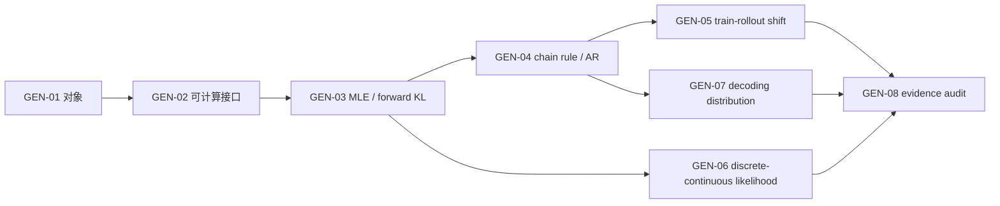

# 生成建模对象、似然与自回归 MOC

> [!abstract] 分卷目标
> 本卷先回答“生成模型究竟在学习什么”，再推导最大似然和自回归分解，最后检查 Teacher Forcing、dequantization 与 decoding 怎样改变训练或采样口径。学完后，读者应能拿到一个陌生生成系统，独立写出它的分布、目标、估计器、训练、采样、评价和证据七本账。

## 一、为什么第一卷不从某个著名模型开始

VAE、GAN、Flow、Diffusion 看起来结构不同，真正的分歧却集中在几件事：是否能算 normalized likelihood、怎样获得样本、代理损失估计什么、有限步程序偏离哪个理想对象。若这些对象没分清，后面很容易把“样本看起来像”“loss 下降”“likelihood 高”和“分布接近”写成同一件事。

## 二、八个核心节点

| ID | 节点 | 主要出口 | 正文 | 题解 |
|---|---|---|---|---|
| GEN-01 | [[生成建模的对象、样本空间与数据分布]] | 区分真实分布、经验分布、模型分布与实际输出分布 | verified | 已配套 |
| GEN-02 | [[显式密度、隐式分布与可计算性三角]] | 按 likelihood/sampling/normalization 接口分类 | verified | 已配套 |
| GEN-03 | [[最大似然、交叉熵与前向 KL]] | 从经验 NLL 推到 population forward KL | verified | 已配套 |
| GEN-04 | [[概率链式分解、顺序选择与自回归生成]] | 从 chain rule 构造 normalized joint 与 ancestral sampler | verified | 已配套 |
| GEN-05 | [[Teacher Forcing、暴露偏差与生成时分布漂移]] | 区分 MLE 一致性、prefix shift 与 rollout risk | verified | 已配套 |
| GEN-06 | [[离散似然、连续似然、Dequantization 与 Bits-per-dim]] | 审计 image likelihood、bin width 与 dequantization bound | verified | 已配套 |
| GEN-07 | [[祖先采样、温度、截断与自回归解码分布]] | 写出 temperature/top-k/top-p 后真正采样的核 | verified | 已配套 |
| GEN-08 | [[自回归模型的表达、成本、失效模式与证据地图]] | 做跨模态受控比较与失败归因 | verified | 已配套 |

## 三、认知顺序

不能跳过 GEN-01—03 直接把 decoder 称为“生成模型”；也不能只会 GEN-04 的乘法公式，却不知道 GEN-07 的解码器已经从 $p_\theta$ 改成了另一个 $q_{\theta,\phi}$。

## 四、贯穿分卷的符号合同

| 符号 | 含义 | 可否直接访问 |
|---|---|---|
| $(\mathcal X,\mathcal F)$ | 样本空间与事件集合 | 由任务定义 |
| $P_*$ 或 $P_{\mathrm{data}}$ | 未知数据生成分布 | 通常只能见 iid/依赖样本 |
| $\widehat P_n$ | $n$ 个观测形成的经验分布 | 可访问，但不是总体真相 |
| $P_\theta$ | 参数 $\theta$ 定义的模型分布 | 访问能力取决于模型族 |
| $p_*,p_\theta$ | 相对同一参考测度的密度/质量 | 连续情形不是点概率 |
| $Q_{\theta,\phi}$ | 解码器、有限步采样器或后处理实际输出分布 | 必须由程序合同确定 |
| $\ell(\theta;X)$ | 单样本损失 | mini-batch 估计的原子 |

本卷统一用自然对数；换成 base 2 时明确除以 $\log 2$。序列索引写 $x_{1:T}$，$x_{<t}=x_{1:t-1}$；图像维度排序写置换 $\pi$。

## 五、科学空间研读路径

1. [[S-2018-Su-5861-Seq2Seq与Beam-Search]]：从条件乘法与搜索树进入 GEN-04/07；
2. [[S-2020-Su-7259-Exposure-Bias]]：把真实前缀与模型前缀的错配问题化；
3. [[S-2020-Su-7500-自回归停止与解码]]：观察 EOS、重复与截断怎样进入生成程序；
4. [[S-2021-Su-8062-从文本生成到搜索采样]]：区分目标分布、proposal、search 与 sampling；
5. [[S-2024-Su-10197-多模态自回归]]：把顺序与条件分布族扩展到视觉 patch，并保留开放假说。

这些文章不替代：[[S-2016-Uria-NADE]] 的 tractable density 定义、[[S-2016-Oord-PixelRNN]] 的离散图像 likelihood、[[S-2019-Ho-FlowPlusPlus-Dequantization]] 的变分下界、[[S-2019-Holtzman-Nucleus-Sampling]] 的 top-$p$ 原始证据，以及[[S-2015-Huszar-Scheduled-Sampling批判]]的反例。

## 六、分卷验收门

完成静态阅读后仍需无提示完成：

- 从测度/质量函数层面解释“密度不是点概率”；
- 推导经验 NLL、population cross-entropy 与 forward KL 的关系；
- 对三变量联合分布做两种排序的完整 chain factorization；
- 写出 teacher-forcing risk 与 rollout-prefix risk 的不同期望测度；
- 从离散 mass 推导 uniform/variational dequantization lower bound 和 BPD 常数；
- 给定 logits，手算 temperature、top-$k$、top-$p$ 后的归一化分布；
- 对一个模型建立七账审计，并拒绝仅凭单一样本或单一 likelihood 下结论。

真实掌握状态仍由答题与复现记录决定；“正文已建立”不自动记为通过。
