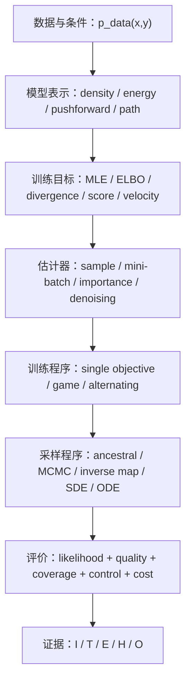

# 生成模型 MOC

> [!abstract] 本章目标
> 从零开始建立统一但不含混的生成建模框架：明确数据分布和模型分布，推导训练目标，判断 estimator 是否可靠，区分训练与采样程序，分析有限步/有限样本误差，并用多指标和证据等级评价模型。完成后应能独立推导经典方法、实现最小模型、诊断失败并阅读 2024—2026 的生成理论工作。

## 课程总地图

- 完整范围、稳定 ID 与掌握标准：[[生成模型完整课程地图与掌握标准]]；
- 科学空间文章、原论文与节点映射：[[科学空间 - 第五章生成模型专题来源地图]]；
- 固定范围：**9 卷、72 个核心节点，`GEN-01`—`GEN-72`**；
- 当前状态：9 卷、72 节点的静态正文、图、A—E 题解、分卷复现门与全章累计审计门已完成；
- 真实掌握状态：尚未作答、评分或完成最小复现，不因静态材料建立而记为通过。

## 统一视角：七本账

学习任何模型时依次问：

1. 它表示的是 normalized density、unnormalized energy、implicit pushforward，还是一条 probability path？
2. 训练目标和真正想比较的分布差异是什么关系？
3. mini-batch 计算的是无偏估计、有偏估计，还是只共享最优点的 surrogate？
4. 训练和采样是否需要两个网络、交替更新、MCMC 或数值 solver？
5. 模型误差、估计误差、优化误差和离散误差如何分账？
6. 样本质量、模式覆盖、likelihood、条件一致性和计算成本是否同时报告？
7. 结论是恒等式、定理、实验、解释还是开放问题？

## 九卷导航

| 分卷 | ID | 主题 | 学习出口 | 状态 |
|---|---|---|---|---|
| [[50.1-生成建模对象、似然与自回归/生成建模对象、似然与自回归 MOC\|50.1 生成建模对象、似然与自回归]] | GEN-01—08 | explicit/implicit distribution、MLE、factorization、sampling | 能为陌生模型建立分布—目标—采样账 | 静态课程与复现门完成 |
| [[50.2-自编码器、隐变量模型与VAE/自编码器、隐变量模型与 VAE MOC\|50.2 自编码器、隐变量模型与 VAE]] | GEN-09—16 | AE、latent variable、ELBO、IWAE、collapse | 能完整推导 VAE 并诊断 latent failure | 静态课程与复现门完成 |
| [[50.3-GAN、分布差异与对抗训练/GAN、分布差异与对抗训练 MOC\|50.3 GAN、分布差异与对抗训练]] | GEN-17—24 | GAN、f-divergence、IPM、Wasserstein、game dynamics | 能分开 equilibrium、gradient 和训练稳定性 | 静态课程与复现门完成 |
| [[50.4-能量模型、Score与Langevin/能量模型、Score 与 Langevin MOC\|50.4 能量模型、Score 与 Langevin]] | GEN-25—32 | EBM、NCE、score matching、DSM、MCMC | 能从 energy/score 构造训练与采样 | 静态课程与复现门完成 |
| [[50.5-Normalizing Flow与可逆密度变换/Normalizing Flow 与可逆密度变换 MOC\|50.5 Normalizing Flow 与可逆密度变换]] | GEN-33—40 | change of variables、coupling、MAF/IAF、CNF | 能手算 logdet 并审计可逆/likelihood 成本 | 静态课程与复现门完成 |
| [[50.6-DDPM、DDIM与离散时间扩散/DDPM、DDIM 与离散时间扩散 MOC\|50.6 DDPM、DDIM 与离散时间扩散]] | GEN-41—48 | forward/reverse、ELBO、parameterization、variance、DDIM | 能从头推导并实现最小 DDPM | 静态课程与复现门完成 |
| [[50.7-SDE、概率流ODE与Flow Matching/SDE、概率流 ODE 与 Flow Matching MOC\|50.7 SDE、概率流 ODE 与 Flow Matching]] | GEN-49—56 | reverse SDE、PF ODE、continuity、FM、ReFlow | 能统一连续路径但保留等价边界 | 静态课程与复现门完成 |
| [[50.8-离散扩散、潜空间与多模态生成/离散扩散、潜空间与多模态生成 MOC\|50.8 离散扩散、潜空间与多模态生成]] | GEN-57—64 | categorical/mask diffusion、VQ/FSQ、LDM、tokens | 能比较 state、representation、latent、randomness 四条路线 | 静态课程与复现门完成 |
| [[50.9-采样器、条件控制、加速与评估/采样器、条件控制、加速与评估 MOC\|50.9 采样器、条件控制、加速与评估]] | GEN-65—72 | guidance、solver、distillation、MeanFlow、metrics | 能设计可复现且不依赖单一指标的评测 | 静态课程与复现门完成 |

## 科学空间主线

本章不是在末尾附“相关阅读”，而是把博客作为第二教学入口嵌入正文：

- **VAE 系列**：从 AE 的采样缺口到 Bayesian latent model、ELBO、collapse、vMF 和 likelihood estimation；
- **能量视角下的 GAN**：从“挖坑—跳坑”直觉进入正负相、generator entropy、Langevin 和 EBM；
- **细水长 flow**：从 NICE、RealNVP/Glow、i-ResNet 到 2025 TARFLOW；
- **去噪—score 主线**：[[S-2023-Su-9509-得分匹配与条件得分匹配]]与“从去噪自编码器到生成模型”；
- **生成扩散模型漫谈 1—31**：DDPM、DDIM、SDE/ODE、统一扩散、ReFlow、采样加速、SiD/Shortcut/Consistency、DDCM、MeanFlow、JiT；
- **离散生成与评价**：VQ-VAE、FSQ、SimVQ、DiVeQ，以及 2026 FD Loss。

每个调用框都要明确：文章帮助理解什么；博客/论文记号如何映射；哪一步可以独立复算；哪些实验或解释不能升级为一般结论；原论文和最小复现补什么。

## 与前置章节的边界

| 前置内容 | 本章怎样调用 | 本章新增 |
|---|---|---|
| 概率、条件期望、MLE/MAP | 作为分布与估计语言 | 组装为具体 generative objective 与 sampler |
| ELBO、散度、Wasserstein、率失真 | 直接链接既有证明 | 解释 VAE/GAN 的优化、collapse 和评价 |
| ODE/SDE、Fokker–Planck、reverse time | 作为连续生成严格前置 | 加入模型参数化、训练、采样器和有限 NFE 误差 |
| CNN/Transformer/U-Net/DiT | 不重复一般架构 | 只写生成任务下的输入输出、conditioning 和成本合同 |
| 学习理论与优化 | 调用泛化/优化结论 | 区分 population target、estimator 与 training dynamics |

## 学习与验收

每个节点必须完成：正文 + 正式图文单元 + 15 道 A—E 题 + 独立详解 + 无提示复现清单。每卷完成后设置：

- 120 题累计题库与抽样测验；
- 一项最小实现或数值实验；
- 一项删除关键假设的反例；
- 一份科学空间文章与原论文的符号/claim 对照；
- 一次跨模型受控比较。

全章出口不是“知道 VAE/GAN/Diffusion 是什么”，而是能对陌生论文完成：

$$
\text{对象}\to\text{目标}\to\text{估计}\to\text{训练}\to\text{采样}\to\text{评价}\to\text{证据}.
$$

## 当前执行点

1. [x] 锁定 9 卷、72 节点与稳定 ID；
2. [x] 建立科学空间生成模型专题来源地图；
3. [x] 补齐 50.1 原论文/博客来源卡和符号表；
4. [x] 生成 GEN-01—08 正文、图、A—E 题解和第一卷验收门；
5. [x] 生成 GEN-09—16 正文、图、A—E 题解和第二卷验收门；
6. [x] 生成 GEN-17—24 正文、图、A—E 题解和第三卷验收门；
7. [x] 生成 GEN-25—32 正文、图、A—E 题解和第四卷验收门；
8. [x] 生成 GEN-33—40 正文、图、A—E 题解和第五卷验收门；
9. [x] 完成 50.6 GEN-41—48、120 题、数值审计与分卷累计门；
10. [x] 完成 50.7—50.9，并建立[[第五章生成模型总复习、累计测验与研究审计门]]。

## 规范入口

- [[00-课程教学与研究总纲]]
- [[01-研读与成稿工作流]]
- [[02-笔记与节点规范]]
- [[03-来源、引用与版权规范]]
- [[05-质量门槛与检查清单]]
- [[06-图文编排与制图工作流]]
