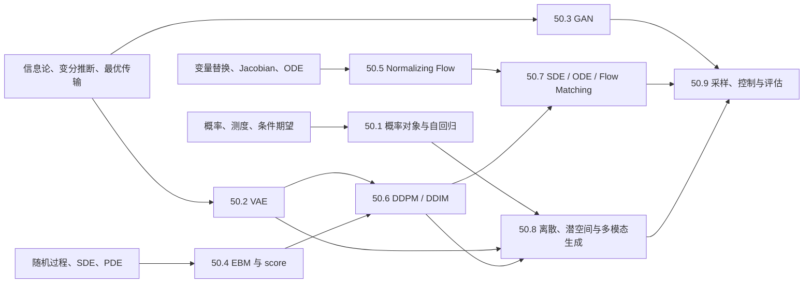

# 生成模型完整课程地图与掌握标准

> [!abstract] 范围结论
> 第五章固定为 **9 卷、72 个核心节点**，使用稳定 ID `GEN-01`—`GEN-72`。课程从“模型究竟表示什么概率对象”出发，依次学习自回归、VAE、GAN、能量/score、正规化流、离散时间扩散、连续时间生成、离散/潜空间/多模态生成，最后以采样、控制和评估收官。章节不是模型名词表，而是一门要求能够推导、实现、诊断和阅读前沿论文的生成建模课程。

## 一、范围锁定

- 固定 **9 卷 × 8 节点 = 72 个核心节点**；标题和 ID 只在发现实质性范围错误时修改；
- 每卷包含对象定义、核心推导、最小手算、数值/实现合同、反例、模型比较、科学空间研读框和研究出口；
- 每节点配一份覆盖 A—E 能力的习题与独立完整解答；分卷结束后再建立累计测验和复现门；
- 科学空间承担中文直觉、长推导的第二入口和当代问题地图，不独立承担历史优先权、一般定理或跨设置性能结论；
- 第四章已经讲过 CNN、Transformer、U-Net/DiT 所需的一般架构，本章只解释它们在生成目标中的输入输出合同，不重复架构史；
- 第十章已经证明概率、信息、最优传输、ODE/SDE 与数值分析基础，本章负责把这些工具组装成可训练、可采样、可评价的生成模型。

## 二、贯穿全章的七本账

任一生成模型都必须同时回答七类问题：

| 账本 | 必须写清的对象 | 典型误区 |
|---|---|---|
| 分布账 | $p_{\text{data}}$、$p_\theta$、support、base/latent law | 把样本画得像等同于分布相等 |
| 目标账 | likelihood、ELBO、divergence/IPM、score/velocity loss | 把代理损失直接称为目标距离 |
| 估计账 | population objective、mini-batch estimator、bias/variance | 只看 loss 数值，不问估计对象 |
| 训练账 | 参数、交替/联合优化、梯度估计器、稳定化 | 把可微公式等同于可训练算法 |
| 采样账 | 初始分布、transition/solver、NFE、随机性 | 把连续动力学和有限步程序混同 |
| 评价账 | likelihood、质量、覆盖、条件一致性、成本 | 用单一 FID 或主观样例裁决一切 |
| 证据账 | identity、theorem、experiment、hypothesis、open problem | 把博客直觉或单个 benchmark 升格为定理 |

## 三、认知依赖

建议顺序是 50.1 → 50.2 → 50.3 → 50.4 → 50.5 → 50.6 → 50.7 → 50.8 → 50.9。已有扎实概率与动力系统基础的读者可以并行学习 50.3—50.5，但不能跳过 50.1 的对象和评价口径。

## 四、50.1 生成建模对象、似然与自回归（GEN-01—08）

**卷终能力**：面对离散或连续数据，能写清数据分布、模型分布、密度/质量函数、训练目标和采样程序；能从概率链式法则推导自回归模型，并审计 likelihood、dequantization、teacher forcing 与解码偏差。

| ID | 核心节点 | 层级 | 核心问题 | 当前状态 |
|---|---|---|---|---|
| GEN-01 | [[生成建模的对象、样本空间与数据分布]] | 核心 | “生成得像”究竟要让哪个数学对象接近哪个对象？ | 静态材料 verified；个人掌握待作答 |
| GEN-02 | [[显式密度、隐式分布与可计算性三角]] | 核心 | likelihood、sampling 与 flexible architecture 能否同时容易？ | 静态材料 verified；个人掌握待作答 |
| GEN-03 | [[最大似然、交叉熵与前向 KL]] | 核心 | 经验负对数似然为什么对应 population KL，遗漏了什么常数？ | 静态材料 verified；个人掌握待作答 |
| GEN-04 | [[概率链式分解、顺序选择与自回归生成]] | 核心 | 联合分布怎样化为条件分布乘积，排序会改变什么？ | 静态材料 verified；个人掌握待作答 |
| GEN-05 | [[Teacher Forcing、暴露偏差与生成时分布漂移]] | 核心 | 训练时看真实前缀、采样时看模型前缀为何不是同一分布？ | 静态材料 verified；个人掌握待作答 |
| GEN-06 | [[离散似然、连续似然、Dequantization 与 Bits-per-dim]] | 进阶 | 图像像素从离散值变成连续密度时，likelihood 口径怎样变化？ | 静态材料 verified；个人掌握待作答 |
| GEN-07 | [[祖先采样、温度、截断与自回归解码分布]] | 核心 | temperature、top-k/top-p 和 beam search 实际改变了哪个分布？ | 静态材料 verified；个人掌握待作答 |
| GEN-08 | [[自回归模型的表达、成本、失效模式与证据地图]] | 进阶 | tractable likelihood 与串行采样的优势和代价怎样受控比较？ | 静态材料 verified；个人掌握待作答 |

## 五、50.2 自编码器、隐变量模型与 VAE（GEN-09—16）

**卷终能力**：能从 joint—marginal—posterior 三对象推导 ELBO 和重参数化梯度，手算 Gaussian VAE，区分 inference/amortization gap，诊断 posterior collapse，并比较先验、后验和潜空间几何的不同改法。

| ID | 核心节点 | 层级 | 核心问题 | 当前状态 |
|---|---|---|---|---|
| GEN-09 | [[自编码器、重构与生成缺口]] | 核心 | AE 能重构训练样本，为什么不自动给出可采样的潜变量分布？ | 静态材料 verified；个人掌握待作答 |
| GEN-10 | [[隐变量模型的联合分布、边缘似然与后验]] | 核心 | $p(z)p_\theta(x\mid z)$ 怎样定义模型，困难究竟出在哪里？ | 静态材料 verified；个人掌握待作答 |
| GEN-11 | [[VAE 的 ELBO、变分后验与重参数化梯度]] | 核心 | Jensen/恒等分解如何得到可优化下界，梯度怎样穿过采样？ | 静态材料 verified；个人掌握待作答 |
| GEN-12 | [[Gaussian VAE 的闭式 KL、解码似然与尺度合同]] | 核心 | MSE、Bernoulli/Beta/Gaussian likelihood 各自声明了什么观测模型？ | 静态材料 verified；个人掌握待作答 |
| GEN-13 | [[IWAE、重要性权重与推断缺口]] | 进阶 | 更多 importance samples 收紧什么 bound，又怎样改变梯度信号？ | 静态材料 verified；个人掌握待作答 |
| GEN-14 | [[Posterior Collapse、率失真与解码器容量]] | 进阶 | KL 变成零是优化失败、模型最优，还是评价口径问题？ | 静态材料 verified；个人掌握待作答 |
| GEN-15 | [[层次 VAE、表达性先验与近似后验 Flow]] | 进阶 | 增加层次、mixture、vMF 或 flow 分别增强哪一个概率对象？ | 静态材料 verified；个人掌握待作答 |
| GEN-16 | [[VAE 的条件、聚类、解耦主张与证据地图]] | 进阶 | 可解释潜变量、聚类和 disentanglement 哪些可识别，哪些依赖归纳偏置？ | 静态材料 verified；个人掌握待作答 |

## 六、50.3 GAN、分布差异与对抗训练（GEN-17—24）

**卷终能力**：能从 pushforward 分布和二人博弈写出 GAN，推导最优判别器与 JS 目标，比较 f-divergence、IPM 和 Wasserstein，审计 Lipschitz 约束、旋转动力学、mode collapse 与常见稳定化方法。

| ID | 核心节点 | 层级 | 核心问题 | 当前状态 |
|---|---|---|---|---|
| GEN-17 | [[隐式 Pushforward 分布、生成器与判别博弈]] | 核心 | 没有显式密度时，怎样用样本和判别问题比较两个分布？ | 静态材料 verified；个人掌握待作答 |
| GEN-18 | [[原始 GAN、最优判别器与 Jensen–Shannon 散度]] | 核心 | 固定生成器时最优判别器是什么，代回后究竟最小化什么？ | 静态材料 verified；个人掌握待作答 |
| GEN-19 | [[饱和、非饱和生成器损失与 f-GAN]] | 核心 | 相同 population equilibrium 下，不同 generator loss 的梯度为何不同？ | 静态材料 verified；个人掌握待作答 |
| GEN-20 | [[IPM、Wasserstein-1 与 Kantorovich 对偶]] | 进阶 | support 分离时 Wasserstein 拓扑为何可能提供更连续的训练信号？ | 静态材料 verified；个人掌握待作答 |
| GEN-21 | [[Lipschitz 约束、权重裁剪、梯度惩罚与谱归一化]] | 核心 | critic 的函数类怎样约束，实际 penalty 等于理论约束吗？ | 静态材料 verified；个人掌握待作答 |
| GEN-22 | [[Minimax 动力学、旋转、阻尼与局部收敛]] | 进阶 | saddle-point game 为什么不同于单目标最小化？ | 静态材料 verified；个人掌握待作答 |
| GEN-23 | [[Mode Collapse、模式覆盖与生成器熵]] | 核心 | 样本很清晰却缺少多样性时，哪本账出现了问题？ | 静态材料 verified；个人掌握待作答 |
| GEN-24 | [[GAN 稳定化方法、受控比较与证据地图]] | 进阶 | hinge、WGAN-GP、regularization 和 architecture 改动怎样公平比较？ | 静态材料 verified；个人掌握待作答 |

## 七、50.4 能量模型、Score Matching 与 Langevin Dynamics（GEN-25—32）

**卷终能力**：能从未归一化密度写出配分函数和正负相，推导 score matching 与 denoising identity，解释多噪声尺度的作用，并区分连续 Langevin 的不变分布与有限步 ULA/MALA 的误差。

| ID | 核心节点 | 层级 | 核心问题 | 当前状态 |
|---|---|---|---|---|
| GEN-25 | [[能量模型、未归一化密度与配分函数]] | 核心 | $e^{-E_\theta(x)}/Z_\theta$ 容易定义，为什么 likelihood 和 sampling 仍困难？ | 静态材料 verified；个人掌握待作答 |
| GEN-26 | [[最大似然的正相负相、对比散度与噪声对比估计]] | 进阶 | 数据相与模型相分别来自哪里，CD/NCE 近似了什么？ | 静态材料 verified；个人掌握待作答 |
| GEN-27 | [[Score Matching、分部积分与配分函数消去]] | 核心 | 只匹配 $\nabla_x\log p(x)$ 为什么能绕开未知常数？ | 静态材料 verified；个人掌握待作答 |
| GEN-28 | [[去噪 Score Matching、Tweedie 公式与条件期望]] | 核心 | 最优去噪器、conditional score 与 marginal score 怎样相连？ | 静态材料 verified；个人掌握待作答 |
| GEN-29 | [[多噪声尺度、退火去噪与 Score 网络]] | 核心 | 为什么单一小噪声很难覆盖低密度区和分离的模式？ | 静态材料 verified；个人掌握待作答 |
| GEN-30 | [[Langevin、ULA、MALA 与平稳分布]] | 核心 | 连续过程正确不变分布如何被步长、混合和接受拒绝改变？ | 静态材料 verified；个人掌握待作答 |
| GEN-31 | [[Predictor–Corrector 与 Score-based 生成程序]] | 进阶 | reverse predictor 和 Langevin corrector 分别修正什么误差？ | 静态材料 verified；个人掌握待作答 |
| GEN-32 | [[EBM、Score、GAN 与 Diffusion 的接口和证据地图]] | 进阶 | energy、critic、score 和 denoiser 何时等价，何时只是类比？ | 静态材料 verified；个人掌握待作答 |

## 八、50.5 Normalizing Flow 与可逆密度变换（GEN-33—40）

**卷终能力**：能用变量替换公式计算 exact likelihood，手算 coupling/triangular Jacobian，比较 MAF/IAF 方向成本，理解 residual/CNF 的数值估计，并审计可逆性、support、dequantization 与 likelihood—sample quality 的边界。

| ID | 核心节点 | 层级 | 核心问题 | 当前状态 |
|---|---|---|---|---|
| GEN-33 | [[变量替换、基分布与 Exact Likelihood Flow]] | 核心 | 可逆映射怎样同时给出采样和密度，Jacobian 应取哪个方向？ | 静态材料 verified；个人掌握待作答 |
| GEN-34 | [[Coupling Layer、NICE 与 RealNVP]] | 核心 | 三角 Jacobian 怎样换来低成本 log-determinant 和逆变换？ | 静态材料 verified；个人掌握待作答 |
| GEN-35 | [[Glow、ActNorm、可逆 1×1 卷积与多尺度结构]] | 核心 | channel mixing、normalization 和 split 怎样保持可逆性？ | 静态材料 verified；个人掌握待作答 |
| GEN-36 | [[Autoregressive Flow、MAF 与 IAF 的方向权衡]] | 进阶 | 同一类 triangular transform 为什么 likelihood 与 sampling 成本互换？ | 静态材料 verified；个人掌握待作答 |
| GEN-37 | [[Residual Flow、可逆 ResNet 与 Logdet 估计]] | 进阶 | Lipschitz 条件如何保证可逆，trace series/Hutchinson 引入什么误差？ | 静态材料 verified；个人掌握待作答 |
| GEN-38 | [[Neural Spline Flow 与单调可逆变换]] | 进阶 | 分段有理二次样条怎样兼顾表达力、单调性和解析逆？ | 静态材料 verified；个人掌握待作答 |
| GEN-39 | [[Continuous Normalizing Flow、Liouville 与 FFJORD]] | 进阶 | 离散 Jacobian determinant 如何变成沿轨迹的 divergence 积分？ | 静态材料 verified；个人掌握待作答 |
| GEN-40 | [[Flow 的 Support、Dequantization、TARFLOW 与证据地图]] | 进阶 | exact likelihood 为何不自动等于好的语义或样本，TARFLOW 改变了哪些经验结论？ | 静态材料 verified；个人掌握待作答 |

## 九、50.6 DDPM、DDIM 与离散时间扩散（GEN-41—48）

**卷终能力**：能从 Gaussian Markov forward process 推出任意时刻边缘与后验，逐项重建 ELBO，互换 $x_0/\epsilon/v/score$ 参数化，解释 schedule、SNR、variance 与 DDIM，并实现一个可审计的最小 DDPM。

| ID | 核心节点 | 层级 | 核心问题 | 当前状态 |
|---|---|---|---|---|
| GEN-41 | [[DDPM 前向 Markov 加噪与闭式边缘]] | 核心 | 多步 Gaussian transition 为什么能一次采样 $x_t\mid x_0$？ | 静态材料 verified；个人掌握待作答 |
| GEN-42 | [[DDPM 反向后验、ELBO 与逐步 KL]] | 核心 | $q(x_{t-1}\mid x_t,x_0)$ 怎样闭式求出并进入训练下界？ | 静态材料 verified；个人掌握待作答 |
| GEN-43 | [[数据、噪声、速度与 Score 参数化]] | 核心 | $x_0$、$\epsilon$、$v$、score 之间怎样精确换算，权重如何变化？ | 静态材料 verified；个人掌握待作答 |
| GEN-44 | [[扩散简化损失、时间加权、Schedule 与 SNR]] | 核心 | 去掉 ELBO 系数后最优点、梯度方差和训练重点分别怎样改变？ | 静态材料 verified；个人掌握待作答 |
| GEN-45 | [[反向均值、固定方差、学习方差与 Analytic-DPM]] | 进阶 | 均值正确但方差错误会怎样，imperfect mean 下“最优”条件是什么？ | 静态材料 verified；个人掌握待作答 |
| GEN-46 | [[DDIM、非 Markov 前向族与确定性采样]] | 核心 | 同一训练边缘怎样容纳不同 joint process 和跳步采样器？ | 静态材料 verified；个人掌握待作答 |
| GEN-47 | [[条件核、边缘一致性与统一离散扩散框架]] | 进阶 | 任意写出的 reverse kernel 怎样检查是否与已定边缘相容？ | 静态材料 verified；个人掌握待作答 |
| GEN-48 | [[最小 DDPM 的张量合同、复现门与证据地图]] | 核心 | 从数据缩放到采样循环，哪些一行错误会让理论和代码脱节？ | 静态材料 verified；个人掌握待作答 |

## 十、50.7 SDE、概率流 ODE 与 Flow Matching（GEN-49—56）

**卷终能力**：能从离散扩散过渡到 VP/VE/sub-VP SDE，写出 reverse-time SDE 与 probability-flow ODE，用连续性方程推导 Flow Matching，比较 conditional FM、OT coupling、Rectified Flow/ReFlow，并审计连续目标和有限 NFE 程序的误差分账。

| ID | 核心节点 | 层级 | 核心问题 | 当前状态 |
|---|---|---|---|---|
| GEN-49 | [[从离散扩散到 VP、VE 与 sub-VP SDE]] | 核心 | forward drift/diffusion coefficient 怎样决定边缘均值和方差？ | 静态材料 verified；个人掌握待作答 |
| GEN-50 | [[Reverse-time SDE、时间反演与 Score Drift]] | 核心 | 反向 drift 为什么多出 $-g(t)^2\nabla_x\log p_t(x)$？ | 静态材料 verified；个人掌握待作答 |
| GEN-51 | [[Probability-flow ODE 与共享边缘分布]] | 核心 | 随机 SDE 和确定 ODE 怎样具有相同 one-time marginals？ | 静态材料 verified；个人掌握待作答 |
| GEN-52 | [[Marginal Score、Conditional Score 与去噪等价]] | 核心 | 两个平方损失是数值相等，还是只相差与模型无关的项？ | 静态材料 verified；个人掌握待作答 |
| GEN-53 | [[连续性方程、概率路径与 Flow Matching]] | 核心 | 指定 $p_t$ 后怎样学习运输它的 velocity field？ | 静态材料 verified；个人掌握待作答 |
| GEN-54 | [[Conditional Flow Matching、Coupling 与最优传输路径]] | 进阶 | 条件向量场为何可回归，coupling 怎样改变路径曲率和方差？ | 静态材料 verified；个人掌握待作答 |
| GEN-55 | [[Rectified Flow、ReFlow 与轨迹直化]] | 进阶 | 直线 conditional path 不等于直线 marginal trajectory，ReFlow 改善什么？ | 静态材料 verified；个人掌握待作答 |
| GEN-56 | [[Diffusion、Flow、速度参数化与统一证据地图]] | 进阶 | 哪些模型共享边缘、目标或 ODE，哪些只在极限/理想条件下相连？ | 静态材料 verified；个人掌握待作答 |

## 十一、50.8 离散扩散、潜空间与多模态生成（GEN-57—64）

**卷终能力**：能为 categorical state 写转移矩阵和 reverse posterior，解释 absorbing-mask diffusion 与 CTMC；能拆开 tokenizer/autoencoder 和 prior 两阶段，审计 VQ/FSQ/STE/codebook collapse，并比较 pixel、latent、token 与 multimodal generation 的信息和成本。

| ID | 核心节点 | 层级 | 核心问题 | 当前状态 |
|---|---|---|---|---|
| GEN-57 | [[Categorical Diffusion、转移矩阵与离散后验]] | 核心 | 高斯噪声换成有限状态 Markov kernel 后，闭式边缘怎样写？ | 静态材料 verified；个人掌握待作答 |
| GEN-58 | [[Absorbing-state、Mask Diffusion 与并行迭代生成]] | 核心 | 逐步 mask/unmask 与自回归生成在条件独立性上有何不同？ | 静态材料 verified；个人掌握待作答 |
| GEN-59 | [[连续时间 Markov 链、离散 Score 与采样]] | 进阶 | jump rate、reverse rate 和离散 score ratio 怎样构成 CTMC 生成器？ | 静态材料 verified；个人掌握待作答 |
| GEN-60 | [[VQ-VAE、离散 Tokenizer 与 Straight-Through Estimator]] | 核心 | quantization 不可导时，forward 值和 backward 梯度各是什么？ | 静态材料 verified；个人掌握待作答 |
| GEN-61 | [[Codebook Collapse、FSQ、Rotation、SimVQ 与 DiVeQ]] | 进阶 | code usage、重构、优化器和伪梯度应该怎样分账评估？ | 静态材料 verified；个人掌握待作答 |
| GEN-62 | [[Latent Diffusion、压缩瓶颈与两阶段误差]] | 核心 | encoder 省掉多少生成成本，又不可逆地丢失什么信息？ | 静态材料 verified；个人掌握待作答 |
| GEN-63 | [[图像 Token、掩码生成与多模态条件分布]] | 进阶 | 文本、图像、音频统一成 token 后，分解顺序和条件合同怎样设计？ | 静态材料 verified；个人掌握待作答 |
| GEN-64 | [[DDCM、离散生成路线比较与证据地图]] | 进阶 | categorical diffusion、VQ+AR、latent diffusion 各自把难题放在哪里？ | 静态材料 verified；个人掌握待作答 |

## 十二、50.9 采样器、条件控制、加速与评估（GEN-65—72）

**卷终能力**：能从 Bayes/score 推导 classifier guidance 和 CFG，区分模型误差、离散误差和控制偏差；能比较 stochastic/ODE solvers、蒸馏、一致性、Shortcut、MeanFlow，并以 likelihood、FID/KID、precision/recall、人评、条件一致性和计算预算组成可复现评价协议。

| ID | 核心节点 | 层级 | 核心问题 | 当前状态 |
|---|---|---|---|---|
| GEN-65 | [[条件生成、Bayes 分解与 Classifier Guidance]] | 核心 | $\nabla_x\log p(y\mid x_t)$ 怎样修改 unconditional score？ | 静态材料 verified；个人掌握待作答 |
| GEN-66 | [[Classifier-Free Guidance、尺度与质量多样性前沿]] | 核心 | 条件/无条件预测的线性外推为何增强条件性又可能过饱和？ | 静态材料 verified；个人掌握待作答 |
| GEN-67 | [[逆问题、约束采样与 Plug-and-Play 控制]] | 进阶 | measurement likelihood、prior score 和近似 posterior sampler 怎样组合？ | 静态材料 verified；个人掌握待作答 |
| GEN-68 | [[扩散 SDE、ODE Solver、步长与 NFE 总账]] | 核心 | Euler、Heun、multistep/DPM-Solver 的阶数与模型误差怎样分开？ | 静态材料 verified；个人掌握待作答 |
| GEN-69 | [[扩散蒸馏、一致性模型与 Shortcut]] | 进阶 | teacher trajectory、self-consistency 和 step conditioning 各自约束什么？ | 静态材料 verified；个人掌握待作答 |
| GEN-70 | [[平均速度、MeanFlow 与有限步生成]] | 进阶 | instantaneous velocity 和 finite-interval average velocity 为何不是同一学习对象？ | 静态材料 verified；个人掌握待作答 |
| GEN-71 | [[Likelihood、FID、KID、Precision–Recall 与人类评估]] | 核心 | 质量、覆盖、表示偏差、有限样本偏差和条件一致性怎样联合报告？ | 静态材料 verified；个人掌握待作答 |
| GEN-72 | [[生成模型实验协议、FD Loss 与前沿证据地图]] | 进阶 | 指标变成训练损失后会发生什么，如何避免 benchmark/encoder gaming？ | 静态材料 verified；个人掌握待作答 |

## 十三、分层掌握标准

| 等级 | 可观察能力 | 代表任务 |
|---|---|---|
| L1 对象与记号 | 分开 data/model/latent/conditional law，写清 support、shape 与方向 | 判断 $q(z\mid x)$ 是近似后验还是先验 |
| L2 手算与采样 | 对一维/二维最小例子算 likelihood、ELBO、Jacobian、posterior 和一步 sampler | Gaussian VAE、2D coupling、DDPM 后验 |
| L3 推导与实现 | 无提示重建核心推导，并把公式逐项映射到张量程序 | GAN 最优判别器、score identity、DDPM/Flow Matching |
| L4 反例与边界 | 删除假设并构造 support、估计、优化或数值失败 | manifold support、mode collapse、finite-step bias |
| L5 受控比较与复现 | 统一数据、架构、预算、采样步数和指标比较模型 | DDPM/DDIM/ODE sampler，VAE/GAN/flow |
| L6 研究审计 | 把 identity、theorem、proxy、experiment、hypothesis 和 open problem 分开 | TARFLOW、MeanFlow、JiT、FD Loss |

每卷静态材料通过至少达到 L4；章节出口要求九卷全部达到 L4，至少四卷达到 L5，并能在 90 分钟内对陌生生成模型完成“对象—目标—估计—训练—采样—评价—证据”审计。真实掌握必须通过闭卷作答、最小复现和间隔重做，不能由笔记篇幅替代。

## 十四、节点写作与教学合同

每个核心节点按以下顺序展开：

1. **先给问题**：用普通语言说明为什么需要这个对象，给出最小反例或失败场景；
2. **再给对象**：定义样本空间、分布、参数、随机变量、shape 和方向；
3. **完整推导**：列假设、逐步变形、标明等号/近似/比例/分布等号，做一维或 Gaussian 特例检查；
4. **训练—采样双路径**：不把 loss、optimizer、sampler 和 solver 混成一个流程；
5. **数值与实现**：写出 estimator bias/variance、步长、precision、NFE、显存和可复现配置；
6. **AI 接口**：说明该数学对象进入哪类模型、关键张量是什么、在哪些条件下失效；
7. **科学空间研读框**：指出文章帮助理解的切入点、记号映射、必须补严的假设和原论文；
8. **视觉教学单元**：问题 → 图 → 来源/生成说明 → 怎样读图 → 图没有证明什么；
9. **A—E 习题闭环**：A 定义手算、B 推导证明、C 反例纠错、D 数值实现、E 论文迁移；
10. **学习出口**：给出无提示复现清单、下游节点和失败后回补路径。

## 十五、视觉课程策略

| 内容 | 首选视觉 | 必须表达 | 不应依赖 |
|---|---|---|---|
| 分布与 support | 2D density/样本散点/level set | density、sample、support 是不同对象 | 只画漂亮样本 |
| VAE | graphical model + ELBO gap 几何 | prior、posterior、decoder 与 gap | 通用“编码器—解码器”宣传图 |
| GAN | vector field/game phase portrait + coverage plot | 两方梯度、rotation、mode coverage | 只画真假判别流程 |
| EBM/score | energy contour + score arrows + Langevin paths | 负梯度、噪声、stationary/finite-step 区别 | 把箭头图当收敛证明 |
| Flow | grid deformation + Jacobian ledger | 方向、局部体积、logdet 与逆 | 没有坐标/方向的扭曲网格 |
| DDPM/SDE | noise path + posterior triangle + SNR curve | forward marginal、reverse estimator、schedule | 只有“清晰→噪声→清晰”画廊 |
| Flow Matching | conditional paths + marginal velocity field | coupling、path、field、solver 分层 | 把 conditional 直线当 marginal 直线 |
| 离散/潜空间 | transition matrix + codebook usage + two-stage error | tokenization 与 prior 是两个模型 | 只展示 codebook 小方块 |
| 评价 | metric disagreement plot + uncertainty interval | 样本量、encoder、质量/覆盖/成本 | 用单一 FID 排名全部模型 |

原创图以 paper-ink、proof-map 和 research-plot 为主，不统一成“生成式海报风”。外部教材/论文原图只有在原貌本身是证据、许可明确、署名和页码齐全时纳入；否则独立重绘并保留“据何来源、改了什么、图未证明什么”。

## 十六、来源分工

- **A 级理论骨架**：概率/统计教材、Goodfellow–Bengio–Courville、Murphy、Bishop、Wainwright–Jordan、Santambrogio/最优传输、Øksendal/Pavliotis 与数值 ODE/SDE 教材；
- **A 级方法证据**：VAE/IWAE、GAN/f-GAN/WGAN/WGAN-GP、NICE/RealNVP/Glow/CNF、score matching/NCSN/SDE、DDPM/DDIM、Flow Matching/Rectified Flow、VQ-VAE/D3PM、LDM、CFG、Consistency/Shortcut/MeanFlow 等原论文；
- **B 级实现证据**：作者官方代码、框架文档和可重复 benchmark；
- **C 级科学空间**：中文直觉、多视角推导、公式问题入口、实现经验与当代研究争议；
- **E/H/O 前沿层**：2024—2026 的 TARFLOW、SiD/Shortcut/Consistency、MeanFlow、JiT、DiVeQ、FD Loss 等，正文明确版本、实验设置和开放边界。

具体文章与节点映射见[[科学空间 - 第五章生成模型专题来源地图]]。

## 十七、生产与验收顺序

1. 先为每卷建立 8 个正文骨架、符号表、来源队列和视觉问题；
2. 再完成核心推导、最小例子、反例和训练—采样算法；
3. 然后制作/登记图，执行 SVG 技术验证和 Markdown 图文单元审计；
4. 每节点建立 15 道 A—E 题及逐题独立解答，分卷共 120 题；
5. 分卷结束建立累计测验、最小复现实验和错误分类表；
6. 全章完成后建立跨家族比较、统一实验协议与 90 分钟论文审计门；
7. 静态完成状态与真实学习状态分开记录，不把“已生成”写成“已掌握”。

## 十八、当前基线（2026-08-25）

| 指标 | 当前值 | 解释 |
|---|---:|---|
| 锁定核心节点 | 72 | 九卷范围、标题、ID 与边界已确定 |
| 已有正式正文 | 0 | 现有生成模型 MOC 不计作核心节点正文 |
| 已有节点习题/解答 | 0 / 0 | 将从 GEN-01 起逐卷建立 |
| 已建科学空间来源卡 | 23+ | VAE/GAN/flow/score/diffusion 已有部分卡，仍需补齐专题队列 |
| 分卷验收门 | 0 / 9 | 每卷正文与题解完成后建立 |
| 章节累计门 | 0 / 1 | 全章静态材料完成后建立 |
| 真实学习验收 | 0 | 尚未闭卷作答、评分或复现 |

## 十九、导航

- 总入口：[[生成模型 MOC]]
- 来源地图：[[科学空间 - 第五章生成模型专题来源地图]]
- 前置：[[数学基础 MOC]] · [[学习理论 MOC]] · [[神经网络基础 MOC]] · [[表示与模型架构 MOC]]
- 标准：[[00-课程教学与研究总纲]] · [[05-质量门槛与检查清单]] · [[06-图文编排与制图工作流]]
- 实践：[[练习与测验 MOC]] · [[推导与实验 MOC]]
