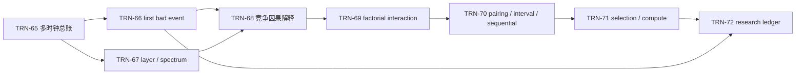

# 训练诊断、消融与因果归因 MOC

> [!abstract] 分卷目标
> 最后一卷把“看曲线调参”变成带 telemetry、故障定位、实验设计和统计不确定性的研究过程。目标不是让每次训练成功，而是让失败和改善都可定位、可复查、可证伪。

| ID | 节点 | 主要出口 | 状态 |
|---|---|---|---|
| TRN-65 | [[训练 Telemetry、损失梯度更新与激活总账]] | 建立最小 dashboard | 静态验收通过；个人掌握另计 |
| TRN-66 | [[NaN、Inf、梯度爆炸与训练失败决策树]] | 定位 first bad tensor | 静态验收通过；个人掌握另计 |
| TRN-67 | [[Update-to-Weight Ratio、谱与尺度诊断]] | 联合 scalar/layer/spectral telemetry | 静态验收通过；个人掌握另计 |
| TRN-68 | [[数据优化器调度交互、混杂与归因边界]] | 识别 training confounder | 静态验收通过；个人掌握另计 |
| TRN-69 | [[单因素、全因子消融与交互效应]] | 设计 factorial ablation | 静态验收通过；个人掌握另计 |
| TRN-70 | [[随机种子、配对比较、置信区间与序贯决策]] | 正确处理 seed variance | 静态验收通过；个人掌握另计 |
| TRN-71 | [[Checkpoint 选择、验证泄漏与 Compute-matched 比较]] | 固定 selection/budget | 静态验收通过；个人掌握另计 |
| TRN-72 | [[训练实验协议、事故记录与因果证据地图]] | 形成完整 research ledger | 静态验收通过；个人掌握另计 |

卷终项目必须包含一次真实失败运行：保存 first anomaly、配置、数据批次、checkpoint、环境和修复前后对照；删除失败记录的“完美实验”不通过本卷审计。

## 学习主线

前半卷回答“训练哪里首先偏离合同”，后半卷回答“怎样比较干预并限制归因”。Telemetry、谱和时间线属于候选机制证据；随机化、配对、factorial、locked test 与外部复验决定结论能走到哪一级。

## 来源与证据分工

本卷 8 个核心节点共调用 27 张 verified 来源卡、95 次：PyTorch 官方文档承担 profiler/anomaly/reproducibility 当前语义；NIST 与 Hernán–Robins 承担 DOE/因果对象；Dodge、Bouthillier、Agarwal、Howard、Arlot–Celisse 承担 variance/interval/selection；MLPerf/MLCommons 承担 time-to-quality；Pineau 与 Google SRE 承担可复现性和事故流程。科学空间只在 Update/Weight RMS、谱范数估计和低精度 Attention 因果案例上承担中文机制桥。

## 卷级实验与验收

- [[实验 - 训练诊断、实验设计与因果证据审计]]：10 条解析/有限轨道、40 项机器断言、10 CSV、3 SVG 与 14/14 byte identity；
- [[60.9 分卷累计测验与研究审计门]]：闭卷八题、真实 failure/postmortem、paired factorial study 与外部复验；
- [[60.9 静态完成与质量审计]]：题号、来源、链接、公式、SVG、实验、状态与边界的最终审计。

## 题库入口

| 节点 | 习题 | 独立解答 |
|---|---|---|
| TRN-65 | [[习题 - 训练 Telemetry、损失梯度更新与激活总账]] | [[解答 - 训练 Telemetry、损失梯度更新与激活总账]] |
| TRN-66 | [[习题 - NaN、Inf、梯度爆炸与训练失败决策树]] | [[解答 - NaN、Inf、梯度爆炸与训练失败决策树]] |
| TRN-67 | [[习题 - Update-to-Weight Ratio、谱与尺度诊断]] | [[解答 - Update-to-Weight Ratio、谱与尺度诊断]] |
| TRN-68 | [[习题 - 数据优化器调度交互、混杂与归因边界]] | [[解答 - 数据优化器调度交互、混杂与归因边界]] |
| TRN-69 | [[习题 - 单因素、全因子消融与交互效应]] | [[解答 - 单因素、全因子消融与交互效应]] |
| TRN-70 | [[习题 - 随机种子、配对比较、置信区间与序贯决策]] | [[解答 - 随机种子、配对比较、置信区间与序贯决策]] |
| TRN-71 | [[习题 - Checkpoint 选择、验证泄漏与 Compute-matched 比较]] | [[解答 - Checkpoint 选择、验证泄漏与 Compute-matched 比较]] |
| TRN-72 | [[习题 - 训练实验协议、事故记录与因果证据地图]] | [[解答 - 训练实验协议、事故记录与因果证据地图]] |

> [!success] 当前状态
> 八个核心节点、八张机制图、120 道题与逐题解答、十轨道卷级实验、三张实验图和累计研究门已组成静态闭环。`verified` 只表示教材 artifact 已审计；学习者尚需真实作答、独立复现和提交一次真实失败运行。
