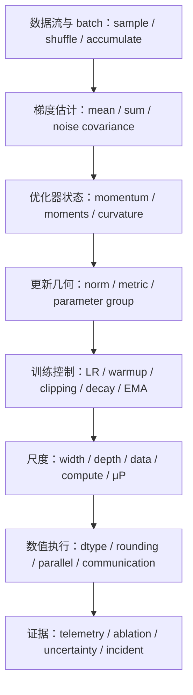

# 训练与优化 MOC

> [!abstract] 本章目标
> 从零开始建立现代神经网络训练的完整对象体系：由 mini-batch 梯度和带状态更新出发，进入 Adam、曲率预条件、Muon、学习率控制、μP、Scaling Law、低精度与分布式执行，最后用可复查实验而非“炼丹故事”做归因。完成后应能重建算法、核对实现、诊断失败并阅读 2024—2026 的训练前沿。

## 课程总地图

- 完整范围、稳定 ID 与掌握标准：[[训练与优化完整课程地图与掌握标准]]；
- 科学空间文章、原论文与节点映射：[[科学空间 - 第六章训练与优化专题来源地图]]；
- 固定范围：**9 卷、72 个核心节点，`TRN-01`—`TRN-72`**；
- 当前状态：九卷教材静态组成与全章机器审计完成，进入个人闭卷学习、真实训练复现与研究证据阶段；
- 真实掌握状态：未作答、评分和独立复现，不因课程地图建立而记为通过。

## 统一视角：训练是状态转移，不是优化器名字

学习任何训练方法时依次问：

1. population objective、当前 batch loss 和代码返回的标量分别是什么？
2. 梯度是求和还是平均，micro-batch、accumulation、world size 如何组成 effective batch？
3. optimizer state 有哪些张量、时标和初始化偏差，跳过一次 step 会改变什么？
4. 更新方向相对哪个 norm/metric/curvature 是“最速”或“预条件”的？
5. learning rate、decay、clipping、schedule 与参数形状共同决定什么相对尺度？
6. 实数更新变成 FP16/BF16/FP8、分片和异步 reduction 后保留了哪些等价性？
7. 观察到的改善是否 compute-matched、多 seed、预先定义选择规则，并排除了交互混杂？

## 九卷导航

| 分卷 | ID | 主题 | 学习出口 | 状态 |
|---|---|---|---|---|
| [[60.1-SGD、Momentum与随机优化噪声/SGD、Momentum 与随机优化噪声 MOC\|60.1 SGD、Momentum 与随机优化噪声]] | TRN-01—08 | batch semantics、state、stability、noise scale | 能写出训练状态机并审计大 batch/隐式偏置 | 静态验收通过；个人掌握另计 |
| [[60.2-AdaGrad、RMSProp、Adam与AdamW/AdaGrad、RMSProp、Adam 与 AdamW MOC\|60.2 AdaGrad、RMSProp、Adam 与 AdamW]] | TRN-09—16 | adaptive moments、epsilon、counterexample、decay | 能逐步手算 Adam 并核对实现变体 | 静态验收通过；个人掌握另计 |
| [[60.3-曲率、自然梯度与矩阵预条件/曲率、自然梯度与矩阵预条件 MOC\|60.3 曲率、自然梯度与矩阵预条件]] | TRN-17—24 | Hessian/Fisher/GGN、HVP、K-FAC、Shampoo/SOAP | 能分清曲率对象、近似和成本 | 静态验收通过；个人掌握另计 |
| [[60.4-矩阵优化、谱最速下降与Muon/矩阵优化、谱最速下降与 Muon MOC\|60.4 矩阵优化、谱最速下降与 Muon]] | TRN-25—32 | dual norm、msign、Newton–Schulz、manifold | 能从约束推导并实现可审计的 Muon | 静态验收通过；个人掌握另计 |
| [[60.5-学习率、Warmup与训练控制/学习率、Warmup 与训练控制 MOC\|60.5 学习率、Warmup 与训练控制]] | TRN-33—40 | LR、schedule、clipping、decay、averaging | 能把联合控制器分账并做受控实验 | 静态验收通过；个人掌握另计 |
| [[60.6-参数化、μP与尺度迁移/参数化、μP 与尺度迁移 MOC\|60.6 参数化、μP 与尺度迁移]] | TRN-41—48 | parameterization、maximal update、μTransfer | 能推导并检验跨宽度超参迁移 | 静态验收通过；个人掌握另计 |
| [[60.7-Scaling-Law与资源最优分配/Scaling Law 与资源最优分配 MOC\|60.7 Scaling Law 与资源最优分配]] | TRN-49—56 | power law、compute-optimal、data quality、extrapolation | 能拟合、推导并质疑资源最优结论 | 静态验收通过；个人掌握另计 |
| [[60.8-低精度、量化与分布式训练/低精度、量化与分布式训练 MOC\|60.8 低精度、量化与分布式训练]] | TRN-57—64 | dtype、rounding、parallelism、memory/communication | 能追踪每个张量和 collective 的数值合同 | 静态验收通过；个人掌握另计 |
| [[60.9-训练诊断、消融与因果归因/训练诊断、消融与因果归因 MOC\|60.9 训练诊断、消融与因果归因]] | TRN-65—72 | telemetry、failure tree、ablation、uncertainty | 能把训练曲线升级成可证伪研究证据 | 静态验收通过；个人掌握另计 |

> [!tip] 初学者怎样使用目录
> 默认只沿上表进入九个分卷：每个分卷目录中的 **1 个 MOC + 8 篇核心正文** 才是主课程。`实验与复现` 在学完对应分卷后使用，`测验与解答` 用于阶段验收，`课程维护` 只记录教材组成和机器质量检查，正常学习时可以跳过。标题中的“数值审计”表示用实验核对结论，不等于维护文档。

## 科学空间主线

本章把博客作为第二教学入口，而不是按网页顺序改写：

- **优化动力学**：SGD—Momentum、有限学习率、采样与优化的联系；
- **学习率—Batch Size**：noise scale、二阶近似、mean-field、EMA 与 Surge 假说；
- **Adam/AdamW**：epsilon、Update RMS、Weight RMS、decay 与 schedule；
- **矩阵优化/Muon**：谱最速下降、matrix sign、Newton–Schulz、流式幂迭代、流形约束和尺度版本；
- **μP 与稳定性**：μTransfer、高阶谱条件、“好模型三个特征”和特殊参数组；
- **Scaling Law**：量子化假说、compute-optimal 分配和优化—架构—数据分解；
- **低精度与数值边界**：有偏舍入、谱范数估计和训练稳定性。

每个调用框必须明确：博客帮助理解什么；记号如何映射；哪一步可独立复算；哪些是 mean-field/各向同性等条件下的近似；原论文、教材和最小实验分别补什么。

## 与前置章节的边界

| 前置内容 | 本章怎样调用 | 本章新增 |
|---|---|---|
| 一阶、随机、二阶优化 | 直接调用下降、收敛和 lower bound | optimizer state、framework convention、finite training |
| 概率与随机过程 | 调用 covariance、EMA、SDE 近似 | batch/noise estimator 与可测 telemetry |
| 矩阵分析与数值线代 | 调用 norm、polar、matrix function、Krylov | Muon/Shampoo 在训练硬件上的计算合同 |
| 初始化、归一化、残差 | 调用激活/梯度尺度 | μP、shape-aware update 与 scale-up protocol |
| 学习理论与统计实验 | 调用 risk、CI、selection bias | compute-matched ablation 和训练因果归因 |

## 学习、实践与验收

推荐顺序固定为：**分卷 MOC → 8 篇核心正文 → 对应实验 → 分卷累计门**。静态质量审计不属于学生必读路径。

每个节点必须完成：正文 + 正式图文单元 + 15 道 A—E 题 + 独立详解 + 无提示复算清单。每卷完成后设置：

- 120 题累计题库与抽样测验；
- 一项无需大型 GPU 的最小数值实验；
- 一项删除关键假设或改变实现约定的反例；
- 一份科学空间文章与原论文的符号/claim 对照；
- 一次包含 compute、memory、wall time 和统计不确定性的受控比较。

全章出口不是“会用 AdamW 或 Muon”，而是能对陌生训练系统完成：

$$
\text{目标}\to\text{估计}\to\text{状态}\to\text{几何}\to\text{尺度}\to\text{数值系统}\to\text{证据}.
$$

全章验收入口：[[第六章训练与优化累计测验与研究总审计门]]；独立校准：[[第六章训练与优化累计测验校准解答]]；机器与人工组成证据：[[第六章训练与优化静态完成与质量审计]]。

## 当前执行点

1. [x] 锁定 9 卷、72 节点与稳定 ID；
2. [x] 建立科学空间第六章专题来源地图；
3. [x] 完成 TRN-01—08、120 题与独立解答、第一卷数值实验和验收门；
4. [x] 完成 TRN-09—24、第二/三卷数值实验与复现门；
5. [x] 完成 TRN-25—32、第四卷数值实验与复现门；
6. [x] 完成 TRN-33—56、第五至第七卷数值实验与复现门；
7. [x] 完成 TRN-57—64、第八卷数值/分布式实验与复现门；
8. [x] 完成 TRN-65—72、120 题与独立解答、第九卷诊断/归因实验和研究审计门；
9. [x] 建立全章累计测验、独立校准解答、真实研究审计门与机器完成审计（静态材料；个人掌握另计）。

## 规范入口

- [[00-课程教学与研究总纲]]
- [[01-研读与成稿工作流]]
- [[02-笔记与节点规范]]
- [[03-来源、引用与版权规范]]
- [[05-质量门槛与检查清单]]
- [[06-图文编排与制图工作流]]
