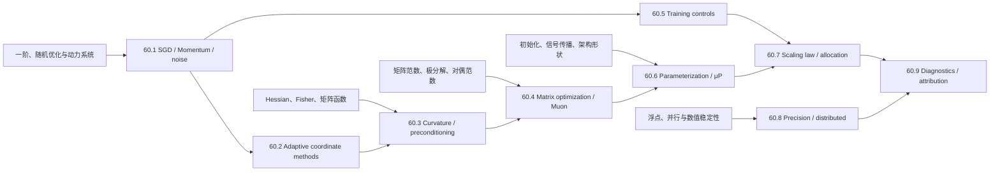

# 训练与优化完整课程地图与掌握标准

> [!abstract] 范围结论
> 第六章固定为 **9 卷、72 个核心节点**，使用稳定 ID `TRN-01`—`TRN-72`。课程不把训练理解成“选一个 optimizer 让 loss 下降”，而是同时追踪目标、梯度估计器、优化器状态、参数几何、尺度、数值格式、并行执行和实验归因。完成后，学习者应能从数学定义重建经典更新，审计现代大模型训练配方，并区分定理、近似、经验规律与系统约束。

## 一、范围锁定

- 固定 **9 卷 × 8 节点 = 72 个核心节点**；只有发现实质性重复或知识断点时才修改标题，ID 不复用；
- 第十章负责一般凸/非凸优化、矩阵分析、随机过程与数值分析；本章负责把这些理论落到有限 batch、有限精度、带状态优化器和分布式训练程序；
- 第三、四章负责网络部件和架构；本章只讨论参数组、梯度、更新和训练稳定性，不重复架构定义；
- 第七章将负责语言模型数据与目标；本章只在说明训练合同和 Scaling Law 时调用 LLM，不把领域配方冒充普遍理论；
- 每节点最终必须有正式正文、教学图、A—E 各 3 题、独立详解、来源分层与可复算检查；每卷另设 120 题累计门和一项标准库最小实验；
- 科学空间承担中文推导入口、当代 Muon/μP/Scaling 问题地图和可证伪假说；历史优先权、一般定理和性能结论回到教材、原论文与独立实验。

## 二、贯穿全章的八本账

| 账本 | 必须写清的对象 | 常见偷换 |
|---|---|---|
| 目标账 | population/empirical loss、regularizer、constraint | 训练 loss 下降等于目标任务改善 |
| 估计账 | sample、micro-batch、effective batch、bias/variance/covariance | 梯度累积在所有状态下都等于大 batch |
| 状态账 | momentum、second moment、preconditioner、step counter | 只写参数更新，遗漏 optimizer state |
| 几何账 | 参数分组、norm、dual norm、metric、curvature | “负梯度最快”不声明范数和坐标 |
| 尺度账 | parameter/activation/gradient/update RMS、width/depth/data/compute | 同一学习率可无条件跨形状和规模迁移 |
| 控制账 | LR、warmup、schedule、clipping、decay、averaging | 把多个控制器的联合作用归给单一组件 |
| 数值系统账 | dtype、rounding、reduction、parallelism、communication、memory | 实数公式正确等于有限精度分布式程序正确 |
| 证据账 | identity、theorem、approximation、experiment、hypothesis、incident | 单次曲线或博客解释升级为一般因果结论 |

## 三、认知依赖

建议顺序为 60.1 → 60.2 → 60.3 → 60.4 → 60.5 → 60.6 → 60.7 → 60.8 → 60.9。已有优化理论基础的读者可以并行学习 60.2 与 60.3，但不能跳过 60.1 的 batch、state 和 execution semantics。

## 四、60.1 SGD、Momentum 与随机优化噪声（TRN-01—08）

**卷终能力**：能把一次训练写成可执行状态转移，区分样本梯度、micro-batch、effective batch 和 optimizer step；能推导 Momentum/Nesterov 的常见形式，分析二次模型稳定域，并用 covariance/noise scale 审计大 batch 与隐式偏置声明。

| ID | 核心节点 | 层级 | 核心问题 | 当前状态 |
|---|---|---|---|---|
| TRN-01 | [[训练系统的对象、状态与一步更新合同]] | 核心 | 一次“训练步”究竟读取、更新和记录哪些对象？ | 静态验收通过；个人掌握另计 |
| TRN-02 | [[Mini-batch 梯度、平均求和与有效 Batch]] | 核心 | loss reduction、batch average 与参数更新尺度怎样对齐？ | 静态验收通过；个人掌握另计 |
| TRN-03 | [[SGD、采样顺序与梯度累积的等价边界]] | 核心 | 梯度累积何时等于一次大 batch，何时被状态与随机层打破？ | 静态验收通过；个人掌握另计 |
| TRN-04 | [[Momentum、EMA、偏差修正与框架约定]] | 核心 | velocity、EMA 和 PyTorch-style buffer 的系数怎样互译？ | 静态验收通过；个人掌握另计 |
| TRN-05 | [[Nesterov、Lookahead 与动量形式的等价边界]] | 核心 | 在哪里计算梯度、如何重参数化状态，会不会改变有限步轨迹？ | 静态验收通过；个人掌握另计 |
| TRN-06 | [[二次模型的学习率—动量稳定域与阻尼]] | 进阶 | 不同 Hessian mode 的 characteristic roots 如何决定振荡和发散？ | 静态验收通过；个人掌握另计 |
| TRN-07 | [[梯度噪声协方差、Noise Scale 与 SDE 近似]] | 进阶 | mini-batch covariance 怎样缩放，连续扩散近似漏掉哪些有限步事实？ | 静态验收通过；个人掌握另计 |
| TRN-08 | [[Critical Batch、隐式偏置与 SGD 证据地图]] | 进阶 | 大 batch、sharpness、generalization 与吞吐之间哪些是机制、哪些只是相关？ | 静态验收通过；个人掌握另计 |

## 五、60.2 AdaGrad、RMSProp、Adam 与 AdamW（TRN-09—16）

**卷终能力**：能从在线预条件推导 AdaGrad/RMSProp/Adam，手算偏差修正和 epsilon 位置，重建 Adam 的经典反例与 AMSGrad 修补条件，并分清 L2 regularization、coupled decay 与 AdamW。

| ID | 核心节点 | 层级 | 核心问题 | 当前状态 |
|---|---|---|---|---|
| TRN-09 | [[AdaGrad、累计平方梯度与稀疏几何]] | 核心 | 累计平方梯度怎样给频繁/稀有坐标不同的有效步长？ | 静态验收通过；个人掌握另计 |
| TRN-10 | [[RMSProp、滑动二阶矩与非平稳尺度]] | 核心 | forgetting factor 解决了 AdaGrad 的什么问题，又引入什么时标？ | 静态验收通过；个人掌握另计 |
| TRN-11 | [[Adam 的一阶二阶矩、偏差修正与逐坐标步长]] | 核心 | $m_t,v_t$ 的初始化偏差怎样计算，实际 update 是什么？ | 静态验收通过；个人掌握另计 |
| TRN-12 | [[Adam 的 Epsilon、数值稳定与实现分歧]] | 核心 | epsilon 放在根号内外、加在何时，会怎样改变小梯度区域？ | 静态验收通过；个人掌握另计 |
| TRN-13 | [[Adam 收敛反例、AMSGrad 与条件化保证]] | 进阶 | 自适应步长为何可能忘记过去的大梯度，修补保证依赖什么假设？ | 静态验收通过；个人掌握另计 |
| TRN-14 | [[Adam 的尺度不变性、Sign 近似与 Update RMS]] | 进阶 | Adam 何时近似 sign update，动量和 SNR 如何改变 RMS？ | 静态验收通过；个人掌握另计 |
| TRN-15 | [[L2 正则、Coupled Decay 与 AdamW]] | 核心 | SGD 中的等价性为什么在自适应预条件下断裂？ | 静态验收通过；个人掌握另计 |
| TRN-16 | [[Lion、Adafactor 与自适应优化器证据地图]] | 进阶 | 低状态内存、sign update 和 benchmark 改善应怎样受控比较？ | 静态验收通过；个人掌握另计 |

## 六、60.3 曲率、自然梯度与矩阵预条件（TRN-17—24）

**卷终能力**：能区分 Hessian、GGN、Fisher 与 empirical Fisher，理解 damping/trust region，利用 HVP+CG 做隐式求解，并比较 natural gradient、K-FAC、Shampoo、SOAP 的近似对象、数值代价和证据边界。

| ID | 核心节点 | 层级 | 核心问题 | 当前状态 |
|---|---|---|---|---|
| TRN-17 | [[Hessian、GGN、Fisher 与经验 Fisher 对象总账]] | 核心 | 四种“曲率矩阵”何时相同，何时 PSD 性和统计含义不同？ | 静态验收通过；个人掌握另计 |
| TRN-18 | [[Newton、Damping、Trust Region 与 Levenberg–Marquardt]] | 核心 | 负曲率、病态和模型失配时怎样控制二阶步？ | 静态验收通过；个人掌握另计 |
| TRN-19 | [[Hessian-vector Product、共轭梯度与隐式二阶步]] | 核心 | 不显式形成 Hessian 时怎样计算方向、残差和停止条件？ | 静态验收通过；个人掌握另计 |
| TRN-20 | [[自然梯度、KL 局部几何与坐标不变性]] | 进阶 | Fisher metric 下的最速下降如何由 KL trust region 推出？ | 静态验收通过；个人掌握另计 |
| TRN-21 | [[GGN、经验 Fisher 与曲率近似陷阱]] | 进阶 | gradient outer product 什么时候不是 Fisher，更不是 Hessian？ | 静态验收通过；个人掌握另计 |
| TRN-22 | [[K-FAC、Kronecker 分块与阻尼合同]] | 进阶 | activation/error independence 怎样产生块 Kronecker 近似？ | 静态验收通过；个人掌握另计 |
| TRN-23 | [[Shampoo、逆矩阵根与 Kronecker 预条件]] | 进阶 | 多轴统计量如何组合，inverse root 怎样可靠计算？ | 静态验收通过；个人掌握另计 |
| TRN-24 | [[SOAP、二阶混合优化器与成本证据地图]] | 进阶 | Shampoo basis 中做 Adam 改变了什么，额外成本是否公平计入？ | 静态验收通过；个人掌握另计 |

## 七、60.4 矩阵优化、谱最速下降与 Muon（TRN-25—32）

**卷终能力**：能由 norm/dual norm 推导最速下降，证明谱范数约束对应 matrix-sign/polar 方向，逐步实现 Muon 与 Newton–Schulz，并审计矩阵分组、形状缩放、流形约束、通信成本和预训练—微调不匹配。

| ID | 核心节点 | 层级 | 核心问题 | 当前状态 |
|---|---|---|---|---|
| TRN-25 | [[最速下降、范数选择与对偶范数]] | 核心 | “负梯度最快”隐含了哪个单位球，换范数后方向怎样变化？ | 静态验收通过；个人掌握另计 |
| TRN-26 | [[矩阵梯度、谱核范数对偶与 Matrix Sign]] | 核心 | 为什么谱范数球上的线性最优化给出 polar factor？ | 静态验收通过；个人掌握另计 |
| TRN-27 | [[Muon 的动量、正交化与参数分组合同]] | 核心 | 标准 Muon 更新、fallback 参数组和 optimizer state 怎样定义？ | 静态验收通过；个人掌握另计 |
| TRN-28 | [[Newton–Schulz Matrix Sign 的收敛与有限精度]] | 进阶 | 缩放、迭代多项式和低精度怎样影响正交化残差？ | 静态验收通过；个人掌握另计 |
| TRN-29 | [[Muon 形状缩放、Update RMS 与版本差异]] | 进阶 | naive、official、MuP、Moonlight 版本的缩放因子各控制什么？ | 静态验收通过；个人掌握另计 |
| TRN-30 | [[Muon、Shampoo、SOAP 与隐式曲率关系]] | 进阶 | 它们共享哪些矩阵统计或极分解结构，不能说成哪些等价？ | 静态验收通过；个人掌握另计 |
| TRN-31 | [[Stiefel、谱球面、旋转 Muon 与约束更新]] | 前沿 | tangent direction、retraction 与精确可行更新怎样区分？ | 静态验收通过；个人掌握另计 |
| TRN-32 | [[Muon 的扩展证据、系统成本与迁移边界]] | 前沿 | 大规模结果、通信开销和 AdamW↔Muon 切换应怎样审计？ | 静态验收通过；个人掌握另计 |

## 八、60.5 学习率、Warmup 与训练控制（TRN-33—40）

**卷终能力**：能把 learning rate 解释为相对具体更新方向的尺度，区分 warmup 机制假说，计算常见 schedule，并共同审计 clipping、weight decay、EMA/SWA 和 checkpoint averaging。

| ID | 核心节点 | 层级 | 核心问题 | 当前状态 |
|---|---|---|---|---|
| TRN-33 | [[学习率、局部损失变化与相对更新尺度]] | 核心 | 同一个数字为什么对 SGD、Adam、Muon 和不同参数组含义不同？ | 静态验收通过；个人掌握另计 |
| TRN-34 | [[Warmup、早期曲率与优化器状态建立]] | 核心 | warmup 可能缓解哪些早期问题，又不能证明哪个机制唯一？ | 静态验收通过；个人掌握另计 |
| TRN-35 | [[Constant、Linear、Cosine、Inverse-Sqrt 与 WSD 调度]] | 核心 | 每条 schedule 的时间变量、端点、面积和 horizon 合同是什么？ | 静态验收通过；个人掌握另计 |
| TRN-36 | [[训练时域、Restart、Schedule-Free 与末端学习率]] | 进阶 | 更改总步数后原 schedule 还是同一个实验吗？ | 静态验收通过；个人掌握另计 |
| TRN-37 | [[全局逐层梯度裁剪、AGC 与裁剪偏差]] | 核心 | norm clipping 实际改变了哪个 estimator，阈值怎样随尺度解释？ | 静态验收通过；个人掌握另计 |
| TRN-38 | [[权重衰减、尺度不变性与 Weight RMS 动力学]] | 进阶 | decay、学习率、归一化和正齐次结构怎样共同决定权重尺度？ | 静态验收通过；个人掌握另计 |
| TRN-39 | [[参数 EMA、SWA 与 Checkpoint Averaging]] | 核心 | 平均参数、平均预测和平均轨迹分别在什么条件下相近？ | 静态验收通过；个人掌握另计 |
| TRN-40 | [[训练控制器的联合实验、消融与证据地图]] | 进阶 | schedule、clipping、decay、EMA 同时变化时怎样识别贡献？ | 静态验收通过；个人掌握另计 |

## 九、60.6 参数化、μP 与尺度迁移（TRN-41—48）

**卷终能力**：能声明宽度、深度、参数和激活的极限对象，比较 standard/NTK/mean-field/μP parameterization，推导 maximal update 的尺度条件，并为 embedding、readout、attention 与非方阵建立可检查的 μTransfer 合同。

| ID | 核心节点 | 层级 | 核心问题 | 当前状态 |
|---|---|---|---|---|
| TRN-41 | [[模型尺度、稳定性指标与 Width-Depth 对象合同]] | 核心 | “模型变大”究竟改变宽度、深度、形状、数据还是训练预算？ | 静态验收通过；个人掌握另计 |
| TRN-42 | [[Standard、NTK 与 Mean-field 参数化]] | 进阶 | 不同初始化/学习率尺度产生 lazy 还是 feature-learning 极限？ | 静态验收通过；个人掌握另计 |
| TRN-43 | [[μP 的 Maximal Update 与宽度尺度推导]] | 核心 | 前向、反向和 feature update 同时非退化需要哪些指数？ | 静态验收通过；个人掌握另计 |
| TRN-44 | [[Tensor Programs、坐标检查与无限宽极限]] | 前沿 | 坐标级极限怎样支持 μP，有限宽网络还需哪些验证？ | 静态验收通过；个人掌握另计 |
| TRN-45 | [[μTransfer、Base Shape 与超参数零样本迁移]] | 核心 | 小模型最优超参怎样映射到目标宽度，哪些超参不自动迁移？ | 静态验收通过；个人掌握另计 |
| TRN-46 | [[Embedding、Readout、Attention 与特殊参数组缩放]] | 进阶 | 输入层、输出层、bias/norm 和 QKV 为什么不能机械套 hidden rule？ | 静态验收通过；个人掌握另计 |
| TRN-47 | [[谱条件、高阶 μP 与参数更新稳定性]] | 前沿 | worst-case operator control 与均值方差尺度怎样互补？ | 静态验收通过；个人掌握另计 |
| TRN-48 | [[Scale-up 协议、μP 证据与失效边界]] | 进阶 | 深度、aspect ratio、optimizer 或架构改变后“迁移成功”怎样判定？ | 静态验收通过；个人掌握另计 |

## 十、60.7 Scaling Law 与资源最优分配（TRN-49—56）

**卷终能力**：能拟合并质疑有限窗口 power law，推导参数—数据—算力的 compute-optimal 条件，建立 FLOPs/时间/能耗/推理成本总账，并审计数据质量、重复、过训练和架构变化对外推的影响。

| ID | 核心节点 | 层级 | 核心问题 | 当前状态 |
|---|---|---|---|---|
| TRN-49 | [[经验 Scaling Law、幂律拟合与不可约项]] | 核心 | log-log 直线、offset 和有限窗口怎样共同影响指数估计？ | 静态验收通过；个人掌握另计 |
| TRN-50 | [[Kaplan 参数数据律、联合拟合与有限区间]] | 核心 | $N,D$ 两条边际律怎样组合，训练未收敛会制造什么偏差？ | 静态验收通过；个人掌握另计 |
| TRN-51 | [[Chinchilla、Compute-optimal 参数与数据分配]] | 核心 | 在 $C\propto ND$ 下怎样由指数推导最优 $N(C),D(C)$？ | 静态验收通过；个人掌握另计 |
| TRN-52 | [[IsoFLOP、训练算力口径与系统校正]] | 核心 | theoretical FLOPs、hardware FLOPs、wall time 和 energy 能否互换？ | 静态验收通过；个人掌握另计 |
| TRN-53 | [[数据质量、重复、混合与有效 Token]] | 进阶 | 相同 token 数为何不等于相同信息量，mixture 怎样进入外推？ | 静态验收通过；个人掌握另计 |
| TRN-54 | [[过训练、推理成本与多目标最优规模]] | 进阶 | 训练 compute-optimal 为什么未必是部署总成本最优？ | 静态验收通过；个人掌握另计 |
| TRN-55 | [[Broken Scaling、涌现表象与优化架构数据分解]] | 前沿 | kink 是新能力、指标阈值、训练不足还是数据/架构变化？ | 静态验收通过；个人掌握另计 |
| TRN-56 | [[Scaling 实验设计、外推不确定性与证据地图]] | 核心 | 怎样用预注册、held-out scales 和 interval 防止事后挑选幂律？ | 静态验收通过；个人掌握另计 |

## 十一、60.8 低精度、量化与分布式训练（TRN-57—64）

**卷终能力**：能追踪每个张量的 storage/compute/accumulation dtype，分析 underflow/overflow/rounding，区分训练量化与推理量化；能写出 data/tensor/pipeline/sequence/expert parallel 的通信和 batch 合同，并审计 ZeRO/FSDP、checkpointing 和 nondeterminism。

| ID | 核心节点 | 层级 | 核心问题 | 当前状态 |
|---|---|---|---|---|
| TRN-57 | [[FP32、TF32、FP16、BF16 与 FP8 数值合同]] | 核心 | exponent、mantissa、subnormal 和 accumulation dtype 各控制什么风险？ | 静态验收通过；个人掌握另计 |
| TRN-58 | [[Loss Scaling、Master Weight 与低精度梯度累积]] | 核心 | 动态 loss scale 怎样检测 overflow，未更新 step 会怎样影响状态？ | 静态验收通过；个人掌握另计 |
| TRN-59 | [[随机舍入、无偏性与微小更新保留]] | 进阶 | 单次 rounding 无偏能否保证长期训练轨迹无偏？ | 静态验收通过；个人掌握另计 |
| TRN-60 | [[训练量化、优化器状态压缩与 QAT]] | 进阶 | weight/activation/gradient/state 各自量化会引入什么 estimator？ | 静态验收通过；个人掌握另计 |
| TRN-61 | [[数据并行、All-Reduce 与全局 Batch 语义]] | 核心 | sum/average、world size、accumulation 和 uneven batch 如何对齐？ | 静态验收通过；个人掌握另计 |
| TRN-62 | [[Tensor、Pipeline、Sequence 与 Expert Parallel]] | 进阶 | 每种并行切哪个张量维度，通信发生在前向、反向还是路由？ | 静态验收通过；个人掌握另计 |
| TRN-63 | [[ZeRO、FSDP、激活重计算与 Offload]] | 核心 | 参数、梯度、状态、激活分别怎样分片或重算，峰值内存怎么算？ | 静态验收通过；个人掌握另计 |
| TRN-64 | [[通信 Roofline、非确定性与分布式训练证据地图]] | 进阶 | 理论等价为何仍产生数值/顺序差异，吞吐比较怎样公平？ | 静态验收通过；个人掌握另计 |

## 十二、60.9 训练诊断、消融与因果归因（TRN-65—72）

**卷终能力**：能建立损失、梯度、更新、参数、激活和系统 telemetry；用决策树定位 NaN/发散；设计 factorial/paired/seed-aware 实验，控制 compute 和 checkpoint selection，并把“组件有效”改写成可证伪、受范围约束的因果声明。

| ID | 核心节点 | 层级 | 核心问题 | 当前状态 |
|---|---|---|---|---|
| TRN-65 | [[训练 Telemetry、损失梯度更新与激活总账]] | 核心 | 最少记录哪些量才能区分数据、模型、优化和系统故障？ | 静态验收通过；个人掌握另计 |
| TRN-66 | [[NaN、Inf、梯度爆炸与训练失败决策树]] | 核心 | 第一个异常张量、首个异常 step 和根因怎样定位？ | 静态验收通过；个人掌握另计 |
| TRN-67 | [[Update-to-Weight Ratio、谱与尺度诊断]] | 进阶 | 标量 RMS、逐层比例和谱异常各能发现什么、漏掉什么？ | 静态验收通过；个人掌握另计 |
| TRN-68 | [[数据优化器调度交互、混杂与归因边界]] | 进阶 | 多组件联动时“optimizer 更好”为什么可能是混杂？ | 静态验收通过；个人掌握另计 |
| TRN-69 | [[单因素、全因子消融与交互效应]] | 核心 | one-at-a-time 为什么可能漏掉 synergy 和 antagonism？ | 静态验收通过；个人掌握另计 |
| TRN-70 | [[随机种子、配对比较、置信区间与序贯决策]] | 核心 | 多 seed 如何利用配对、何时停止实验又不夸大显著性？ | 静态验收通过；个人掌握另计 |
| TRN-71 | [[Checkpoint 选择、验证泄漏与 Compute-matched 比较]] | 核心 | best checkpoint、训练预算和调参预算怎样进入公平比较？ | 静态验收通过；个人掌握另计 |
| TRN-72 | [[训练实验协议、事故记录与因果证据地图]] | 核心 | 怎样把一次训练结论变成可复查、可否证、可迁移的研究证据？ | 静态验收通过；个人掌握另计 |

## 十三、掌握层级

| 层级 | 可观察能力 | 不计为通过的行为 |
|---|---|---|
| L1 对象识别 | 写出参数、梯度估计器、状态、更新和 dtype/shape | 只背 optimizer 名称 |
| L2 手算重建 | 手算多个 step、bias correction、稳定域、memory/FLOPs | 只会调用框架 API |
| L3 推导与实现 | 从约束/metric 推导更新并做 oracle、残差和有限差分检查 | 复制伪代码但不核对合同 |
| L4 实验归因 | 设计 compute-matched、多 seed、可证伪的训练比较 | 用单条 loss 曲线下因果结论 |
| L5 研究阅读 | 区分 theorem/approximation/evidence，审计前沿规模外推 | 把博客或单篇论文当最终定论 |

## 十四、每卷共同验收门

1. 闭卷完成每节点 15 题中的抽样题，定义、手算、推导、反例、迁移五类不得缺类；
2. 用标准库或最小依赖重现一项核心恒等式/反例，输出原始数值和断言；
3. 删除一个关键假设或改变一个实现约定，指出结论在哪一步断裂；
4. 对至少一篇科学空间文章制作“博客记号—课程记号—原论文对象—证据等级”对照；
5. 写出一次训练实验的 config、seed、预算、失败运行、选择规则和复现命令；
6. 静态材料完成与学习者个人掌握分开记录，不因文件存在自动记为通过。

## 十五、实施状态

- [x] 锁定九卷、72 节点与稳定 ID；
- [x] 建立第六章科学空间专题来源地图与一级来源队列；
- [x] 完成 TRN-01—08 正文、图、题解、数值实验与 60.1 复现门（静态材料；个人掌握另计）；
- [x] 完成 TRN-09—16 正文、图、题解、数值实验与 60.2 复现门（静态材料；个人掌握另计）；
- [x] 完成 TRN-17—24 正文、图、题解、数值实验与 60.3 复现门（静态材料；个人掌握另计）；
- [x] 完成 TRN-25—32 正文、图、题解、数值实验与 60.4 复现门（静态材料；个人掌握另计）；
- [x] 完成 TRN-33—40；
- [x] 完成 TRN-41—48；
- [x] 完成 TRN-49—56；
- [x] 完成 TRN-57—64；
- [x] 完成 TRN-65—72 正文、图、题解、确定性实验与 60.9 研究审计门（静态材料；个人掌握另计）；
- [x] 建立[[第六章训练与优化累计测验与研究总审计门|全章累计测验与研究审计门]]、[[第六章训练与优化累计测验校准解答|独立校准解答]]与[[第六章训练与优化静态完成与质量审计|机器完成审计]]（静态材料；个人掌握另计）。
