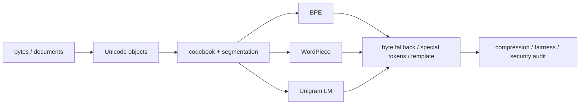

# 70.1 文本、Unicode 与 Tokenization MOC

> [!abstract] 卷终目标
> 把“文本”从自然语言直觉变成可逆、可版本化、可审计的模型接口；能手工执行三类主流子词算法，并解释 tokenizer 对压缩、算力、多语言公平和安全的影响。

## 学习路径

1. [[语言模型的文本对象、文档边界与序列样本空间]] `LM-01`
2. [[Unicode、字节、码点、字素簇与规范化合同]] `LM-02`
3. [[Tokenizer 作为码本、分段路径与压缩接口]] `LM-03`
4. [[BPE、合并规则与确定性编码解码]] `LM-04`
5. [[WordPiece、词表构建与最长匹配边界]] `LM-05`
6. [[Unigram LM、Viterbi、EM 与 Subword Regularization]] `LM-06`
7. [[Byte-level、Byte Fallback、特殊 Token 与 Chat Template]] `LM-07`
8. [[Tokenizer 评估、多语言公平、安全与证据地图]] `LM-08`

## 一张图看依赖

## 卷终产物

- [[70.1 Tokenization 最小实验与复现说明]]
- [[70.1 Tokenization 累计测验与研究审计门]]
- [[70.1 静态完成与质量审计]]
- 每节点 15 题与独立解答、每节点至少一幅教学图；静态完成与个人掌握分开记录。

## 当前状态

- [x] LM-01—08 正文与八幅教学图；
- [x] 120 道 A—E 分层题与 120 份独立解答；
- [x] 9-check 标准库实验、三张实验图与结果文件；
- [x] 分卷累计门与静态质量审计；
- [ ] 学习者个人闭卷、复现与研究协议验收。
