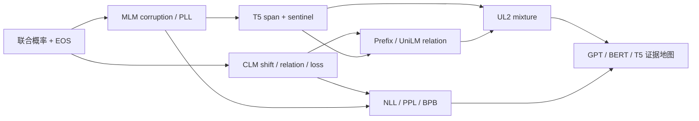

# 70.2 语言模型目标 MOC

> [!abstract] 卷终目标
> 从概率对象和 corruption sampler 出发统一 CLM、MLM、span corruption、prefix/seq2seq 与 mixture-of-denoisers，并建立 tokenizer-aware 的 NLL/PPL/BPB 比较合同。

## 学习路径

1. [[概率语言模型、链式法则与自回归因子化]] `LM-09`
2. [[Causal LM 的 Shift、Attention Mask 与 Token Loss]] `LM-10`
3. [[Masked LM 的 Corruption Law、伪似然与 BERT]] `LM-11`
4. [[Span Corruption、Sentinel Token 与 T5 Seq2Seq 目标]] `LM-12`
5. [[Prefix LM、UniLM 与序列到序列 Mask 合同]] `LM-13`
6. [[Mixture-of-Denoisers、UL2 与多目标采样]] `LM-14`
7. [[NLL、Perplexity、Bits-per-Byte 与 Tokenizer 公平比较]] `LM-15`
8. [[GPT、BERT、T5 的目标—模型族—能力证据地图]] `LM-16`

## 一张图看依赖

## 卷终产物

- [[70.2 语言模型目标 最小实验与复现说明]]
- [[70.2 语言模型目标 累计测验与研究审计门]]
- [[70.2 静态完成与质量审计]]
- 每节点 15 题与独立解答、每节点一幅教学图；静态完成与个人掌握分开记录。

## 卷终门

能为任意 batch 画出 input/target、attention mask、loss mask 和 denominator；不得以架构名代替概率目标。

## 当前状态

- [x] LM-09—16 正文与八幅教学图；
- [x] 120 道 A—E 分层题与 120 份独立解答；
- [x] 9-check 标准库实验、三张实验图与结果文件；
- [x] 分卷累计门与静态质量审计；
- [ ] 学习者个人闭卷、复现与研究协议验收。

