# 语言模型 MOC

> [!abstract] 本章回答什么
> 第七章研究“文本怎样被声明为可计算对象，模型怎样给序列赋概率，数据怎样进入训练，已有模型怎样适配任务，证据怎样进入上下文，概率怎样变成输出，以及输出怎样被评估和约束”。全章固定为 **9 卷、72 个核心节点**，稳定 ID 为 `LM-01`—`LM-72`。正文面向从零开始的学习者，但推导、实现合同与研究证据按顶尖大学高年级课程标准书写。

## 一、统一生命周期

```mermaid
flowchart LR
    RAW["原始文本<br/>bytes / Unicode / documents"] --> TOK["Tokenizer<br/>vocabulary / segmentation"]
    TOK --> OBJ["概率目标<br/>causal / masked / denoising"]
    OBJ --> DATA["训练语料<br/>filter / dedup / mixture / packing"]
    DATA --> ADAPT["任务适配<br/>SFT / PEFT / merge"]
    ADAPT --> CTX["上下文学习<br/>examples / reasoning / budget"]
    CTX --> RET["外部证据<br/>retrieval / memory / tools"]
    RET --> DEC["解码与服务<br/>sampling / cache / batching"]
    DEC --> EVAL["评估<br/>quality / calibration / attribution"]
    EVAL --> SAFE["安全与运维<br/>privacy / injection / monitoring"]
    SAFE -. "incident 与新证据" .-> RAW
```

这不是九个彼此独立的主题。任何一次语言模型实验都必须能回答下面八个问题：

1. **文本对象**：输入是字节、码点、字素簇、token 还是文档？规范化和边界在哪里发生？
2. **概率对象**：模型最大化的是哪一个条件分布或伪似然？哪些位置进入 loss？
3. **数据对象**：样本从哪里来，怎样过滤、去重、混合和打包，许可与隐私合同是什么？
4. **适配对象**：哪些参数被更新，监督信号作用在哪些 token，基座能力怎样被保留或遗忘？
5. **上下文对象**：能力来自参数、示例、检索证据还是搜索预算？怎样做因果区分？
6. **生成对象**：概率分布怎样经截断、停止和约束变成输出？随机性和服务状态是否记录？
7. **评估对象**：任务单位、参考答案、指标、采样器、judge 和污染审计是否一致？
8. **风险对象**：记忆、隐私、注入、偏差、拒答、漂移和事故由谁监测，如何复现？

## 二、九卷导航

| 卷 | 稳定 ID | 核心产物 | 入口 |
|---|---:|---|---|
| 70.1 文本、Unicode 与 Tokenization | LM-01—08 | 可逆文本接口、分词算法与公平审计 | [[70-语言模型/70.1-文本Unicode与Tokenization/70.1 文本Unicode与Tokenization MOC\|进入]] |
| 70.2 语言模型目标 | LM-09—16 | CLM/MLM/去噪目标与可比指标 | [[70-语言模型/70.2-语言模型目标/70.2 语言模型目标 MOC\|进入]] |
| 70.3 预训练数据工程 | LM-17—24 | 数据谱系、去重、混合、污染和 packing | [[70-语言模型/70.3-预训练数据工程/70.3 预训练数据工程 MOC\|进入]] |
| 70.4 指令适配与参数高效微调 | LM-25—32 | SFT、LoRA/QLoRA、适配器和模型合并 | [[70-语言模型/70.4-指令适配与参数高效微调/70.4 指令适配与参数高效微调 MOC\|进入]] |
| 70.5 上下文学习与推理时计算 | LM-33—40 | ICL、机制解释、CoT、搜索与长上下文 | [[70-语言模型/70.5-上下文学习与推理时计算/70.5 上下文学习与推理时计算 MOC\|进入]] |
| 70.6 检索增强与外部记忆 | LM-41—48 | 检索—生成—引用端到端证据链 | [[70-语言模型/70.6-检索增强与外部记忆/70.6 检索增强与外部记忆 MOC\|进入]] |
| 70.7 解码、推理服务与加速 | LM-49—56 | 采样、约束生成、KV Cache 与吞吐合同 | [[70-语言模型/70.7-解码推理服务与加速/70.7 解码推理服务与加速 MOC\|进入]] |
| 70.8 评估、校准与幻觉 | LM-57—64 | 指标、估计器、judge、事实性与污染审计 | [[70-语言模型/70.8-评估校准与幻觉/70.8 评估校准与幻觉 MOC\|进入]] |
| 70.9 安全、隐私与部署证据 | LM-65—72 | 攻击面、拒答、版本、监控与研究协议 | [[70-语言模型/70.9-安全隐私与部署证据/70.9 安全隐私与部署证据 MOC\|进入]] |

> [!tip] 初学者怎样使用目录
> 默认只沿上表进入九个分卷：每个分卷目录中的 **1 个 MOC + 8 篇核心正文** 才是主课程。`实验与复现` 在学完对应分卷后使用，`测验与解答` 用于阶段验收，`课程维护` 是教材作者的静态检查记录，正常学习时可以跳过。评估、污染与证据审计若出现在核心节点标题中，则是语言模型研究方法本身，不属于这里所说的维护审计。

完整节点清单、先修关系和验收标准见[[语言模型完整课程地图与掌握标准]]；科学空间文章、一级论文、教材与官方文档的职责分工见[[科学空间 - 第七章语言模型专题来源地图]]。

## 三、与相邻章节的边界

| 问题 | 本章负责 | 相邻章节负责 |
|---|---|---|
| Transformer / Attention / RoPE 的结构 | 只调用它们解释 mask、cache、长上下文和语言目标 | 第四章给出结构与复杂度推导 |
| 优化器、Scaling Law、低精度训练 | 记录语言数据/目标如何改变训练合同 | 第六章给出优化与系统理论 |
| 概率、信息论、矩阵与统计 | 在具体语言模型对象上复算 | 第十章给出一般数学理论 |
| RLHF、Reward Model、DPO | 只在边界处说明为何不是 SFT | 第八章系统讲偏好优化、RL 与智能体 |
| Agent 规划与长期行动 | 只定义 tool interface 和 prompt injection 面 | 第八章研究行动、环境、奖励与规划 |

> [!warning] 边界不是删掉接口
> 例如 LM-67 必须讲工具/RAG 的注入威胁，但不会在此重复 PPO 或 agent planning；LM-55 必须证明 speculative decoding 的分布精确性，但不会重讲 Transformer 的全部架构。

## 四、证据与教学合同

每个正式节点都要同时具备：

- **直觉层**：从一个具体文本、概率表或系统请求出发，说明问题为什么存在；
- **严格层**：定义对象、shape、条件、概率空间和结论地位，逐步推导至少一个核心式；
- **计算层**：给出手算例、伪代码或确定性实验，并设置 oracle、反例或不变量；
- **AI 层**：落到真实 tokenizer/model/data/API 合同，区分训练、推理和部署语义；
- **研究层**：用 `I/T/A/E/H/O` 标记恒等式、定理、近似、实验、假说和开放问题；
- **教学图**：图前提出视觉问题，图后给 caption、读图顺序和失效边界；
- **练习门**：A 定义、B 手算、C 推导、D 反例、E 迁移各 3 题，并有独立详解。

## 五、推荐学习路径

初学者按 70.1 → 70.2 → 70.3 → 70.4 → 70.5 → 70.6 → 70.7 → 70.8 → 70.9 顺序学习。每卷内部固定采用 **分卷 MOC → 8 篇核心正文 → 对应实验 → 分卷累计门**；`课程维护` 不进入学习顺序。已经会训练 Transformer 的读者也不要跳过 70.1、70.2 和 70.8：大量“模型能力”争论其实源于 tokenizer、loss denominator、sampling estimator 或 benchmark contamination 的对象偷换。

每卷通过后应能完成一次卷终复现；九卷完成后，再通过全章累计测验与研究审计。文件存在只代表**静态材料完成**，不代表学习者已经掌握。

## 六、研究纪律

“当前大模型普遍这样实现”是行业事实描述，“这种实现理论最优”是需要条件的命题。笔记必须把以下内容分开：

- 数学定义与恒等式；
- 在明确假设下的定理；
- 便于计算的近似和机制解释；
- 受模型、数据、预算与采样器限制的实验结果；
- 博客作者、论文作者或课程提出的可证伪假说；
- 尚无充分证据的开放问题。

科学空间用于建立中文问题意识、推导桥梁和前沿假说；历史优先权、一般结论与性能主张必须回到原论文、教材、官方实现和独立复现。

## 七、当前执行状态

- [x] 锁定九卷、72 个核心节点及稳定 ID；
- [x] 明确与第六章优化、第八章对齐/智能体、第十章数学的边界；
- [x] 落地九卷正文、教学图、来源卡、题解和确定性实验（静态材料；个人掌握另计）；
- [x] 建立九个分卷累计门与[[第七章语言模型累计测验与研究审计门]]；
- [x] 运行链接、frontmatter、公式、SVG、题解数量与九卷复现实验全局验收，详见[[第七章语言模型静态完成与质量审计]]。
