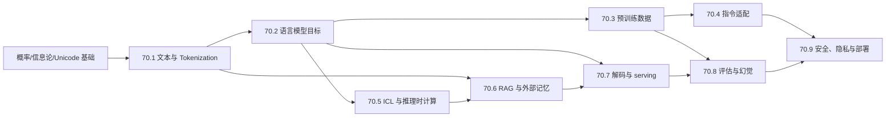

# 语言模型完整课程地图与掌握标准

> [!abstract] 范围结论
> 第七章固定为 **9 卷、72 个核心节点**，稳定 ID 为 `LM-01`—`LM-72`。全章从文本的计算对象出发，经概率目标、预训练数据、任务适配、上下文学习、外部检索、解码服务、评估校准，最终到安全、隐私和部署证据。它不是产品术语百科，而是一门能把“一个模型回答了什么”追溯到 tokenizer、条件分布、数据、上下文、采样器与评估协议的完整课程。

## 一、范围锁定

- 固定 **9 卷 × 8 节点 = 72 节点**；标题可在发现知识断点时微调，稳定 ID 不复用；
- 第四章负责 Transformer、Attention、位置编码与长序列架构，本章负责它们在语言目标、上下文和 serving 中的语义；
- 第六章负责优化器、低精度、分布式与 Scaling Law，本章负责数据/目标/序列化如何改变训练与比较合同；
- 第八章负责 reward model、RLHF、DPO 和 agent 决策；本章截止于 SFT/PEFT、test-time search、RAG/tool interface 与安全边界；
- 每节点最终包含四层讲解、至少一幅教学图、A—E 各 3 题、独立详解与来源分层；每卷另有一项确定性实验、实验图和 120 题累计门；
- 科学空间负责中文推导入口、tokenization/解码/LoRA/RAG 等问题地图和可证伪假说；一级论文、教材、标准与官方实现承担原创断言、通用定理和实现合同。

## 二、贯穿全章的九本账

| 账本 | 必须记录 | 典型错误 |
|---|---|---|
| 文本账 | bytes、encoding、normalization、grapheme、document boundary | 把“一个字符”当成唯一数学对象 |
| 码本账 | vocabulary、special token、segmentation、encode/decode version | 换 tokenizer 后仍直接比较 perplexity |
| 概率账 | factorization、conditioning set、corruption law、loss mask | 把 MLM pseudo-likelihood 当普通 joint likelihood |
| 数据账 | source、license、filter、dedup、mixture、packing、cutoff | 只报告 token 数，不报告有效文档和污染 |
| 参数账 | base model、trainable set、adapter、merge、quantization | “LoRA 等于低秩模型”而非低秩更新参数化 |
| 上下文账 | prompt bytes/tokens、examples、retrieved evidence、search budget | 把参数知识、检索命中和推理预算混为能力 |
| 生成账 | logits processor、sampler、seed、stop、cache、batch scheduler | 只报告 temperature，遗漏 top-p/EOS/模板 |
| 评估账 | task unit、metric estimator、reference/judge、sample count、CI | 把一次 greedy 输出当模型分布的性能 |
| 风险证据账 | threat model、privacy unit、attack budget、version、incident | 用单次越狱或安全演示宣称普遍安全/不安全 |

## 三、依赖关系

## 四、70.1 文本、Unicode 与 Tokenization（LM-01—08）

**卷终能力**：能从 byte stream 建立可逆文本合同，区分码点/字素/token，手工执行 BPE、WordPiece、Unigram-Viterbi/EM 的小例子，并用压缩、fertility、公平性、鲁棒性和安全指标审计 tokenizer。

| ID | 核心节点 | 层级 | 核心问题 | 当前状态 |
|---|---|---|---|---|
| LM-01 | [[语言模型的文本对象、文档边界与序列样本空间]] | 核心 | 一个训练样本从 bytes 到 document/token sequence 究竟经过哪些映射？ | 静态验收通过；个人掌握另计 |
| LM-02 | [[Unicode、字节、码点、字素簇与规范化合同]] | 核心 | “字符”为什么不是单一对象，NFC/NFKC 会保留或破坏什么？ | 静态验收通过；个人掌握另计 |
| LM-03 | [[Tokenizer 作为码本、分段路径与压缩接口]] | 核心 | 分词如何同时决定模型接口、序列长度和可表达性？ | 静态验收通过；个人掌握另计 |
| LM-04 | [[BPE、合并规则与确定性编码解码]] | 核心 | 频繁 pair 合并如何训练，tie-breaking 为什么属于模型版本？ | 静态验收通过；个人掌握另计 |
| LM-05 | [[WordPiece、词表构建与最长匹配边界]] | 核心 | likelihood-style 词表准则与 longest-match 编码分别做了什么？ | 静态验收通过；个人掌握另计 |
| LM-06 | [[Unigram LM、Viterbi、EM 与 Subword Regularization]] | 进阶 | 分段作为潜变量时怎样做 MAP、EM 和随机采样？ | 静态验收通过；个人掌握另计 |
| LM-07 | [[Byte-level、Byte Fallback、特殊 Token 与 Chat Template]] | 核心 | 开放词表、控制 token 和消息模板怎样共同保证可逆与安全？ | 静态验收通过；个人掌握另计 |
| LM-08 | [[Tokenizer 评估、多语言公平、安全与证据地图]] | 进阶 | 压缩率、fertility、下游效果和攻击面怎样在同一协议中比较？ | 静态验收通过；个人掌握另计 |

## 五、70.2 语言模型目标（LM-09—16）

**卷终能力**：能写出自回归、掩码、span corruption、prefix/seq2seq 和多目标去噪的概率对象、采样器与 loss denominator，重建 shift/mask，解释 perplexity 的可比边界，并比较 GPT/BERT/T5 的目标与能力证据。

| ID | 核心节点 | 层级 | 核心问题 | 当前状态 |
|---|---|---|---|---|
| LM-09 | [[概率语言模型、链式法则与自回归因子化]] | 核心 | 联合序列分布怎样因子化，EOS 与长度概率在哪里？ | 静态验收通过；个人掌握另计 |
| LM-10 | [[Causal LM 的 Shift、Attention Mask 与 Token Loss]] | 核心 | input/target shift、causal mask 和 ignored token 怎样对齐？ | 静态验收通过；个人掌握另计 |
| LM-11 | [[Masked LM 的 Corruption Law、伪似然与 BERT]] | 核心 | 掩码位置由谁采样，MLM 目标为什么通常不是规范化联合似然？ | 静态验收通过；个人掌握另计 |
| LM-12 | [[Span Corruption、Sentinel Token 与 T5 Seq2Seq 目标]] | 核心 | 被删 span 怎样由 sentinel 编码，decoder target 怎样构造？ | 静态验收通过；个人掌握另计 |
| LM-13 | [[Prefix LM、UniLM 与序列到序列 Mask 合同]] | 进阶 | 同一 Transformer 怎样靠可见性图实现不同因子化？ | 静态验收通过；个人掌握另计 |
| LM-14 | [[Mixture-of-Denoisers、UL2 与多目标采样]] | 进阶 | 目标 mixture 的采样权重、序列成本和梯度尺度怎样定义？ | 静态验收通过；个人掌握另计 |
| LM-15 | [[NLL、Perplexity、Bits-per-Byte 与 Tokenizer 公平比较]] | 核心 | 为什么跨 tokenizer 的 token perplexity 不可直接比较？ | 静态验收通过；个人掌握另计 |
| LM-16 | [[GPT、BERT、T5 的目标—模型族—能力证据地图]] | 进阶 | 架构、目标、数据和评估如何拆开，避免把相关性写成因果？ | 静态验收通过；个人掌握另计 |

## 六、70.3 预训练数据工程（LM-17—24）

**卷终能力**：能为语料写出可审计数据卡，区分解析、过滤、精确/近似去重与污染检测，计算 mixture/packing，追踪许可、隐私、版本和有效 token，并设计时间截止与 benchmark 隔离实验。

| ID | 核心节点 | 层级 | 核心问题 | 当前状态 |
|---|---|---|---|---|
| LM-17 | [[预训练语料来源、许可、隐私与文档单位合同]] | 核心 | 数据的法律来源、统计单位与隐私主体是否一致？ | 静态验收通过；个人掌握另计 |
| LM-18 | [[解析、语言识别、质量过滤与数据偏差]] | 核心 | 过滤器删掉了噪声，还是系统性删掉某些人群和文体？ | 静态验收通过；个人掌握另计 |
| LM-19 | [[精确去重、MinHash、LSH 与近重复检测]] | 进阶 | Jaccard、signature 和候选桶怎样换 recall、成本与误删？ | 静态验收通过；个人掌握另计 |
| LM-20 | [[Benchmark 污染、时间截止与成员重叠审计]] | 核心 | 数据重叠、任务泄漏和真实泛化怎样被区分？ | 静态验收通过；个人掌握另计 |
| LM-21 | [[数据混合、温度采样、重加权与域损失]] | 核心 | mixture weight 是文档概率、token 概率还是 batch 配额？ | 静态验收通过；个人掌握另计 |
| LM-22 | [[Packing、文档边界、Position ID 与 Loss Mask]] | 核心 | 把短序列塞进同一窗口时，attention 与 loss 是否跨文档泄漏？ | 静态验收通过；个人掌握另计 |
| LM-23 | [[Curriculum、持续预训练与域适配数据路径]] | 进阶 | 数据顺序如何影响优化、遗忘和域外能力？ | 静态验收通过；个人掌握另计 |
| LM-24 | [[数据版本、Provenance、有效 Token 与证据地图]] | 核心 | 怎样让一次预训练的数据结论在删除、更新后仍可追溯？ | 静态验收通过；个人掌握另计 |

## 七、70.4 指令适配与参数高效微调（LM-25—32）

**卷终能力**：能把消息模板编译为 token/loss mask，重建 SFT 与 response-only loss；能推导 LoRA 的低秩更新、缩放、合并和 QLoRA 显存账，并比较 adapter/prompt/prefix/IA3 与模型合并的适用边界。

| ID | 核心节点 | 层级 | 核心问题 | 当前状态 |
|---|---|---|---|---|
| LM-25 | [[指令、消息、Chat Template 与任务序列化合同]] | 核心 | role/content/tool message 怎样唯一编译成训练和推理序列？ | 静态验收通过；个人掌握另计 |
| LM-26 | [[监督微调、Teacher Forcing 与 Response-only Loss]] | 核心 | 哪些 token 是输入、target、ignored，exposure bias 在哪里出现？ | 静态验收通过；个人掌握另计 |
| LM-27 | [[指令数据质量、混合、多轮状态与选择偏差]] | 核心 | 谁写的答案、谁被筛掉、turn 如何加权会改变什么能力？ | 静态验收通过；个人掌握另计 |
| LM-28 | [[全量微调、冻结表示与灾难性遗忘]] | 核心 | 参数漂移、功能漂移与遗忘应怎样分别测量？ | 静态验收通过；个人掌握另计 |
| LM-29 | [[LoRA 的低秩更新、初始化、缩放与合并]] | 核心 | $\Delta W=BA$ 的秩、缩放和初始化怎样影响首步梯度？ | 静态验收通过；个人掌握另计 |
| LM-30 | [[QLoRA、量化基座与适配显存总账]] | 进阶 | quantized storage、dequant compute、optimizer state 各占多少？ | 静态验收通过；个人掌握另计 |
| LM-31 | [[Adapter、Prompt Tuning、Prefix Tuning 与 IA3]] | 进阶 | 它们分别修改参数、激活还是 attention key/value 路径？ | 静态验收通过；个人掌握另计 |
| LM-32 | [[Model Soup、Task Arithmetic、TIES 与适配证据地图]] | 进阶 | 参数合并何时近似函数合并，冲突坐标如何处理？ | 静态验收通过；个人掌握另计 |

## 八、70.5 上下文学习与推理时计算（LM-33—40）

**卷终能力**：能把 prompt 声明为条件事件，量化示例顺序/标签映射敏感性；能比较 Bayesian、线性回归、元优化和 induction-head 解释，分清 CoT 可读性与 faithfulness，并按采样/搜索/verifier 预算评估 test-time compute。

| ID | 核心节点 | 层级 | 核心问题 | 当前状态 |
|---|---|---|---|---|
| LM-33 | [[Prompt 作为条件事件、序列化与敏感性]] | 核心 | 空格、模板和答案前缀改变的是语义还是条件概率事件？ | 静态验收通过；个人掌握另计 |
| LM-34 | [[Zero-shot、Few-shot ICL、示例顺序与标签映射]] | 核心 | ICL 改善来自任务说明、格式模仿、标签校准还是示例内容？ | 静态验收通过；个人掌握另计 |
| LM-35 | [[ICL 的 Bayesian、线性回归与元优化解释]] | 进阶 | 哪个 toy model 支持哪种解释，能否外推真实 LLM？ | 静态验收通过；个人掌握另计 |
| LM-36 | [[Induction Head、机制回路与因果干预边界]] | 前沿 | attention pattern、ablation 与因果机制之间还缺什么证据？ | 静态验收通过；个人掌握另计 |
| LM-37 | [[Chain-of-Thought、Scratchpad 与 Faithfulness]] | 核心 | 可见推理文本是否忠实反映决定输出的内部计算？ | 静态验收通过；个人掌握另计 |
| LM-38 | [[Self-Consistency、Best-of-N 与 Pass-at-k]] | 核心 | 多样本改进来自覆盖率还是选择器，估计量怎样去偏？ | 静态验收通过；个人掌握另计 |
| LM-39 | [[Test-time Compute、Search、Verifier 与预算]] | 进阶 | 更多 token、更多样本、更深搜索和更强 verifier 如何公平比较？ | 静态验收通过；个人掌握另计 |
| LM-40 | [[长上下文利用、Lost-in-the-Middle 与推理证据地图]] | 进阶 | context window 长度为何不等于有效检索和推理长度？ | 静态验收通过；个人掌握另计 |

## 九、70.6 检索增强与外部记忆（LM-41—48）

**卷终能力**：能把 RAG 写成含隐变量文档的端到端系统，构造 chunk/index，比较 BM25/dense/hybrid/ANN/reranker，训练 retriever，设计 context/citation 合同，并分解 retrieval、generation 与 attribution 误差。

| ID | 核心节点 | 层级 | 核心问题 | 当前状态 |
|---|---|---|---|---|
| LM-41 | [[参数记忆、外部记忆与 RAG 潜变量分解]] | 核心 | 答案来自参数还是文档，latent document 怎样边缘化或近似？ | 静态验收通过；个人掌握另计 |
| LM-42 | [[Chunk、Metadata、Embedding 与 Index 合同]] | 核心 | chunk 边界与 metadata 怎样决定可检索证据单位？ | 静态验收通过；个人掌握另计 |
| LM-43 | [[BM25、Dense Retrieval、Hybrid 与 Score Fusion]] | 核心 | 稀疏和稠密分数不可比时怎样融合与校准？ | 静态验收通过；个人掌握另计 |
| LM-44 | [[ANN Recall、Latency、Reranker 与两阶段检索]] | 核心 | approximate recall、reranking quality 与服务延迟如何联立？ | 静态验收通过；个人掌握另计 |
| LM-45 | [[Retriever 训练、Negative Sampling 与 Query-Document 目标]] | 进阶 | in-batch negatives、hard negatives 与 false negatives 怎样改变梯度？ | 静态验收通过；个人掌握另计 |
| LM-46 | [[Context Construction、Citation、Grounding 与冲突证据]] | 核心 | 检索到证据之后怎样排序、压缩、引用和处理冲突？ | 静态验收通过；个人掌握另计 |
| LM-47 | [[Multi-hop、Iterative、Graph Retrieval 与 Tool Interface]] | 进阶 | 查询怎样随中间证据更新，停止与权限边界在哪里？ | 静态验收通过；个人掌握另计 |
| LM-48 | [[RAG 的 Retrieval—Generation—Attribution 评估地图]] | 核心 | 错答案是没检到、没使用、错误综合还是错误引用？ | 静态验收通过；个人掌握另计 |

## 十、70.7 解码、推理服务与加速（LM-49—56）

**卷终能力**：能从 logits 重建常用采样器和 beam score，证明/反驳其分布性质，处理 EOS/重复/结构约束；能画出 prefill/decode/KV 状态机，计算 batch/cache 账并解释 speculative decoding 的接受校正。

| ID | 核心节点 | 层级 | 核心问题 | 当前状态 |
|---|---|---|---|---|
| LM-49 | [[Logits、Softmax、Temperature 与 Categorical Sampling]] | 核心 | 温度怎样改变 odds、熵和极限行为，seed 控制什么？ | 静态验收通过；个人掌握另计 |
| LM-50 | [[Greedy、Beam Search、Sequence Score 与 Length Penalty]] | 核心 | beam 搜索优化哪个近似目标，宽度增加为何不保证任务质量？ | 静态验收通过；个人掌握另计 |
| LM-51 | [[Top-k、Top-p、Typical 与 Min-p 截断采样]] | 核心 | 截断、重归一化和阈值自适应分别改变什么分布？ | 静态验收通过；个人掌握另计 |
| LM-52 | [[EOS、停止规则、重复惩罚与退化循环]] | 核心 | 停止是模型概率事件还是外部字符串规则，重复惩罚是否仍为概率模型？ | 静态验收通过；个人掌握另计 |
| LM-53 | [[Grammar-constrained Decoding、Schema 与结构化输出]] | 进阶 | token 前缀怎样映射 automaton state，约束何时导致死路？ | 静态验收通过；个人掌握另计 |
| LM-54 | [[Prefill、Decode、KV Cache 与 Continuous Batching]] | 核心 | 每阶段的算力/内存瓶颈和请求状态怎样变化？ | 静态验收通过；个人掌握另计 |
| LM-55 | [[Speculative Decoding、Acceptance 与分布精确性]] | 进阶 | draft token 怎样接受/拒绝才能保持 target 分布？ | 静态验收通过；个人掌握另计 |
| LM-56 | [[解码质量、延迟、吞吐、随机性与证据地图]] | 核心 | quality-latency frontier 怎样在相同模型、请求和硬件下比较？ | 静态验收通过；个人掌握另计 |

## 十一、70.8 评估、校准与幻觉（LM-57—64）

**卷终能力**：能定义评估 estimand 和 sampling unit，计算并审计自动指标、pass-at-k、proper scoring、ECE/coverage，分解 hallucination/factuality/grounding/attribution，并控制 LLM judge、污染和 prompt sensitivity。

| ID | 核心节点 | 层级 | 核心问题 | 当前状态 |
|---|---|---|---|---|
| LM-57 | [[语言模型评估对象、任务单位与 Benchmark 合同]] | 核心 | 评估的是模型分布、固定解码器、系统还是一次产品会话？ | 静态验收通过；个人掌握另计 |
| LM-58 | [[Exact Match、F1、BLEU、ROUGE 与语义指标边界]] | 核心 | 字符、token、n-gram、语义相似度各忽略什么？ | 静态验收通过；个人掌握另计 |
| LM-59 | [[Pass-at-k、Best-of-N、采样估计与选择偏差]] | 进阶 | 从有限样本估计覆盖率时如何避免重复、选择和预算混杂？ | 静态验收通过；个人掌握另计 |
| LM-60 | [[Proper Scoring、Calibration、ECE 与 Selective Generation]] | 进阶 | token 信心、答案信心与语义事件概率怎样连接？ | 静态验收通过；个人掌握另计 |
| LM-61 | [[Hallucination、Factuality、Grounding 与 Attribution 分解]] | 核心 | “幻觉”究竟是错误、无证据、错引还是不可核验？ | 静态验收通过；个人掌握另计 |
| LM-62 | [[LLM-as-a-Judge、Pairwise Preference、位置与长度偏差]] | 核心 | judge 的顺序、风格、长度和自家模型偏差如何校正？ | 静态验收通过；个人掌握另计 |
| LM-63 | [[Contamination、Prompt Sensitivity、Robustness 与不确定性]] | 核心 | benchmark 分数的变化来自能力、污染、提示还是抽样误差？ | 静态验收通过；个人掌握另计 |
| LM-64 | [[能力—行为—系统评估协议与证据地图]] | 核心 | 如何把内在能力、解码行为和工具系统贡献分开报告？ | 静态验收通过；个人掌握另计 |

## 十二、70.9 安全、隐私与部署证据（LM-65—72）

**卷终能力**：能定义 memorization/exposure/membership 的隐私单位与攻击预算，建立 direct/indirect prompt injection 威胁模型，审计 jailbreak/bias/refusal，固定模型—tokenizer—模板—API 版本，并设计 drift、incident、model/data/system card 的证据链。

| ID | 核心节点 | 层级 | 核心问题 | 当前状态 |
|---|---|---|---|---|
| LM-65 | [[Memorization、Exposure、Canary 与训练数据抽取]] | 核心 | 记住、可提取、逐字复现和隐私伤害分别如何定义？ | 静态验收通过；个人掌握另计 |
| LM-66 | [[Membership、隐私攻击、数据删除与 Unlearning 边界]] | 进阶 | membership score 测量什么，删除请求怎样获得可验证保证？ | 静态验收通过；个人掌握另计 |
| LM-67 | [[Prompt Injection、Indirect Injection 与 Tool-RAG 威胁模型]] | 核心 | 数据与指令共享上下文时，信任边界和能力权限怎样声明？ | 静态验收通过；个人掌握另计 |
| LM-68 | [[Jailbreak、Toxicity、Bias 与安全评估]] | 核心 | 攻击适应性、基准覆盖和人群切片怎样影响安全结论？ | 静态验收通过；个人掌握另计 |
| LM-69 | [[Abstention、Refusal、Over-refusal 与风险覆盖]] | 核心 | 何时回答、拒答或请求澄清，怎样画 risk-coverage 曲线？ | 静态验收通过；个人掌握另计 |
| LM-70 | [[Model、API、Tokenizer、Template 版本与复现合同]] | 核心 | 同一模型名为何不能唯一标识一次语言模型实验？ | 静态验收通过；个人掌握另计 |
| LM-71 | [[线上监控、Drift、反馈回路与 Incident 记录]] | 核心 | 无即时真值时监控什么，用户反馈会制造什么选择偏差？ | 静态验收通过；个人掌握另计 |
| LM-72 | [[语言模型研究协议、Model-Data-System Card 与证据地图]] | 核心 | 一项结果怎样变成可复查、可否证、可迁移的研究记录？ | 静态验收通过；个人掌握另计 |

## 十三、掌握层级

| 层级 | 可观察能力 | 不计为通过 |
|---|---|---|
| L1 对象识别 | 能指出 byte/code point/token/document、conditioning set、loss mask 与评估单位 | 只会复述产品名词 |
| L2 手算重建 | 能手算分词、NLL/PPL、采样、检索分数、LoRA 参数量与指标 | 只会调用现成 API |
| L3 推导与实现 | 能由定义推导目标/估计器，并以 oracle、不变量、反例检查程序 | 复制代码但不固定模板、版本和随机性 |
| L4 系统实验 | 能分解数据—模型—上下文—解码—评估贡献，做预算匹配和置信区间 | 用少量演示下普遍结论 |
| L5 研究审计 | 能区分 `I/T/A/E/H/O`，追溯一级来源并指出外推边界 | 把博客、榜单或单篇论文当最终证据 |

## 十四、每卷共同验收门

1. 闭卷从每节点 A—E 五类题中抽题，定义、手算、推导、反例和迁移不得缺类；
2. 使用标准库或最小依赖复现一项核心算法，输出输入合同、原始数值、断言和失败样例；
3. 更换 tokenizer、mask、template、sampler、retriever 或 judge 中至少一个对象，定位结论在哪一步失去可比性；
4. 对至少一篇科学空间文章完成“博客记号—课程对象—一级来源—证据等级—最小复现”对照；
5. 保存数据/模型/API 版本、seed、预算、失败运行、选择规则和复现命令；
6. 静态材料完成与个人掌握分开记录，不能因文件存在自动记为通过。

## 十五、实施状态

- [x] 锁定 LM-01—72、九卷主题和相邻章节边界；
- [x] 完成 70.1 正文、图、题解、来源卡、实验与分卷累计门（静态材料；个人掌握另计）；
- [x] 完成 70.2 正文、图、题解、来源卡、实验与分卷累计门（静态材料；个人掌握另计）；
- [x] 完成 70.3 正文、图、题解、来源卡、实验与分卷累计门（静态材料；个人掌握另计）；
- [x] 完成 70.4 正文、图、题解、来源卡、实验与分卷累计门（静态材料；个人掌握另计）；
- [x] 完成 70.5 正文、图、题解、来源卡、实验与分卷累计门（静态材料；个人掌握另计）；
- [x] 完成 70.6 正文、图、题解、来源卡、实验与分卷累计门（静态材料；个人掌握另计）；
- [x] 完成 70.7 正文、图、题解、来源卡、实验与分卷累计门（静态材料；个人掌握另计）；
- [x] 完成 70.8 正文、图、题解、来源卡、实验与分卷累计门（静态材料；个人掌握另计）；
- [x] 完成 70.9 正文、图、题解、来源卡、实验与分卷累计门（静态材料；个人掌握另计）；
- [x] 建立[[第七章语言模型累计测验与研究审计门]]和[[第七章语言模型静态完成与质量审计]]；
- [x] 运行全局链接、公式、SVG、1080/1080 问答和九卷 81/81 实验断言验收。
