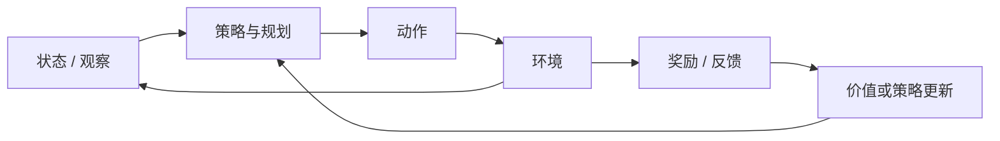

# 强化学习与智能体 MOC

## 交互闭环

## 核心节点

- 决策基础：[[多臂老虎机]]、[[探索与利用]]、[[Markov 决策过程]]
- 动态规划：[[Bellman 方程]]、[[价值迭代]]、[[策略迭代]]
- 价值学习：[[Monte Carlo 方法]]、[[Temporal Difference]]、[[Q-Learning]]
- 策略优化：[[Policy Gradient]]、[[Actor-Critic]]、[[PPO]]
- 高级范式：[[Model-based RL]]、[[离线强化学习]]、[[模仿学习]]
- 对齐：[[奖励模型]]、[[RLHF]]、[[DPO]]、[[可验证奖励]]
- 智能体：[[规划]]、[[搜索]]、[[记忆]]、[[工具使用]]、[[反思与反馈]]
- 多主体：[[博弈论基础]]、[[多智能体强化学习]]

## 边界

具体 Agent 框架和产品 API 只有在能揭示规划、记忆、反馈或评估机制时才进入正文。
