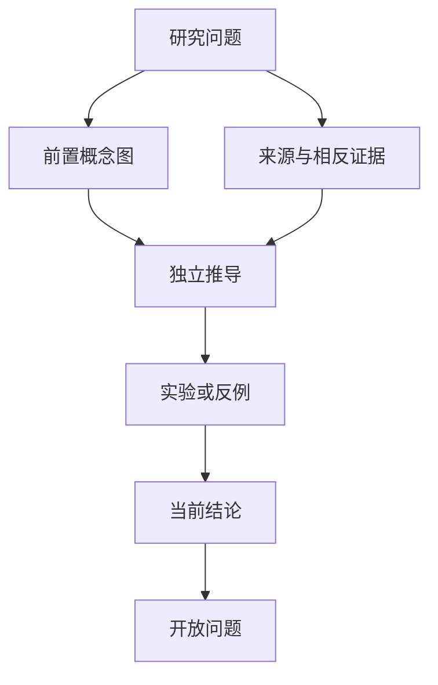

# 研究专题 MOC

研究专题不是新闻收藏，而是一组具有明确问题、前置知识、证据链、实验和开放问题的跨章节路线。

## 专题模板

## 首批专题

1. [[专题 - 低秩近似、有效秩与 Attention]]
2. [[专题 - 位置编码与长度外推]]
3. [[专题 - 线性 Attention 的统一视角]]
4. [[专题 - Normalization、Residual 与深度稳定性]]
5. [[专题 - Muon 与矩阵参数的谱几何]]
6. [[专题 - 模型扩展、参数迁移与函数保持]]
7. [[专题 - 生成扩散模型的统一视角]]
8. [[专题 - Scaling Law 与最优资源分配]]
9. [[专题 - MoE 的几何、路由与负载均衡]]

## 专题完成条件

- 有一个明确、可证伪的问题，而非只有主题名称。
- 前置节点已达到 `verified` 或明确标注缺口。
- 至少包含原论文、教材/综述和分析文章三类来源。
- 对关键结论至少设计一个反例检查或数值实验。
- 结尾保留“已知、未知、下一步怎么验证”的研究账本。
